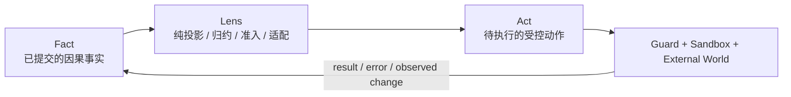
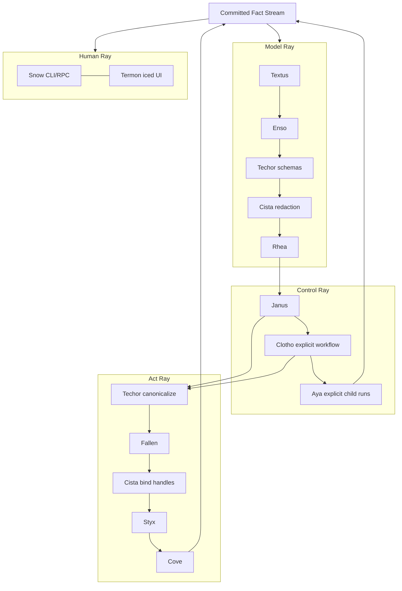
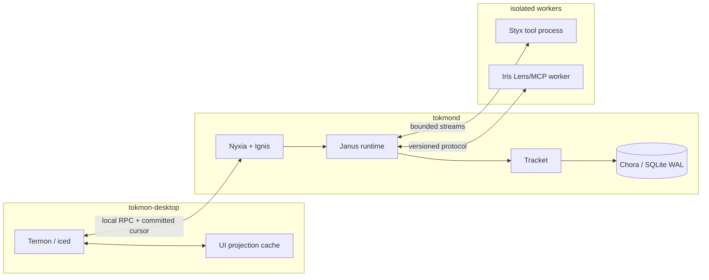
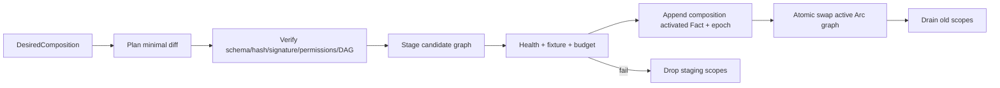
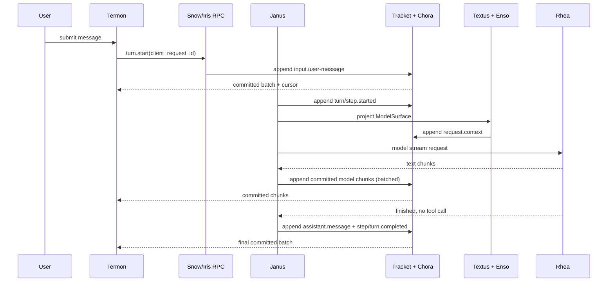

# Tokmon Rust 版总体设计与实现

> 文档状态：Architecture Baseline / Implementation Guide 1.2  
> 设计基线：2026-08-22  
> 目标目录：`tokmon-rs/`  
> UI 技术：[`iced`](https://github.com/iced-rs/iced)  
> 唯一语义：**Fact → Lens → Act**

本文是新 Tokmon 的工程设计基线。它综合以下材料，并把其中的理论语言收敛为可实现、可测试的 Rust 契约：

- `docs/advise.md` 中关于 20 个模块、Fact–Lens–Act、动态 composition 和因果光流的讨论；
- `docs/everything-is-a-lens-paper.zh.md` 与英文版的理论模型；
- `docs/tokmon-lens-architecture-explained.zh.md` 中的白话解释和光流执行示例；
- 旧版 C++ Tokmon 的 `Arche / Axon / Snow / White / Tokmon` 代码、轨迹协议、工具安全管线、工作区模型和产品 UI；
- 论文 **《A Programming Paradigm for Spatiotemporal Composability》（时空可组合性的编程范式）**关于 Context、Fiber、effect/coeffect、动态组合和安全收敛的实现启发；
- 旧版 UI 参考图与 `UI.md.txt` 中列出的对话、计划、审批、Diff、终端、完成总结、错误恢复、历史和轨迹等产品页面；
- `iced` 当前的 Elm 式 `State / Message / update / view`、异步 `Task` 与声明式 `Subscription` 模型。

本文既是架构说明，也是实现手册。文中的“必须”“禁止”和数据契约应视为实现约束；性能数字如果标记为“目标”，只能在基准测试通过后变成发布承诺。**“Fact–Lens–Act 是唯一规范语义”与“committed Fact 只能追加、绝不编辑/删除/撤销”是宪法级不变量，普通 ADR 无权放宽。**

## 目录

1. 结论、目标与工程化原则（第 1–3 章）
2. 总体架构、Fact Plane、Lens 与 Act 契约（第 4–8 章）
3. 20 个 Lens 的总览与逐模块实现（第 9–10 章）
4. 端到端光流、协议、配置与路径（第 11–12 章）
5. 基于 iced 的 Termon 桌面 UI（第 13 章）
6. 安全、Rust workspace、诊断与测试（第 14–17 章）
7. C++ 迁移、实施路线、验收、ADR 与风险（第 18–23 章）

---

## 1. 结论先行

新 Tokmon 是一个**事件溯源、能力受控、可组合的本地优先 Agent Runtime 与桌面客户端**。它不是把旧 C++ 类逐个翻译成 Rust，也不是把 20 个名字做成 20 个互相调用的服务对象。

系统只有三类一等语义：

1. **Fact（事实）**：所有已经发生且影响后续行为的事情，先作为不可变事件提交到因果事实流；
2. **Lens（透镜）**：从事实和显式环境中推导 Surface、提出或变换 Act、观察外部输入；
3. **Act（动作）**：对外部世界的意图，必须经过规范化、策略、审批、凭据和沙箱管线，结果再成为新的 Fact。

20 个命名模块全部只以 Lens 存在。Tokmon 不建立“核心/扩展”双轨运行时；系统中的状态变化只有一条合法路径：**已有 Fact 被当前 Lens composition 观察，Lens 投影 Surface 或提出 Act，Act 的结果再追加为 Fact**：

- 所有 20 个 Lens 都具有 descriptor、stage、activate、replace、drain、retire 和 inspect 的 generation/composition 行为，但这些行为仍通过 Fact 与 Act 表达，不另立第二套生命周期；
- 除 Nyxia 外，其余 19 个 Lens 必须支持在运行时切换到另一个兼容 generation，不要求关闭整个 Tokmon；
- Nyxia 同样可替换；由于它拥有 scope、lease 和资源生命周期，使用 shadow runtime + 进程级 handoff，而不是在自身活动栈帧内替换自身；
- Lens 实现可以预链接，也可装载为稳定 C ABI、WASM Component 或独立 worker；这些只是代码承载形态，不产生第四类系统语义；
- 不可信 Lens 实现默认运行在独立 worker/WASM 隔离域，通过版本化 typed port 接入；
- v1 不跨动态库传递 Rust trait object，不把 Rust ABI 当作稳定动态边界；可信 native Lens 使用版本化 C ABI function table；
- `Termon` 只负责 `iced` 桌面 UI 与 UI 本地状态，不拥有 Agent 的规范事实；
- `Snow` 只负责 CLI/headless/RPC 呈现，不复制 Agent loop；
- `Janus` 是唯一默认直接 Agent loop；`Clotho` 和 `Aya` 只能由显式工作流或显式子代理 Act 启动，不根据提示词暗中路由。

默认部署采用进程隔离：

```text
tokmon-desktop (Termon / iced)
        │ local typed protocol, cursor + backpressure
        ▼
tokmond (Nyxia ... Cove + Snow protocol server)
        │
        ├─ sandbox/tool processes (Styx)
        └─ replaceable lens workers/components (Iris)
```

桌面进程崩溃不能破坏正在持久化的会话；Agent Runtime 崩溃后，桌面端按 durable cursor 重连并恢复；工具进程和第三方 worker 崩溃只会追加对应 generation unavailable Fact，使后续 composition 不再解析到该 capability。

---

## 2. 目标与非目标

### 2.1 目标

- 使用 Rust 重写完整 Tokmon，重点实现 20 个 Lens 模块及其可组合契约；
- Windows、macOS、Linux 共用绝大部分核心代码，平台差异收敛到 Styx、Cista、Cove、Termon 等适配层；
- 模型看到的 Prompt、工具 Schema、人类看到的对话和轨迹都能追溯到 committed Fact；
- Lens generation 退役后不残留其当前 Prompt 贡献、工具声明、订阅、后台任务和能力路由；历史 Fact 永远保留；
- 外部不可逆副作用不伪装成可由内部 inverse 抹除，而是使用审批、幂等键、预提交、补偿或 `outcome_unknown`；
- Agent loop、模型、工具、审批、沙箱、文件变更、组合 epoch 和 UI 投影都可解释、可恢复、可离线回放；
- UI 在持续模型流、工具输出和大轨迹下保持可交互，并支持虚拟列表、批量增量更新和缓存；
- 第一方模块在 Lens 边界内保持 Rust 类型安全和窄 trait object；所有实现都通过统一 descriptor/generation contract 进入 composition，动态原生或跨进程边界使用稳定 C ABI/WIT/显式 Schema；
- 从第一天建立 golden trajectory、crash-point、property、协议兼容和 UI screenshot 测试。

### 2.2 非目标

- 不把每个函数、每条 token、每个 UI widget 都提升为独立 Lens；
- 不引入服务注册表、可变全局扩展点或另一套与 Fact–Lens–Act 并列的运行时语义；
- 不承诺 LLM 永远不会“幻想”一个不存在的工具名；系统只保证不存在宿主侧残留工具 Schema，并拒绝未在当前 epoch 注册的调用；
- 不声称所有 Lens 都是无内存分配的数学纯函数；允许可丢弃缓存、连接池和索引，但它们不能成为规范事实源；
- 不在 v1 支持进程内不可信 native Lens；Rust 内存安全也不能约束恶意 FFI 或同进程原生代码；
- 不追求任意网页兼容层、DOM/CSS/JavaScript 运行时；旧 White UI 不移植，Termon 直接使用 `iced`；
- 不根据用户 prompt 隐式选择 Council、Squad、RTS、Planner 或多 Agent 路由；
- 不把 OpenTelemetry、日志文件或 UI snapshot 当作恢复 Agent 行为的事实源；
- 不在设计阶段承诺 `<2ns` 分发或 `0.1ms` 全量投影等未经本实现基准验证的数字。

---

## 3. 从理论“透镜”到工程“透镜”

### 3.1 唯一语义：Fact → Lens → Act

Tokmon 不把“动态装载”提升为与 Fact、Lens、Act 并列的概念。代码如何到达进程只是承载问题；系统如何变化只能由下面的闭环解释：

```text
append-only causal photon stream
              │ committed Facts
              ▼
       active Lens composition
       ├─ project Surface
       ├─ reduce derived state
       └─ propose typed Act
              │ admitted / executed / observed
              ▼
        append new Facts only
```

因此：

- **Fact** 是唯一规范历史；一旦提交，只能被后续 Fact 引用、解释、纠正、补偿或取代其“当前有效性”，绝不能原地编辑、覆盖、删除、撤销或使其从因果链消失；
- **Lens** 是当前 composition 中的受约束观察与变换；Lens generation 的启用、替换和退役本身也由 composition Fact 驱动；
- **Act** 是唯一改变外部世界或运行时 composition 的请求；任何隐藏 registry 写入、后台自修改或旁路切换都非法；
- “回到旧 Lens”不是撤销新 generation，而是追加新的 composition proposal、Act result 和 epoch，使后续光子从新的 active composition 通过；两个历史 epoch 都永久存在。

形式化地，设 `Pₙ` 是截至序号 `n` 的因果光子流，每一个 committed Fact 是一个因果光子：

```text
Pₙ₊₁ = Pₙ || Factₙ₊₁
prefix(Pₙ₊₁, len(Pₙ)) = Pₙ

Surfaceₙ = LensComposition(epochₙ).project(Pₙ)
Actₙ₊₁  = LensComposition(epochₙ).propose(Pₙ, Surfaceₙ)
result(Actₙ₊₁) -> append Factₙ₊₁
```

系统不存在 `edit(Pₙ, i)`、`delete(Pₙ, i)`、`undo(Pₙ, i)` 或复用旧 `seq` 的合法转移。任何实现只要破坏 prefix invariant，就不属于 Tokmon 的 Fact Plane。

论文中的 Context、Fiber、effect/coeffect、依赖收敛和 consumer-first teardown 只作为 Nyxia/Ignis 实现 Lens composition 的内部机制，不形成另一套上层语义。它们必须满足 Fact–Lens–Act：生命周期意图来自 Fact，composition 变化经 Act，完成/失败/资源收束重新追加为 Fact。

### 3.2 三个原语



#### Fact

Fact 是“已经被系统承认发生”的事实。用户消息、模型请求、模型可见上下文、流式输出、工具计划、审批结果、文件变化、Lens composition 变化都属于 Fact。瞬时鼠标移动、未提交的 hover、渲染帧耗时等通常只是 transient telemetry，不自动进入 Fact 流。

#### Lens

Lens 是受约束的变换单元。它可以：

- 从 Fact 归约状态或投影 Surface；
- 从一个 Surface 变换出另一个 Surface；
- 把外部输入规范化为候选 Fact；
- 把候选 Act 变换为更窄、更安全的 Act；
- 执行已经获准的 Act，并把结果交回引擎提交。

Lens 表达的是**统一的因果与权力约束**，不是要求所有模块实现一个万能 `view/refract(JSON) -> JSON` 接口。

#### Act

Act 是尚未发生的意图，不能直接写成成功事实。一个 Act 至少包含来源 epoch、调用者、能力名、规范化参数、风险、幂等键和因果来源。执行成功、拒绝、取消、超时或结果未知分别产生不同 Fact。

### 3.3 Surface

Surface 是从 Fact 临场投影出的像平面，不是新的规范数据库：

- `ModelSurface`：消息、system contribution、工具 Schema、预算和 provenance；
- `UiSurface`：会话列表、对话项、计划、工具卡、Diff、审批和状态；
- `CliSurface`：适合终端显示的行、进度和机器可读输出；
- `WorkspaceSurface`：文件树、Git 状态、preimage/postimage、diff；
- `DiagnosticSurface`：Lens 图、能力解析、延迟、失败和资源状态。

Surface 可以缓存，也可以保存 checkpoint，但必须能够从 Fact + Lens version + composition epoch 重建。

### 3.4 工程约束替代理论绝对化

| 理论或会话中的表达 | Rust 工程中的精确定义 |
| --- | --- |
| “透镜无状态” | 透镜不得持有规范业务真相；允许 memoization、连接池和可重建索引 |
| “透镜是纯函数” | `Projector/Reducer/Policy` 必须确定且无 I/O；I/O 只能进入 `Source/Actuator/Sink` 契约 |
| “一条直线光路” | 每个命名光路内部是有序管线；全系统是由少量强类型光路组成的显式 DAG，不是万能总线 |
| “generation 退役后零当前残留” | 后续 epoch 的 Surface、Schema 和路由不再包含该 generation；scope 资源被取消和 drain；历史 Fact 永久保留 |
| “恢复旧实现” | 追加新的 composition epoch 再次选择旧实现；历史 epoch、外部动作与结果 Fact 均不撤销 |
| “所有状态都在 Fact” | 规范状态来自 Fact；短寿命 UI 状态、缓存、socket、进程句柄是显式拥有且可丢弃的运行状态 |
| “20 个透镜串行执行” | 20 个模块提供不同 typed contribution；一次模型调用、一次工具调用或一次 UI 帧只经过相关光路 |

### 3.5 六条工程 Lens Law

每个 Lens 必须满足与其契约相关的规则：

1. **Determinism**：相同 Fact window、配置、Lens version 和 epoch 产生相同纯投影；
2. **Provenance**：模型/UI 可见的非装饰信息必须带来源事件或配置内容 hash；
3. **Append-only**：Lens 不能覆写、编辑、删除或撤销历史 Fact，只能提出追加新 Fact 的 Act；
4. **Authority narrowing**：子 scope、Lens Policy 和 worker 只能缩小权限，不能绕过 root guard 扩权；
5. **Epoch isolation**：旧 epoch 产生的异步结果不能污染新 epoch，除非通过明确兼容与因果校验；
6. **Replay safety**：R0–R2 离线回放不得调用模型、工具、网络或写工作区。

---

## 4. 总体架构

### 4.1 三个平面与四条主光路

系统分成三个平面：

- **Fact Plane**：Tracket 定义语义，Chora 负责持久化、序号、事务和 checkpoint；
- **Lens Plane**：Nyxia 管 scope/capability，Ignis 管组合图和 epoch，其他 Lens 提供 typed contribution；
- **Act Plane**：Techor 规范化和路由，Fallen 准入，Cista 绑定机密，Styx 执行，Cove 捕获工作区结果。

四条主光路如下：



Nyxia、Ignis、Lemon、Iris、Chora、Tracket、Nota 是贯穿这些光路的底座或适配 Lens，不意味着它们在每个事件上都执行一次通用回调。

### 4.2 默认进程拓扑



默认由 `tokmon-desktop` 监督一个 bundled `tokmond` 子进程。CLI 可以连接已有 daemon，也可以临时启动 embedded-local daemon，但 UI 和 CLI 都只能通过同一公开协议进入 Janus，不得复制 Agent loop。

### 4.3 依赖方向

```text
tokmon-types
  ├─ tokmon-fact-contracts
  ├─ tokmon-lens-contracts
  ├─ tokmon-act-contracts
  └─ tokmon-protocol

20 Lens crates -> contracts only
tokmon-runtime -> contracts + selected Lens crates
tokmon-daemon -> runtime + composition
tokmon-desktop -> protocol + termon(iced)
tokmon-cli -> protocol + snow
```

硬规则：

- 具体 Lens crate 禁止依赖另一个具体 Lens crate；协作只能通过 `contracts` 中的 capability/port；
- `termon` 之外的 crate 禁止依赖 `iced`；
- 模型 provider、MCP server、工具实现禁止直接依赖 Chora 数据库；
- 只有 FactAppender 能分配 durable `seq`；
- 只有 active Ignis 能提出/验证 composition commit，最终 epoch compare-and-swap 由 Nyxia/BootHost 的最小 primitive 执行，因此 Ignis 可以替换自己却不能伪造历史 epoch；
- active Fallen generation 产生策略准入结论，但结果还必须满足 BootHost/Nyxia 不可放宽的 safety ceiling；替换 Fallen 不能降低上界；
- 只有 active Cista generation 能把 `SecretRef` 解析为短寿命明文；替换时旧 secret lease 留在旧 scope drain，新请求只进入新 generation，明文不能进入 ModelSurface、Fact payload 或普通日志。

---

## 5. Fact Plane：只追加因果光子流

### 5.1 事件封装

v1 使用强类型 envelope + namespaced JSON payload。进程内已知事件映射为 Rust enum/struct；跨版本、跨 worker 和数据库边界保留 `schema + version + JSON`，避免把整个核心绑死在一个无限增长的 Rust enum 上。

```rust
pub struct FactEnvelope {
    pub event_id: EventId,              // UUIDv7/等价的时序唯一 ID
    pub stream_id: StreamId,            // session / composition / system stream
    pub seq: u64,                        // stream 内单调递增，由 Chora 分配
    pub committed_at: Timestamp,
    pub kind: FactKind,                  // 例如 "tokmon.turn/started"
    pub schema_version: u32,
    pub producer: LensInstanceId,
    pub composition_epoch: u64,
    pub correlation: CorrelationIds,
    pub causes: SmallVec<[EventId; 4]>,
    pub visibility: Visibility,
    pub payload: serde_json::Value,
    pub prev_checksum: Digest,          // 同 stream 前一 Fact；首条绑定 stream genesis
    pub checksum: Digest,
}
```

`FactEnvelope` 没有 `revision`、`deleted`、`revoked` 或可变 `status` 字段。若先前认识错误，追加 `*.corrected` 并在 `causes` 指向原 Fact；若现实动作需要补偿，追加新的补偿 Act 及其结果 Fact；若某信息不再进入当前 Surface，Lens 只改变投影选择，原 Fact 仍完整存在。

`CorrelationIds` 至少支持：

```text
trace_id / session_id / run_id / turn_id / step_id
model_call_id / tool_call_id / approval_id / workflow_id / child_run_id
```

序号只定义 stream 内顺序；跨 stream 的因果关系由 `causes` 表达。`checksum = H(canonical_envelope_without_checksum || prev_checksum)` 形成 stream 内哈希链，segment root 定期签名并写入独立审计流。session fork 不复制父事件，而是记录 `parent_stream_id + seed_seq + seed_checksum`，子流只追加新事件。

`visibility` 至少区分 `ModelEligible`、`HumanVisible`、`Internal`、`AuditOnly` 和 `RawReference`。它是投影资格而不是唯一访问控制；真正读取仍需 capability 和 sensitivity policy。语义 Fact payload 有严格大小上限，大文本、终端输出、图像和二进制必须存 blob，Fact 只保留 digest、media type、size 和受控引用。

### 5.2 提交协议

所有会影响下一步决策或用户 durable cursor 的事实遵循：

```text
validate draft
-> redact/normalize
-> SQLite transaction append
-> assign seq + checksum
-> COMMIT
-> publish CommittedFact to Lemon
-> reducers / UI / next Agent step observe
```

禁止 `publish -> later persist`。长流式输出允许在 8–16 ms 时间窗或固定大小内批量事务提交，但 UI 只能看到已提交 batch。关键外部 dispatch 前使用更强 durability policy；普通 token chunk 可以使用经过故障测试的批量策略。

`FactDraft` 只是尚未进入光路的候选，可以因验证失败而拒绝或重新生成；它不是 Fact，也不能占用 durable `seq`。一旦事务 COMMIT 并获得 `seq/checksum`，它就成为因果光子，此后没有任何 API 能把它退回 draft 或改变其字节。

### 5.3 SQLite v1 逻辑 Schema

```sql
CREATE TABLE fact_streams (
  stream_id TEXT PRIMARY KEY,
  kind TEXT NOT NULL,
  parent_stream_id TEXT,
  seed_seq INTEGER,
  created_at TEXT NOT NULL,
  header_json TEXT NOT NULL
);

CREATE TABLE facts (
  stream_id TEXT NOT NULL,
  seq INTEGER NOT NULL,
  event_id TEXT NOT NULL UNIQUE,
  committed_at TEXT NOT NULL,
  kind TEXT NOT NULL,
  schema_version INTEGER NOT NULL,
  producer TEXT NOT NULL,
  composition_epoch INTEGER NOT NULL,
  correlation_json TEXT NOT NULL,
  causes_json TEXT NOT NULL,
  visibility INTEGER NOT NULL,
  payload_json TEXT NOT NULL,
  prev_checksum BLOB NOT NULL,
  checksum BLOB NOT NULL,
  PRIMARY KEY (stream_id, seq)
);

CREATE TABLE projection_checkpoints (
  stream_id TEXT NOT NULL,
  projection_id TEXT NOT NULL,
  projection_version INTEGER NOT NULL,
  composition_epoch INTEGER NOT NULL,
  through_seq INTEGER NOT NULL,
  state_blob BLOB NOT NULL,
  checksum BLOB NOT NULL,
  PRIMARY KEY (stream_id, projection_id, through_seq)
);

CREATE TABLE blobs (
  blob_id TEXT PRIMARY KEY,
  digest BLOB NOT NULL UNIQUE,
  media_type TEXT NOT NULL,
  size INTEGER NOT NULL,
  codec TEXT,
  encryption TEXT,
  relative_path TEXT NOT NULL
);

CREATE TABLE composition_epochs (
  epoch INTEGER PRIMARY KEY,
  composition_id TEXT NOT NULL,
  lock_digest BLOB NOT NULL,
  graph_json TEXT NOT NULL,
  committed_at TEXT NOT NULL
);

CREATE TRIGGER facts_forbid_update
BEFORE UPDATE ON facts
BEGIN SELECT RAISE(ABORT, 'facts are append-only'); END;

CREATE TRIGGER facts_forbid_delete
BEFORE DELETE ON facts
BEGIN SELECT RAISE(ABORT, 'facts are append-only'); END;

CREATE TRIGGER composition_epochs_forbid_update
BEFORE UPDATE ON composition_epochs
BEGIN SELECT RAISE(ABORT, 'composition epochs are append-only'); END;

CREATE TRIGGER composition_epochs_forbid_delete
BEFORE DELETE ON composition_epochs
BEGIN SELECT RAISE(ABORT, 'composition epochs are append-only'); END;
```

`composition_epochs` 是由 `composition.activated` Fact 构建的 append-only 查找索引，不是第二事实源；它与 Fact 不一致时必须丢弃索引并从光子流重建。stream 的 closed/archived/current-title 等状态同样由 Fact 投影，不通过更新 `fact_streams` 行表达。

实际迁移由 `PRAGMA user_version` 或独立 migration 表管理。迁移可以新增表、索引和新版本投影，但禁止用 `UPDATE facts` 或 `DELETE FROM facts` 重写历史；需要新表示时，从旧流读取并追加到有明确 parent/derivation 的新流。数据库开启 WAL；`synchronous`、checkpoint 和 batch 参数必须成为显式配置并接受 crash matrix 测试，不能埋在代码常量中。

### 5.4 事件族

核心保留以下 namespace；Lens descriptor 可以声明自己产生和理解的事件族：

规范 kind 格式为 `<反向域名或产品 namespace>.<domain>/<event>`，例如 `tokmon.turn/started`、`tokmon.tool/result`、`org.example.weather/result`。下表和后文为便于阅读会使用 `turn.*`、`tool.proposed` 一类短写；持久化与协议中必须使用完整规范名。

| 事件族 | 例子 |
| --- | --- |
| `runtime.*` | boot、shutdown、scope opened/closed、recovery |
| `composition.*` | proposed、validated、committed、rejected、superseded |
| `lens.replace/*` | staged、healthy、prepared、activated、draining、drained、switch-failed、stuck |
| `runtime.handoff/*` | shadow-ready、endpoint-switched、old-runtime-drained、failed |
| `storage.handoff/*` | prepared、writer-token-transferred、activated、aborted |
| `session.*` | created、forked、titled、closed、end-seed |
| `run.* / turn.* / step.*` | started、completed、aborted、blocked、interrupted |
| `input.*` | queued、claimed、user-message、steered |
| `context.*` | contribution、projected、item-omitted、summary-produced、budget-reported |
| `model.*` | request、accepted、chunk、message、usage、finish、error |
| `tool.*` | proposed、canonicalized、policy、dispatch、progress、result |
| `approval.*` | requested、resolved、expired |
| `sandbox.*` | plan、started、terminated、violation |
| `artifact.* / workspace.*` | preimage、postimage、diff、snapshot |
| `workflow.* / child.*` | node state、fork、join、child result |
| `memory.* / skill.*` | retrieved、loaded、proposed-write、committed-write |
| `recovery.*` | pending dispatch、outcome-unknown、repair complete |

未知且 `ignorable=false` 的事件阻止 R1/R2 回放；未知但 ignorable 的事件可显示为通用结构化卡片。`superseded`、`item-omitted` 等名称只描述后续 composition/Surface 的选择关系，不改变被引用 Fact 的内容、序号或存在性。

### 5.5 Surface、checkpoint 与 compaction

Fact 永不因上下文压缩而删除、修改或撤销。Textus 的 compaction 只追加 `context.summary-produced` Fact，指出当前 ModelSurface 可以使用哪个摘要以及摘要引用了哪些来源；它不替换、更名或隐藏原始 Fact。人类 transcript 仍可显示完整原始链，当前 ModelSurface 的选择由当前 Lens generation 和 composition epoch 决定。

checkpoint 只优化启动和投影：

```text
cache key = stream_id
          + through_seq
          + projection_id/version
          + composition_epoch
          + relevant config digest
```

任一维度不匹配即丢弃缓存并重放。缓存失败不能影响规范数据。

### 5.6 Retention、隐私与不可变边界

因果光子流的 append-only 是绝对语义，不存在普通模式、高权限模式或维护模式的例外：

- 禁止对 committed Fact 执行 update、delete、rewrite、revoke、redact-in-place 或 sequence reuse；
- 会话关闭、用户要求遗忘、策略过期都只能追加新的意图/结果 Fact，Lens 据此停止在当前 Surface 中投影相关内容；
- 敏感大内容必须从一开始存入独立、按 stream/key 隔离的加密 blob，Fact 只保存 digest、密文引用和必要元数据；销毁密钥可以令内容不可恢复，但不能移除或改写因果链中的 Fact envelope；
- projection、index、checkpoint 是可删除缓存；删除缓存不等于删除 Fact，下一次只能从原流重建；
- backup 必须保持相同的 append-only 与完整性规则，不能成为修改历史的旁路；
- 如果未来法规要求物理移除 committed Fact 行，该操作不再属于同一因果光子流语义：必须通过独立迁移产品边界处理，并明确宣告原流不可再验证。v1 不提供这种原地擦除能力。

“当前不再有效”和“历史从未发生”必须严格区分。前者由新的 Fact 和 Lens 投影表达；后者在 Tokmon 中不可表达。

---

## 6. Lens 编程模型

### 6.1 不设计万能 `Lens` trait

如果将所有 Lens 强行写成以下形式：

```rust
trait Lens {
    fn view(&self, json: Value) -> Value;
    async fn refract(&self, json: Value) -> Value;
}
```

将立即失去类型安全、纯/副作用分离、背压、可取消性和清晰的错误模型。新 Tokmon 使用“一个 Lens descriptor + 一组 typed optical port”。crate/module 是代码组织，`LensGeneration` 是进入当前 composition 的运行时实现。

```rust
pub trait LensGeneration: Send + Sync + 'static {
    fn descriptor(&self) -> &LensDescriptor;
    fn stage<'a>(
        &'a self,
        context: StagingContext<'a>,
    ) -> BoxFuture<'a, Result<StagedLens, LensError>>;
}
```

`stage` 只在 Ignis 构建候选组合图时调用，返回 immutable typed contributions、health probe 和已经由 Nyxia 接管的 scoped effects；真正热路径使用已经解析好的 typed list/route，不做 service locator 查询。预链接实现、C ABI 实现、WASM component 和 worker proxy 最终都被适配到相同的 `LensGeneration` contract。stage/activate/replace/drain/retire 的每个可观察状态变化都必须由输入 Fact 触发，并把结果追加成 Fact。

### 6.2 Typed optical ports

```rust
pub trait FactReducer<S>: Send + Sync {
    fn reduce(&self, state: &mut S, fact: &CommittedFact) -> Result<()>;
}

pub trait SurfaceLens<S>: Send + Sync {
    fn project(&self, input: &ProjectionInput<'_>, surface: &mut S) -> Result<()>;
}

pub trait ActNormalizer: Send + Sync {
    fn normalize(&self, intent: ActIntent) -> Result<CanonicalActPlan, ActError>;
}

pub trait ActPolicy: Send + Sync {
    fn evaluate(&self, ctx: &PolicyContext<'_>, plan: &CanonicalActPlan)
        -> Result<Admission, ActError>;
}

pub trait Actuator: Send + Sync {
    fn capability(&self) -> &CapabilityId;
    fn execute<'a>(
        &'a self,
        ctx: ActContext<'a>,
        plan: &'a AuthorizedActPlan,
    ) -> futures::future::BoxFuture<'a, Result<EffectReport, ActError>>;
}

pub trait ExternalSource: Send + Sync {
    fn run(self: Arc<Self>, scope: LensScope, output: FactDraftSender)
        -> futures::future::BoxFuture<'static, Result<(), SourceError>>;
}
```

主要 port：

| Port | 纯度 | 典型 Lens |
| --- | --- | --- |
| `FactReducer<UiProjection>` | 纯 | Termon projection、Snow transcript |
| `SurfaceLens<ModelSurface>` | 纯 | Textus、Enso、Techor schema、Cista redaction |
| `ActNormalizer` | 纯 | Techor、Cove path normalization |
| `ActPolicy` | 纯/只读配置 | Fallen、Cista disclosure policy |
| `Actuator` | 有副作用 | Rhea provider call、Styx execution、Cove writes |
| `ExternalSource` | 有 I/O | Termon input bridge、MCP、file watcher、model stream |
| `DurableSink` | 有 I/O | Chora |
| `TelemetrySink` | 非规范 | Nota |

副作用 port 不能直接制造 `CommittedFact`；它们只能返回 `FactDraft`/`EffectReport`，由 Tracket 校验、Cista 脱敏、Chora 分配序号并提交。

### 6.3 Descriptor 与 capability

```rust
pub struct LensDescriptor {
    pub id: LensId,
    pub version: Version,
    pub contract: ContractVersion,
    pub build_digest: Digest,
    pub kind: LensKind,
    pub requires: Arc<[CapabilityRequirement]>,
    pub provides: Arc<[CapabilityProvision]>,
    pub permissions: PermissionRequest,
    pub event_schemas: Arc<[EventSchemaDescriptor]>,
    pub replay_support: ReplaySupport,
    pub replacement: ReplacementContract,
    pub state_transfer_schema: Option<SchemaDigest>,
}
```

Capability id 使用 `namespace/name@major + interface_digest`。同一 capability 默认只有一个 active provision；需要 fallback、负载均衡或多实现聚合时，必须有显式 broker contribution。

#### Coeffect、provision 与 scoped resource

论文《A Programming Paradigm for Spatiotemporal Composability》中的机制只作为 Lens composition 的内部实现映射，不成为第四类规范对象：

| 论文概念 | Lens 工程对象 | generation 切换时的作用 |
| --- | --- | --- |
| coeffect / dependency | `CapabilityRequirement` | 决定 Fiber 是否可激活；依赖变化触发 reconcile |
| provision | `CapabilityProvision` + typed lease | 只在 generation Active 后对新 consumer 可见 |
| witnessed effect | `ScopedResource` / `ResourceLedger` | stage 部分失败与 retire 时逆序释放运行时资源；不修改 Fact |
| component instance | `LensFiber` | 某 Lens generation 在 Context/Scope 中的一次实例 |
| context change | composition Act + epoch Fact | propose/verify/activate/replace 的因果边界 |

```rust
pub struct ScopedResource {
    pub id: ResourceId,
    pub label: Arc<str>,
    pub kind: ScopedResourceKind,
    release: Box<dyn FnOnce() -> BoxFuture<'static, Result<(), EffectError>> + Send>,
}

pub struct LensFiber {
    pub instance: LensInstanceId,
    pub descriptor: LensDescriptor,
    pub state: FiberState,
    pub committed_dependencies: CapabilityLeaseSet,
    pub resources: ResourceLedger,
    pub scope: LensScope,
}
```

service/route、Lemon connection、timer、watcher、task、child scope、socket listener、临时文件、UI contribution 和资源租约都必须形成 host-owned `ScopedResource`。`stage` 每成功产生一个 resource，Nyxia 立即接管其 release；中途失败只逆序释放已经登记的资源，不能依赖一个可能永远执行不到的巨大 `deactivate()`。

`release` 只是结束运行时资源所有权，不会删除、修改或撤销任何 Fact。已经发送的网络写入、文件覆写、邮件、支付、token 消耗等现实行为属于 Act/Fact，只能使用 preimage、幂等、后续补偿 Act 或 `outcome_unknown`；任何资源 ledger 都不能把现实或历史逆转。

Fiber 规范状态为：

```text
Absent -> Staging -> Active -> Draining -> Retired
              \-> stage-failed -> release staged resources -> Absent
```

generation replacement/retirement 时，Ignis 先在下一 composition 中停止把旧 provision 分配给新 consumer，再按反向依赖拓扑 drain 已存在 consumer；consumer 在 teardown 期间保留 committed dependency lease，最后才释放旧 generation。异步 state transition 携带 dependency/composition epoch，旧结果不能覆盖新目标。每个阶段都追加状态 Fact；资源释放只影响当前运行时，不改变这些 Fact。

### 6.4 LensScope 与资源所有权

```rust
pub struct LensScope {
    pub id: ScopeId,
    pub instance: LensInstanceId,
    pub epoch: u64,
    pub cancellation: CancellationToken,
    pub tasks: TaskTracker,
    pub grants: CapabilityGrantSet,
    resources: ResourceTable,
}
```

所有后台任务、watcher、channel sender、child process、socket、临时目录和订阅都由 scope 持有。generation 退役顺序：

```text
hide provisions from new resolutions
-> mark scope draining
-> cancel token
-> stop accepting new work
-> wait bounded TaskTracker drain
-> expire grants and close broker handles
-> drop resources in reverse ownership order
-> remove routes/contributions
-> append lens.generation/drained
```

Rust RAII 是资源释放机制，但不能成为唯一的生命周期证明：Nyxia 必须能枚举 scope 中仍存活的任务、permit 和进程，并在超时后报告 stuck。禁止 `mem::forget`、永生 detached task 和无法追踪的 `tokio::spawn`；只能经 scope 的 spawn API 创建后台任务。

### 6.5 运行时替换等级与不可约 Boot Host

“可替换”必须区分替换实例、替换代码和替换拥有运行时本身，不能只把同一个静态对象重新注册一遍：

| 等级 | 名称 | 含义 | 适用范围 |
| --- | --- | --- | --- |
| S0 | Graph Swap | 在已经存在的 Lens generation 间切换 instance/config/route | 所有 Lens |
| S1 | Generation Hot Swap | 加载新 Lens artifact/code，shadow activate，原子切 route，旧 scope drain | 除 Nyxia 外的 19 个 Lens 必须支持 |
| S2 | Runtime Handoff | 启动 shadow host/runtime，迁移可序列化意图和 cursor，切换进程 endpoint，旧 runtime drain | Nyxia 必须设计支持；Termon/Chora 等基础 Lens 也可使用 |

#### 不可约 Boot Host

如果 Nyxia 自己负责 scope 与 Lens 代码装载，它不能在自己的调用栈、allocator 所有权和任务仍活跃时安全地替换自己。因此进程入口保留一个极小的 `BootHost`，它不是第 21 个 Lens，也不提供 Agent/UI/存储业务能力，只实现以下不可约 primitive：

1. 验证最初 Nyxia artifact、宿主签名与 ABI；
2. 启动 active/shadow runtime 进程或 runtime image；
3. 持有可原子切换的 active endpoint/generation；
4. 执行不可被 Lens 放宽的 capability ceiling、协议尺寸和紧急终止下限；
5. 在 handoff 失败时继续路由旧 runtime，成功后 drain/终止旧 runtime。

`BootHost` 不是业务语义，只是让 Fact–Lens–Act 闭环可以启动并安全交接的最小物理机制。签名校验、原子 endpoint、进程入口和“权限不得超过上界”属于执行公理，不形成可变全局服务。`BootHost` 自身只能随已签名可执行程序升级，并使用双版本进程切换；普通 Lens 不能获得改变安全上界的 capability。

#### ReplacementContract

每个 Lens descriptor 声明：

```rust
pub struct ReplacementContract {
    pub minimum_level: ReplacementLevel,
    pub quiescent_points: Arc<[QuiescentPoint]>,
    pub state_mode: StateTransferMode,
    pub max_drain: Duration,
    pub compatibility: CompatibilityPolicy,
}

pub enum StateTransferMode {
    RebuildFromFacts,
    VersionedSnapshot { schema: SchemaDigest },
    DrainOnly,
    RuntimeHandoff { protocol: ContractVersion },
}
```

优先使用 `RebuildFromFacts`，因为它不把旧 generation 的私有内存变成新 generation 的隐式依赖。连接池、线程、文件描述符、GPU 对象和 secret lease 默认不迁移：旧调用继续持有旧 lease 至 drain，新调用进入新 generation。只有显式 versioned snapshot 可以跨 generation 传输，且必须可校验、可迁移、可丢弃重建；snapshot 只是派生输入，不能替换任何历史 Fact。

“可替换”不等于系统允许关键 capability 出现空集。composition 可以声明 `cardinality = exactly-one` 与 `availability = continuous`；Nyxia、active composition commit、durable Fact path、root safety ceiling 等在正常运行期必须始终有一个 active generation。旧 generation 只能在新 generation 已由新 epoch Fact 激活之后退役，或在整个宿主 shutdown 时结束。

### 6.6 组合与 epoch

组合文件使用严格 UTF-8 JSON：

```json
{
  "schema": "org.tokmon.composition/v1",
  "id": "tokmon.desktop.default",
  "lenses": [
    {
      "instance": "rhea.default",
      "artifact": "sha256:rhea-generation-digest",
      "config": { "broker": "default" }
    },
    {
      "instance": "termon.desktop",
      "artifact": "sha256:termon-generation-digest"
    }
  ],
  "locks": { "file": "composition.lock.json" }
}
```

Ignis 的 reconcile：



替换是 Fact–Lens–Act 的一等光路，不是另一套旁路生命周期：

```text
active L@old keeps serving committed leases
-> stage L@new in shadow scope
-> restore from Facts or import versioned snapshot
-> run contract/health/differential fixtures
-> append replacement/prepared Fact through current durable path
-> execute composition.activate Act
-> append composition/activated epoch Fact
-> atomically publish the graph represented by that committed Fact
-> new calls resolve to L@new
-> old calls drain on L@old
-> release old scope resources
-> append replacement/drained (or stuck) Fact
```

Ignis 替换自身时，当前 Ignis 只负责从 Fact 投影候选并提出 Act；最终 epoch compare-and-swap 由 Nyxia 暴露的最小 composition commit primitive 执行。Chora、Tracket、Fallen、Cista 等基础 Lens 的替换也必须 side-by-side，任何时刻至少保留一条可验证的 durable/safety path，禁止先结束旧 generation 再希望新 generation 能成功启动。

每个异步工作携带 `originating_epoch`。结果到达时：

- epoch 相同：正常提交；
- 旧 generation 仍有显式兼容 lease：按原 epoch 提交并记录兼容桥；
- capability/plan 已改变：追加 `stale-result/ignored-by-current-projection` Fact，不得注入新 Surface；原结果及忽略决定均保留。

### 6.7 Lens 代码承载形态

| 形态 | v1 支持 | 用途 | 替换/ABI |
| --- | --- | --- | --- |
| 预链接 Rust generation | 是 | 默认第一方实现、极热路径 | 仍按 artifact digest/descriptor/Fiber 进入 composition；单独只能在已链接候选间 S0，或随新进程做 S2 |
| 稳定 C ABI native Lens | 是（可信） | 需要进程内性能的第一方/审计实现 | `cdylib` + versioned function table；不传 Rust trait/type |
| 独立 worker Lens | 是（默认动态形态） | 第三方、Node/Python、可独立崩溃实现 | versioned length-delimited protocol；blue/green S1 |
| WASM Component Lens | 是（受限 port） | 纯投影、policy、transform、轻量工具 | WIT contract、fuel/memory/host-import capability；S1 |
| MCP server | 是 | 外部工具生态 | Iris MCP client，仍经过 Techor/Fallen/Styx |
| `cdylib` Rust trait object | 否 | 不使用 | Rust ABI、panic、allocator 和动态卸载不稳定 |

稳定 C ABI 只传 fixed-width integer、UTF-8/byte span、opaque handle、versioned function table 和 host-owned buffer callback；panic/exception 不跨边界，谁分配谁释放。native library 采用 shadow-copy load 和**逻辑退役优先**：route/scope 可以热切换，但旧代码页只有在无 callback、TLS、线程、对象和 allocator ownership 时才允许物理卸载；否则保留映射到进程退出。当前 composition 已不再选择它即可完成语义退役。

Lens artifact 是 content-addressed、已签名的代码承载物；把 artifact 导入本地 store 不会改变 active composition。预链接 generation 同样必须以 digest 出现在 composition lock 中。对除 Nyxia 外的 19 个命名 Lens，正式发布不能只提供 S0 预链接图切换：必须至少存在 C ABI、WASM、worker 或 S2 process handoff 中的一条**新代码运行时装载路径**。artifact 只有在不被任何 Fact、composition lock、scope、lease 或 migration 引用时才可从派生代码缓存清理；历史 Fact 中的 digest 永不改写。

### 6.8 generation 退役的可验证定义

Lens generation `L@old` 退役后，测试必须证明：

1. 新 epoch 的 ModelSurface 不包含 `P` 提供的 prompt contribution 或工具 Schema；
2. `P` 的工具路由不可寻址，旧 tool call 会得到 `capability_unavailable`；
3. `P` 的 task、subscription、worker、端口和文件句柄全部结束或明确 stuck；
4. 历史调用仍保留，但 Textus 将其投影为 inert history，不恢复当前工具能力；
5. 新 epoch 的缓存 key 不复用旧 epoch 的 Surface；
6. 如果外部效果已经发生，历史 Fact 不删除、不修改、不撤销，只能追加补偿 Act 及其结果；
7. 对模型“是否仍会凭先验猜出同名工具”不作绝对保证，执行层始终拒绝未注册调用。

---

## 7. Act Plane：受控动作模型

### 7.1 数据结构

```rust
pub struct ActIntent {
    pub id: ActId,
    pub capability: CapabilityId,
    pub arguments: serde_json::Value,
    pub origin: LensInstanceId,
    pub originating_epoch: u64,
    pub causes: SmallVec<[EventId; 4]>,
}

pub struct CanonicalActPlan {
    pub id: ActId,
    pub capability: CapabilityId,
    pub normalized_arguments: serde_json::Value,
    pub argument_digest: Digest,
    pub requested_grants: CapabilityGrantSet,
    pub effect_class: EffectClass,
    pub idempotency_key: Option<IdempotencyKey>,
    pub preconditions: Vec<Precondition>,
}

pub enum Admission {
    Allow(AuthorizedActPlan),
    Deny { code: DenialCode, reason: String },
    Ask(ApprovalRequest),
}
```

`EffectClass` 至少区分：`ReadOnly`、`LocalReversible`、`LocalDestructive`、`NetworkWrite`、`CredentialUse`、`ExternalIrreversible`。

### 7.2 固定管线

```text
model/tool intent
-> Techor schema validate + canonicalize
-> Cove canonical path and workspace boundary (if filesystem)
-> Fallen hard deny + policy + approval
-> Cista resolve short-lived secret handles
-> Styx compile sandbox capability plan
-> durable tool/dispatch fact
-> execute with deadline/cancel/output budget
-> Cove capture preimage/postimage/diff
-> Cista redact all exits
-> durable result/error/outcome_unknown fact
```

审批针对 `argument_digest + grant set + sandbox plan`。任一字段变化都使审批失效。非交互环境的 `Ask` 默认 `Deny`。

“固定管线”固定的是安全阶段和不可绕过顺序，不固定某个 Lens generation。Techor、Fallen、Cista、Styx、Cove 都可按 S1 side-by-side 替换；新 generation 仍必须占据同一阶段并满足相同或更严格的 contract/safety ceiling。

### 7.3 不可逆与崩溃

外部动作按能力使用：

- prepare/commit：远端支持草稿或事务时优先使用；
- idempotency key：安全重试；
- compensation：追加补偿 Act，不删除旧 Fact；
- outcome unknown：dispatch 后崩溃且无法查询结果时禁止自动重跑；
- human approval：不可逆、扩权、高成本动作必须在 dispatch 前确认。

---

## 8. Ray Engine 与 Agent loop

### 8.1 引擎不是递归 20 行函数

生产实现使用显式异步状态机，避免递归、无界循环和隐藏重入：

```rust
pub enum TurnPhase {
    ClaimInput,
    BuildSurface,
    RequestModel,
    AdmitActs,
    ExecuteActs,
    AwaitApproval,
    Settle,
    Complete,
}
```

概念主循环：

```rust
while let Some(turn) = inbox.claim().await? {
    journal.append(turn.started()).await?;

    for step_no in 0..turn.max_steps {
        let surface = model_ray.project(&turn.stream, active_graph.snapshot())?;
        journal.append(surface.request_context_fact()).await?;

        let response = rhea.complete(surface, turn.scope()).await?;
        journal.append_batch(response.semantic_facts()).await?;

        let intents = techor.extract(response)?;
        if intents.is_empty() {
            journal.append(turn.completed(step_no)).await?;
            break;
        }

        for intent in intents {
            act_engine.admit_and_execute(intent, turn.scope()).await?;
        }
    }
}
```

实际代码中 model stream、approval 和 tool progress 都以 bounded stream 推进；每个 phase 有 deadline、cancel 和 durable start/end。

### 8.2 自然停机的工程定义

自然停机不是“数学上不会死循环”。满足下列任一条件时结束或挂起：

- 模型响应无 tool call：`completed`；
- 达到 `max_steps`/token/cost/deadline：`budget_exhausted`；
- 等待人工审批：`blocked(approval)`，不是占用运行线程自旋；
- 用户 cancel：`aborted(user)`；
- capability 在新 epoch 不再可用：追加 `aborted(composition_changed)` 或在安全点提出新的重试 Act；
- crash repair：`interrupted`；
- 未知外部结果：`blocked(outcome_unknown)`。

### 8.3 并发与背压

- Tokio 作为 daemon 异步运行时；CPU 密集索引/解析进入受控 blocking/compute pool；
- 每个 session 同时最多一个写入 turn，steer 进入 inbox；
- parallel-safe 工具可并发执行，但 result 按模型 tool-call 顺序提交；
- exclusive 工具形成 barrier；
- Lemon channel 必须有界，并定义 `block / coalesce / drop-telemetry / disconnect` 策略；
- Fact 永不因背压静默丢弃；高频 telemetry 可以采样；
- 模型 chunk 和终端 output 在持久层、协议层、UI 层分别批量化，不能共享一个无界 `Vec`。

### 8.4 Fork 与回放

| 等级 | 行为 | 调用外部世界 |
| --- | --- | --- |
| R0 Transcript | 重建人类可见对话、工具、Diff、状态 | 否 |
| R1 Request | 重建每次 ModelSurface、工具 Schema、composition epoch | 否 |
| R2 Control | 使用记录结果重演 Janus/Clotho/Aya 控制流 | 否 |
| R3 Live | 在新分支重新调用模型与工具 | 是，不保证相同结果 |

Beam split 对应创建 child stream。主流不受 child 影响；merge 不是拼接任意事件，而是显式 Act，验证 base revision、artifact 冲突、权限和审批后，将选定结果作为新的主流 Fact 追加。

---

## 9. 二十 Lens 总览

| # | Lens | Rust crate | 主要 typed port | 规范职责 | 最低运行时替换 |
| ---: | --- | --- | --- | --- | --- |
| 1 | Nyxia | `tokmon-lens-nyxia` | scope/capability runtime | Context、Scope、grant、task/resource ownership | S2 shadow runtime handoff |
| 2 | Ignis | `tokmon-lens-ignis` | composition reconciler | artifact descriptor、generation、epoch、HMR/升级 | S1；Nyxia commit CAS |
| 3 | Lemon | `tokmon-lens-lemon` | bounded typed conduit | 进程内流、背压、cursor fan-out；不做万能总线 | S1 bridge + drain |
| 4 | Iris | `tokmon-lens-iris` | external bridge/source/actuator | MCP、LSP、worker 和跨进程协议归一化 | S1 reconnect/cursor handoff |
| 5 | Rhea | `tokmon-lens-rhea` | model actuator/source | provider broker、请求转换、流式模型响应 | S1 call lease drain |
| 6 | Janus | `tokmon-lens-janus` | control reducer | 唯一默认 direct loop、turn/step 状态机 | S1 turn/step quiescent point |
| 7 | Clotho | `tokmon-lens-clotho` | workflow reducer | 显式确定性 DAG、条件、barrier、join | S1 Fact rebuild/snapshot |
| 8 | Aya | `tokmon-lens-aya` | child-run actuator/reducer | 子 Agent fork、预算、隔离、join | S1 child lease drain |
| 9 | Textus | `tokmon-lens-textus` | `SurfaceLens<ModelSurface>` | 对话 Surface、token 预算、压缩、历史降级 | S1 pure differential projection |
| 10 | Enso | `tokmon-lens-enso` | context contribution/retrieval | skill、instruction、memory、RAG | S1 index rebuild |
| 11 | Techor | `tokmon-lens-techor` | tool schema/normalizer/router | 工具目录、参数校验、Code Mode、结果预算 | S1 schema/route epoch swap |
| 12 | Styx | `tokmon-lens-styx` | sandbox planner/actuator | OS 进程隔离、PTY、资源限额、终止 | S1 old sandbox drain |
| 13 | Fallen | `tokmon-lens-fallen` | `ActPolicy` | policy、审批、风险分类（受 safety ceiling） | S1 dual-policy differential |
| 14 | Cista | `tokmon-lens-cista` | secret broker/redactor | keyring、SecretRef、短时注入、多出口脱敏 | S1 lease isolation |
| 15 | Chora | `tokmon-lens-chora` | durable sink/store | SQLite WAL、blob、事务、migration、checkpoint | S1/S2 storage handoff |
| 16 | Tracket | `tokmon-lens-tracket` | fact validator/replay | 语义轨迹、因果校验、R0–R3 回放 | S1 shadow replay validator |
| 17 | Nota | `tokmon-lens-nota` | telemetry sink | tracing、metrics、diagnostic bundle、profiling | S1 exporter overlap |
| 18 | Cove | `tokmon-lens-cove` | workspace source/act normalizer | 安全路径、文件树、watch、Git、Diff、artifact | S1 watcher rescan/cursor |
| 19 | Snow | `tokmon-lens-snow` | CLI/RPC surface | headless CLI、daemon protocol、doctor、脚本入口 | S1 listener handoff |
| 20 | Termon | `tokmon-lens-termon` | iced UI surface/source | 桌面 Workbench、UI reducer、输入、审批和可视化 | S1 UI contribution/frame swap；S2 shell handoff |

下面逐一规定每个 Lens 的输入、输出、依赖、内部结构和验收边界。

## 10. 二十 Lens 详细设计

### 10.1 Nyxia：原初棱镜 / Runtime 与 Scope

**定位**：Nyxia 是 Lens 运行环境的可替换根 Lens。它不是业务 service locator，而是 ownership、capability visibility 和 cancellation 的执行者。它不能在自己的活动调用栈内直接替换当前代码，但必须支持 S2 shadow runtime handoff。

**输入**：初始启动时由 BootHost 校验、运行期替换时由 active Ignis 校验的 Lens descriptor；父 Scope、permission ceiling、composition epoch。  
**输出**：`LensScope`、capability lease、受控 task/resource handle、scope diagnostic snapshot。  
**主要依赖**：Rust 标准库、Tokio cancellation/task primitives、contracts；不依赖任何业务 Lens。

内部对象：

```text
Runtime
└─ root scope
   ├─ daemon scope
   │  ├─ workspace scope
   │  │  └─ session scope
   │  │     ├─ turn scope
   │  │     │  └─ tool-call scope
   │  │     └─ child-run scope
   │  └─ lens-worker scope
   └─ diagnostics scope
```

实现要点：

- `ScopeId`、父子关系和 epoch 不可变；
- capability 解析只在组合/变化时发生，热路径持有 `CapabilityLease<T>`；
- lease 包含 generation instance、contract version、epoch 和 expiry state；
- 子 scope 有效权限是父权限、descriptor permission request、用户 policy 和 root guard 的交集；
- scope drain 时先隐藏 provision，再取消新 work，最后回收资源；
- 维护 `ScopeSnapshot { tasks, resources, leases, children, state, stuck_reason }`；
- 所有 runtime handle 均可被 diagnostic inspector 查询，不允许全局 singleton。

**运行时替换（S2）**：active Ignis/BootHost 启动 `Nyxia@new` shadow runtime；旧 Nyxia 导出只含 composition lock、Fact cursor、scope intent、pending durable work 和 capability grants 的 versioned `RuntimeHandoffSnapshot`，不转移裸指针/线程/句柄；新 Nyxia 从 Fact 重建 graph，在隔离 endpoint 完成 health/differential test；BootHost 原子切 active endpoint/generation；新请求进入新 runtime，旧 turn/lease 在旧 runtime drain；超时资源由旧 runtime 终止并记录 stuck。切换失败时 endpoint 始终留在旧 runtime。

关键 Fact：`runtime.booted`、`scope.opened`、`scope.draining`、`scope.closed`、`scope.stuck`。高频 task 状态只进入 Nota，除非影响恢复。

验收：随机创建/取消父子 scope，不出现任务越过 epoch、资源泄漏、generation 先于 consumer 释放或 capability 增权。

### 10.2 Ignis：光圈调焦环 / Lens composition 生命周期

**定位**：Ignis 从 composition Fact 投影 desired graph，验证 Lens artifact/generation，提出并协调 composition Act，是唯一能够发起 epoch commit 的 Lens。

**输入**：DesiredComposition Fact、Lens artifact descriptor、trust store、当前 graph snapshot、用户审批 Fact。  
**输出**：staged graph、composition plan/report、新 epoch、scope activate/retire Act。  
**依赖**：Nyxia、Chora、Tracket、Cista trust/secret handles、Fallen permission-delta policy。

Lens artifact descriptor 至少声明：

```json
{
  "schema": "org.tokmon.lens-artifact/v1",
  "id": "org.example.weather",
  "version": "1.2.0",
  "entry": { "kind": "worker", "command": "weather-lens" },
  "contracts": { "runtime": "tokmon-lens/1", "protocol": "tokmon-worker/1" },
  "requires": [{ "capability": "tokmon.http@1", "range": "^1" }],
  "provides": [{ "capability": "tool.weather@1", "interface_digest": "sha256:..." }],
  "replacement": {
    "minimum_level": "s1",
    "state_mode": "rebuild-from-facts",
    "quiescent_points": ["request-boundary"],
    "max_drain_ms": 30000
  },
  "permissions": { "network": ["api.weather.example:443"] },
  "events": [{ "kind": "org.example.weather/result", "schema": 1 }],
  "artifacts": { "digest": "sha256:...", "signature": "..." }
}
```

实现要点：

- artifact store 分为 `incoming/`、`verified/`、`quarantine/` 和 content-addressed `generations/`；不存在可原地覆盖的 `active/` 目录；
- artifact digest 和签名验证在执行 entry 前完成；验证结果追加 Fact；
- resolver 默认拒绝 required dependency cycle、contract major mismatch 和同 capability 多 active generation；
- staging graph 与 active graph 完全隔离；健康检查不能使用 active secrets 之外的授权；
- commit 先追加 epoch/lock Fact，再 `ArcSwap` active graph；重启只从 committed Fact 恢复；
- worker 升级使用 start-new → health → switch-route → drain-old；
- 预链接 Lens generation 的退役是让后续 composition 不再选择其 contribution，并 drain 对应 scope；代码页随宿主存在不影响 generation 已从当前光路退役；
- artifact migration 是独立 Act，不能混在 stage/activate 回调里偷偷执行。

**运行时替换（S1）**：当前 Ignis 将 `Ignis@new` 作为候选 generation 在 shadow scope 激活，使用相同 DesiredComposition 计算计划并做 differential comparison；候选不能直接提交自己。验证通过后，当前 Ignis 提出 composition Act，由 Nyxia 的 commit CAS 在 activation Fact durable 后发布新 Ignis capability/epoch；旧 Ignis 只 drain 已开始的 staging transaction。任一未决 transaction 必须由 transaction id 明确归属旧或新 generation，禁止双方同时提交。

关键 Fact：`composition.proposed/validated/staged/activated/rejected/superseded`、`lens.generation/staged/active/draining/drained/stuck`、`lens.artifact/imported/verified/quarantined`。任何失败与恢复都追加新 Fact，不改写先前状态记录。

验收：签名失败、扩权、依赖冲突、health failure、commit 前 crash 均不改变 active epoch；commit 后 crash 能恢复到新图；旧 scope 最终 drain 或明确 stuck。

### 10.3 Lemon：光纤波导 / 有界进程内传输

**定位**：Lemon 是 transport substrate，不是业务事实源，也不是任意字符串 topic 的全局 EventBus。

**输入/输出**：typed bounded stream、request/response、watch cursor、backpressure signal。  
**依赖**：Nyxia scope/cancellation、Nota metrics。

Lemon 提供三类原语：

1. `Conduit<T>`：有界 MPSC，明确容量和满载策略；
2. `Watch<T>`：只保留最新 immutable snapshot，适合状态/graph revision；
3. `CommittedFanout<FactBatch>`：从 durable cursor 分发，慢消费者可断开后按 cursor 重放。

禁止：

- 无界 channel；
- `topic: String + payload: Any`；
- 把未持久化业务事件广播给 UI/下一 Agent step；
- 用 Lemon 消息顺序替代 Chora 的 committed seq；
- 订阅生命周期脱离 LensScope。

**运行时替换（S1）**：新 Lemon 先建立 parallel conduits 和 committed cursor bridge；active graph 在 barrier 上把新 sender/receiver lease 发布给新调用；旧 conduit 停止接收新消息并 drain 已排队项。Fact fan-out 用 durable cursor 校验桥接无缺口；transient telemetry 可以在声明策略下丢弃。不得试图迁移 channel 内部指针或唤醒器。

背压策略必须逐 conduit 声明：Fact 使用 block/spill/replay，UI chunk 可 coalesce，Nota telemetry 可 sample/drop，控制命令不能静默丢弃。

验收：慢 UI、断连 CLI、模型高频 chunk、终端大输出下内存有上限；重新连接后 Fact 顺序无缺失无重复应用。

### 10.4 Iris：跨界折射镜 / 协议桥

**定位**：Iris 把 MCP、LSP、第三方 worker 和本地 RPC 的异构消息折射为内部 capability、FactDraft 和 Act；它不绕过 Techor/Fallen/Styx。

**输入**：外部握手、Schema、请求、流、断线、capability notification。  
**输出**：规范 capability descriptor、tool definition、bridge fact、bounded stream。  
**依赖**：Nyxia、Lemon、Cista、Fallen、Nota。

子模块：

- `mcp_client`：工具、资源和 prompt 能力发现；
- `mcp_server`：按显式 policy 暴露 Tokmon 能力；
- `worker_host`：启动第三方 Lens worker，initialize/heartbeat/cancel/shutdown；
- `lsp_bridge`：代码智能，作为工作区只读或显式 edit capability；
- `local_rpc`：Termon/Snow 与 daemon 的进程边界。

协议共同要求：版本协商、peer identity、Schema 校验、deadline、cancel、bounded queue、最大消息尺寸、blob reference、错误码和 heartbeat。外部工具 annotation 只是策略输入，不能替代 Fallen 的风险判断。

关键 Fact：连接建立/断开、capability discovered/withdrawn、外部请求的 durable 边界、worker crash。原始 wire frame 默认进入加密且有保留期的 trace vault，不进入普通语义 Fact。

**运行时替换（S1）**：新 Iris 在 shadow endpoint 完成协议握手和 capability discovery，恢复 committed cursor/外部 session token；graph 切换后新 request 进入新 bridge，旧 in-flight request 由旧 lease 完成或按 idempotency/cancel policy 收束。外部 capability 集合变化作为 composition diff 再验证，不能在 handoff 时偷偷扩权。

验收：恶意超大 frame、Schema 混淆、超时、半包、重复响应、worker crash 和重连不导致 capability 悬挂或消息无界增长。

### 10.5 Rhea：神谕聚焦镜 / 模型网关

**定位**：Rhea 将 `ModelSurface` 转换为 provider 请求，并将 provider 明确返回的内容归一化为语义模型事件。它不拥有 session 状态，也不执行工具。

**输入**：ModelSurface、ModelCallConfig、provider capability、turn scope。  
**输出**：`ModelStreamEvent::{Accepted, TextDelta, ReasoningDelta, ToolCallDelta, Usage, Finished, Error}`。  
**依赖**：Iris HTTP/worker transport、Cista secret handle、Lemon stream、Nota；请求事实由 Tracket/Chora 提交。

接口草案：

```rust
pub trait ModelProvider: Send + Sync {
    fn stream<'a>(
        &'a self,
        request: &'a ModelRequest,
        scope: &'a CallScope,
    ) -> BoxStream<'a, Result<ModelStreamEvent, ModelError>>;
}
```

实现要点：

- OpenAI-compatible 等 provider 是独立 adapter；
- provider broker 显式管理选择、fallback、rate limit 和健康状态；
- fallback 每次产生新的 `model_call_id`，不能藏在 adapter catch 内；
- 请求发送前提交 `model.request` 及实际 `request.context`；
- 保存 provider 明确返回的 reasoning content/summary，不推测隐藏思维链；
- tool-call delta 先聚合并进行语法完整性检查，完整 intent 交给 Techor；
- stream 中断保留已提交 chunk，并产生结构化 finish/error；
- provider metadata 和 raw frame 分层存储、严格脱敏。

**运行时替换（S1）**：provider/broker route 以 `model_call_id + originating_epoch` 租约固定。新 Rhea shadow provider 完成连接和模型 capability health 后接收新 model call；旧 streaming call 继续由旧 provider 输出并提交旧 epoch 关联事实，或被显式 cancel。模型流绝不在两个 provider 之间半途拼接；fallback 是新的 model call，不是热替换的隐式副作用。

验收：断流、重复 delta、无序 usage、429 retry、fallback、cancel、超限响应均有确定 Fact 序列，R1 可精确重建发出的请求。

### 10.6 Janus：双面反射镜 / 默认 Direct Loop

**定位**：Janus 是一个 session 中唯一的默认 `agent-loop@1` Lens，一面读取已提交历史，一面推进下一 step。

**输入**：claimed user input、ModelSurface、Rhea 结果、Act 结果、审批/取消/steer。  
**输出**：run/turn/step Fact、Rhea 调用 Act、Techor Act、终止原因。  
**依赖**：Textus、Enso、Rhea、Techor、Tracket、Chora、Nyxia。

状态机：

```text
Idle -> Claiming -> Projecting -> ModelStreaming
     -> AdmittingActs -> ExecutingActs -> Projecting ...
     -> WaitingApproval
     -> Completed | Aborted | Error | Interrupted | OutcomeUnknown
```

实现要点：

- 任何 phase 转换先提交 Fact；
- active turn 只接受 steer/cancel，不允许第二写 turn 并发修改同一 session；
- 最大 step、token、cost、wall time 均为硬预算；
- 没有工具调用时 completed；
- 等待审批时释放执行资源，通过 durable pending state 恢复；
- restart repair 关闭未完成 step 并根据 dispatch 状态决定重试或 outcome_unknown；
- 不做 prompt intent classifier，不自动选择 Clotho/Aya；
- loop replacement 只能在无 active turn 的安全点提交新 epoch。

**运行时替换（S1）**：默认 quiescent point 是无 active turn；若必须不停机升级，旧 Janus 持有正在运行 turn 的 lease，新 Janus 只 claim 新 turn。新 generation 从 committed Fact 重建 session reducer，并对 golden/current-tail 做 differential replay；旧 turn 完成后旧 scope drain。禁止把不可序列化的 phase 内存直接交给新 loop，也禁止一个 turn 中途由两个 Janus 共同拥有。

验收：完整 golden turn、cancel、steer、审批挂起/恢复、max-steps、daemon crash 每个点均产生规范终止原因，无隐藏内存状态决定恢复结果。

### 10.7 Clotho：光栅分束镜 / 显式工作流 DAG

**定位**：Clotho 运行用户、SDK 或已批准 plan 明确提交的确定性工作流；不是隐式 Planner。

**输入**：versioned WorkflowSpec、node inputs、Fact predicates、budget。  
**输出**：node ready/running/result/skipped、join、workflow completion Fact 和子 Act。  
**依赖**：Janus loop capability、Techor、Aya（可选）、Tracket。

WorkflowSpec：

```rust
pub struct WorkflowSpec {
    pub id: WorkflowId,
    pub version: u32,
    pub nodes: Vec<WorkflowNode>,
    pub edges: Vec<WorkflowEdge>,
    pub budgets: WorkflowBudget,
    pub failure: FailurePolicy,
}
```

节点类型限定为显式 `ModelStep`、`ToolAct`、`ChildRun`、`Transform`、`Barrier`、`HumanApproval`；表达式语言必须无 I/O、可确定求值。DAG 在启动前检查环、输入类型、权限上界和最大 fan-out。

并行节点可同时执行，但状态提交有稳定拓扑序/节点序；失败策略明确为 stop、continue、retry 或 compensate。动态新增节点只能产生新 WorkflowSpec revision 并再次校验。

**运行时替换（S1）**：新 Clotho 从 workflow Fact 重建 node 状态；未开始节点由新 generation claim，已运行节点继续绑定旧 executor lease，完成事实由 workflow/node id 去重。若 generation contract major 改变，需要 versioned workflow snapshot migration 和离线 R2 differential test；迁移失败则旧 generation 保持 active。

验收：随机合法调度得到同一控制结果；循环、缺失输入、越权节点、fan-out 爆炸被拒绝；R2 无外部调用重放一致。

### 10.8 Aya：分形复眼镜 / 子 Agent

**定位**：Aya 显式创建独立 child session/stream/scope，可使用独立工作区视图或 worktree，最后以结构化结果回到父流。

**输入**：`SpawnChildAct { objective, seed, capability_subset, workspace_mode, budget }`。  
**输出**：child stream、child progress/result、join/merge proposal。  
**依赖**：Nyxia、Janus、Cove、Tracket、Fallen。

约束：

- child capability 只能是父 scope 的子集；
- 限制 delegation depth、children count、总 token/cost/time；
- 默认每个 child 独立 Fact stream，不把中间思考广播进父 ModelSurface；
- `workspace_mode` 为 read-only snapshot、isolated worktree 或 shared-readonly；
- child 完成只追加摘要与 artifact refs；真正合并文件须产生独立 merge Act；
- 父取消向下传播，child 可在安全边界记录 aborted；
- 不允许 child 自己批准自己的扩权或导入/激活 native Lens artifact。

**运行时替换（S1）**：Aya 的新 generation 只接收新 spawn/join；已存在 child scope 属于旧 Aya lease，或在 child 达到 durable checkpoint 后通过 versioned child registry handoff。worktree/child process 句柄不直接跨 generation，统一通过 Nyxia/Cove 的 capability handle 重新解析；父子因果 link 必须保持不变。

验收：多 child 并发不交叉写 stream、权限不增、worktree 冲突可解释、父崩溃后 child 状态可发现并收束。

### 10.9 Textus：光谱滤波镜 / ModelSurface

**定位**：Textus 从 Fact 构造本次模型可见对话，执行 token 预算、历史压缩、工具历史降级和 provenance 记录。

**输入**：session ancestry、turn/step 事实、active composition、token budget、model tokenizer capability。  
**输出**：`ModelSurface.messages`、context decision report、compaction proposal。  
**依赖**：Tracket、Enso、Techor active schema snapshot、tokenizer；不依赖具体 provider。

每个 `SurfaceItem`：

```rust
pub struct SurfaceItem {
    pub id: SurfaceItemId,
    pub role: ModelRole,
    pub content: ModelContent,
    pub sources: SmallVec<[EventId; 4]>,
    pub token_estimate: u32,
    pub sensitivity: Sensitivity,
    pub mutability: SurfaceMutability,
}
```

预算顺序示例：系统 hard policy → 当前用户输入 → 未完成 tool pair → 最近对话 → Enso contribution → 历史摘要。所有 include/omit/summarize 选择都追加 `context.decision`，被省略的来源 Fact 保持完整。

已退役工具 generation 的历史 call/result 不删除，投影为普通 inert transcript 或 model provider 合法的历史表示，但不加入当前 `tools` Schema；当前工具名解析只看 active epoch。

Textus 的纯投影可以增量缓存，但缓存中不得存 secret 明文或跨 epoch 复用工具 Schema。

**运行时替换（S1）**：Textus 是最适合 shadow differential 的纯投影 Lens。候选版本用同一 Fact window、tokenizer、配置和 active tool snapshot 生成 ModelSurface，与旧版本比较 provenance、预算和安全不变量；切换 epoch 后缓存全量按 projection version 隔离。已开始 model call 保留旧 request.context，不被新 Textus 追溯改写。

验收：每个模型可见 item 可追溯；预算不超限；工具 generation 退役后 Schema 为零且历史仍可读；同一输入重放得到字节等价规范 request context。

### 10.10 Enso：全息定影镜 / Skill、Memory 与 RAG

**定位**：Enso 提供长期认知 contribution，但所有加载和写入都有来源、版本、权限和预算，不在后台偷偷改 prompt。

**输入**：workspace instructions、`SKILL.md`、memory records、索引、query context。  
**输出**：带 provenance 的 ContextContribution、memory write proposal、index status。  
**依赖**：Cove、Chora、Textus、Cista、Fallen。

内部组件：

- `InstructionSource`：解析系统/用户/工作区指令；
- `SkillCatalog`：只读发现、metadata 和渐进加载；
- `MemoryStore`：显式 memory item，分 scope 和 sensitivity；
- `Retriever`：关键词/向量/结构检索 provider；
- `IndexBuilder`：可取消、可重建、content-addressed 索引。

规则：

- 文档内容是 Markdown，结构化配置仍为 JSON；
- 自动记忆只能生成 proposal，敏感或长期偏好写入按 policy 审批；
- 检索结果必须记录 source digest、chunk range、score、retriever version；
- index 是缓存，不是事实源；源文件变化后旧 digest 不可继续命中；
- instruction priority 和裁剪策略显式，不允许任意 Lens contribution 插入最高优先级 system policy；
- secret、`.git` 私密内容和 policy 排除路径不得索引。

**运行时替换（S1）**：Enso 的 index/retriever 是可丢弃派生状态。候选 generation 从源 digest 重建或导入 versioned content-addressed index，在 shadow query fixture 上验证后切换；旧检索请求 drain。memory/skill 规范记录仍在 Fact/Chora，不能只存在旧 generation 私有数据库中。

验收：源变化使缓存失效；相同索引版本检索稳定；所有 contribution 可追溯；Enso generation 退役后，后续 ModelSurface 不再包含其 contribution，历史 Fact 保持完整。

### 10.11 Techor：光能作动镜 / 工具与 Code Mode

**定位**：Techor 是工具 Schema 聚合、tool-call 参数解析、canonical plan 和执行路由中心；它不是沙箱，也不是最终安全裁决者。

**输入**：active `ToolProvider` contributions、模型 tool call、tool config。  
**输出**：ModelSurface tool schemas、ActIntent、CanonicalActPlan、tool result budget report。  
**依赖**：Fallen、Styx、Cista、Cove、Iris、Tracket。

工具契约：

```rust
pub struct ToolDefinition {
    pub name: ToolName,
    pub description: String,
    pub input_schema: JsonSchema,
    pub output_schema: Option<JsonSchema>,
    pub capability: CapabilityId,
    pub effects: EffectDeclaration,
    pub parallelism: Parallelism,
    pub provider: LensInstanceId,
    pub epoch: u64,
}
```

执行前：Schema validate → default/alias normalization → canonical JSON → digest → capability lookup → result/output limit。Code Mode 只是一个可审计的批处理工具协议，把一组显式 call/branch/result 交给相同 Act pipeline；不能获得额外权限或绕过单工具审计。

工具重名默认拒绝；需要 namespace alias 时由 composition 显式指定。工具在当前 epoch 不存在时返回 `tool_unavailable` Fact，而不是 panic。

**运行时替换（S1）**：新 Techor 在 shadow registry 验证所有 tool schema、alias、canonicalization golden 和 route conflict；graph commit 原子替换整个 schema/route snapshot，绝不逐项改写共享 registry。旧 tool call 按 originating epoch/route lease 完成；新 ModelSurface 只读取新 snapshot。若 schema digest 改变，旧审批和未 dispatch plan 自动失效并重新准入。

验收：随机/恶意参数 fuzz 不崩溃；canonical digest 稳定；generation 退役后的新 epoch 不再包含对应 route；Code Mode 与普通模式拥有相同 policy/trajectory 结果。

### 10.12 Styx：暗室隔离镜 / 沙箱执行

**定位**：Styx 将 AuthorizedActPlan 编译为平台沙箱计划并执行，尽可能由 OS 阻止越权；审批不能替代沙箱。

**输入**：AuthorizedActPlan、workspace handles、resource budget、secret injection plan。  
**输出**：process lifecycle、bounded stdout/stderr/PTY、exit、violation、resource usage。  
**依赖**：Nyxia、Fallen、Cista、Cove、Nota。

平台 provider：

- Windows：Job Object、restricted token/AppContainer 等可用组合；
- Linux：namespace、Landlock/seccomp/cgroup 等按发行环境探测；
- macOS：可用 sandbox/profile、process/resource controls；
- remote：显式 E2B/container provider，经 Iris 接入。

具体安全强度必须在执行前显示为 `SandboxStrength`，不可用时不能悄悄降级。高危 Act 若强沙箱不可用，应 deny 或重新审批。

输出采用环形缓冲 + blob spill，实时窗口有界；完整原始输出按 retention policy 存 blob。cancel 先 graceful，再按 deadline terminate process tree。PTY 属于 tool-call scope，禁止遗留后台子进程。

**运行时替换（S1）**：新 Styx 先报告平台 capability 与 `SandboxStrength`，Fallen 对强度差异重新评估。切换后新 Act 使用新 sandbox generation；旧进程树/PTY 始终由旧 Styx scope 管理到退出或强制终止，不把 OS process handle 交给新 generation。新实现强度降低时必须 deny 或重新审批，不能以“升级”名义静默降级。

验收：路径、进程树、网络、CPU/内存/时间、输出洪水和 cancel 攻击测试；平台不支持的能力有明确错误，不做“已沙箱”虚假声明。

### 10.13 Fallen：偏振滤光镜 / Policy 与审批

**定位**：Fallen 是可替换的准入 Lens。它输出策略结论，但 BootHost/Nyxia 还执行不可被任何 Fallen 版本放宽的 safety ceiling；其他 Lens 提供的附加 policy 只能把 Allow 收紧为 Ask/Deny。

**输入**：CanonicalActPlan、用户/系统/workspace policy、环境、历史批准。  
**输出**：Allow、Deny 或 ApprovalRequest。  
**依赖**：Cove canonical paths、Cista sensitivity、Styx sandbox strength、Chora/Tracket。

策略优先级：

```text
root hard deny
-> enterprise/system policy
-> user policy
-> workspace policy
-> session preset
-> lens-specific narrowing policy
-> approval cache (exact digest only)
```

审批 UI 展示工具、规范参数、工作目录、文件/网络/secret grant、风险、sandbox 强度、可逆性和过期时间。批准范围为 `once`、`turn` 或受 policy 允许的精确 rule；“本次始终允许”仍绑定 capability/argument pattern 和 workspace，不能成为万能 allow。

关键 Fact：`policy.evaluated`、`approval.requested/resolved/expired`，包含 rule id 和 plan digest，不包含 secret 明文。

**运行时替换（S1）**：候选 Fallen 对当前 policy corpus、攻击 fixture 和一组近期 canonical plan 与旧版本做双跑。只有新结论不突破 safety ceiling、permission delta 已获批准、pending approval 的 digest 兼容规则明确时才提交。旧 pending approval 默认留给旧 generation resolve；若迁移则必须重新签发 request，旧 request 过期。任何“Allow 比旧版本更宽”的差异都作为扩权 composition proposal 单独审批。

验收：symlink/junction/case-fold/path traversal、参数审批后变化、非交互 Ask、Lens 试图放宽 root deny 等攻击全部失败。

### 10.14 Cista：遮光秘盒 / Secret 与脱敏

**定位**：Cista 是唯一 secret broker。配置、Fact、ModelSurface 和 UI 永远只持有 `SecretRef` 或脱敏表示。

**输入**：SecretRef、AuthorizedActPlan、出口类型、调用 scope。  
**输出**：短寿命 secret lease、受控环境变量/HTTP header 注入、redacted payload。  
**依赖**：OS keyring/keychain provider、Nyxia grants、Fallen、Nota。

规则：

- secret 明文只在执行边界短时存在，尽量使用零化 buffer；
- secret lease 绑定 scope、目标 host/process、用途和 deadline；
- provider adapter 只得到构造请求所需的值，不得把值回传 Fact；
- 模型、semantic journal、raw vault、telemetry、UI、crash dump 六个出口独立脱敏；
- 日志 redaction 不能只靠字符串替换，优先不构造含明文的可记录对象；
- API key 在配置 JSON 中保存 `secret://provider/openai` 一类 handle；
- secret 读取/使用产生 audit Fact，只包含 reference、用途和结果。

**运行时替换（S1）**：新 Cista 只在 shadow scope 校验 keyring access、redaction corpus 和 canary；切换后新 secret request 进入新 broker。已有 secret lease 绝不序列化或转交，继续绑定旧 scope 至 deadline 后 zeroize/expire；旧 generation drain 完成前代码页不得物理卸载。若新 generation 无法解析现有 `SecretRef`，替换失败而不是把明文导出迁移。

验收：property/fuzz 生成 secrets 穿过所有错误路径、panic/timeout/worker crash，任何可持久/可展示出口均不存在明文。

### 10.15 Chora：光感底片 / 持久化

**定位**：Chora 是 Fact、composition、blob metadata 和 checkpoint 的物理存储 Lens，是单 writer 与事务边界。

**输入**：经 Tracket/Cista 验证的 FactDraft、batch、blob、checkpoint、migration plan。  
**输出**：CommittedFact、cursor、query stream、storage health。  
**依赖**：Nyxia、Cista encryption/key handle、Nota；初始 generation 由 boot composition 激活，但不是永久固定实现。

实现建议：Rust SQLite binding 选择必须支持 bundled/系统策略、WAL、busy handler、backup 和 hooks；具体 crate 在 Phase 0 spike 后锁定。数据库由一个 writer actor 独占连接，reader pool 只读。

事务不变量：

- `(stream_id, seq)` 唯一且连续；
- `facts` 与 `composition_epochs` 只允许 insert；UPDATE/DELETE trigger、writer API 和 migration linter 三层拒绝历史变更；
- 每条 Fact 的 `prev_checksum` 必须等于同 stream 前一条 checksum，fork genesis 必须绑定 parent seed checksum；
- payload Schema/size/checksum 在提交前验证；
- external dispatch 的 start Fact 与对应 idempotency/preimage 同事务；
- committed batch 发布顺序等于 seq；
- blob 先写临时文件并 fsync/校验，再原子进入 content-addressed store，数据库引用最后提交；
- migration 有备份、版本、进度和恢复策略，是显式 Act，不是 Lens activation 的隐藏副作用；
- 进程锁确保同一 data root 只有一个 writer。

**运行时替换（S1/S2）**：Chora 使用专门 storage handoff，不允许两个独立 writer 无协议写同一 stream。候选 generation 以只读/影子目标打开，从旧 Chora 导出 committed cursor 并重放/复制；校验 schema、checksum、blob 和 tail；进入短暂 commit barrier，旧 writer 提交 `storage.handoff/prepared` 后停止分配新 seq；BootHost/Nyxia 将单 writer token 和 durable route 切给新 generation；新 Chora 从精确 next seq 提交 `storage.handoff/activated`，随后旧 reader/writer drain。若不能安全转交本地锁或后端类型变化，使用 S2 新 daemon handoff。失败时旧 writer token 始终有效且恢复服务。

验收：在每个 SQLite transaction、WAL checkpoint、blob rename 和 migration 点注入 crash；恢复后只能看到完整事务，不出现 cursor 前进但数据缺失。直接 SQL、迁移脚本、维护模式和故障恢复路径尝试 UPDATE/DELETE committed Fact 均必须失败。

### 10.16 Tracket：光路记录镜 / 轨迹与回放

**定位**：Tracket 定义哪些 Fact 构成合法语义轨迹、因果关系和回放行为；Chora 只负责物理存储。

**输入**：FactDraft、event schema registry、当前 control state、composition epoch。  
**输出**：validated draft、trajectory query、R0–R3 replay、repair plan。  
**依赖**：Chora、Ignis、Janus、Cista。

核心 validator：

- turn/step 嵌套与终止原因；
- model request/context/chunk/message 顺序；
- tool call/canonical/policy/approval/dispatch/result 配对；
- artifact preimage/postimage 来源；
- composition epoch 与 Lens generation instance 是否存在；
- stream seq/prev-checksum/hash-chain/fork seed 是否连续；
- child stream parent/seed、workflow node 状态；
- unknown required/ignorable schema；
- recovery 中 dispatched/started/result 的歧义。

Tracket 还提供 deterministic projection fixtures。R2 使用 recorded model/tool results，禁止调用 Rhea/Styx live provider。R3 必须创建新 stream，绝不覆写旧轨迹。

**运行时替换（S1）**：候选 Tracket 对数据库 checkpoint + tail 和 required event schema 做 shadow replay，比较 turn/step/tool/composition 不变量；新 validator 只能在声明的 schema compatibility/migration 后接受旧事实。commit barrier 上原子切换 FactDraft validator，已经由旧 Tracket 验证但未提交的 draft 要么随旧 batch 提交，要么丢弃重建，不能被新 validator 无来源接管。

验收：任意 event 删除、重排、篡改 payload/prev-checksum/checksum、伪造 fork seed、使用未知 required schema 均被检测；R0/R1/R2 golden fixtures 跨版本迁移后仍一致或给出明确降级，且迁移不改写输入 Fact。

### 10.17 Nota：光谱分析仪 / 可观测性

**定位**：Nota 收集结构化 tracing、metrics、profiling 和诊断包，但这些数据默认不是业务恢复依据。

**输入**：runtime spans、Lens lifecycle、queue depth、storage/model/tool/UI timing、errors。  
**输出**：OpenTelemetry exporter、rolling logs、metrics snapshot、diagnostic bundle。  
**依赖**：Cista redaction、Nyxia inspector；不影响核心路径正确性。

统一字段：

```text
trace/session/run/turn/step/model_call/tool_call
runtime/scope/lens_instance/composition_epoch/artifact_digest
queue/cursor/duration/bytes/result/error_code
```

规则：exporter 失败不能阻塞 Fact append；高频 spans 可采样；日志目录有大小和保留期；诊断包生成本身是需要用户确认的 Act，并在 Cista 脱敏后输出。

**运行时替换（S1）**：新 Nota exporter 可与旧 exporter 短暂 overlap，但相同 telemetry 带 generation/export id 以便去重；graph 切换后旧 exporter flush 到 deadline 再关闭。Nota 替换失败只追加 degraded diagnostic Fact，不改变或阻塞已经提交的业务 epoch；如需恢复旧 generation，必须提出新的 composition Act。

验收：关闭所有 exporter 不改变 semantic trajectory；telemetry 洪水不挤占 Fact queue；secret fuzz 无泄漏。

### 10.18 Cove：实景物镜 / 工作区、Git 与 Artifact

**定位**：Cove 是工作区的唯一规范适配 Lens。其他模块不自行拼接路径或直接 watch 全盘。

**输入**：workspace root handle、文件 Act、watch events、Git query、ignore policy。  
**输出**：WorkspaceSurface、canonical path、preimage/postimage、diff、artifact reference。  
**依赖**：Fallen、Styx、Chora、Tracket、Nota。

实现要点：

- root 在打开时 canonicalize，并保存平台文件标识；
- 每次访问防御 `..`、symlink、junction、case-fold、alternate stream 等绕过；
- watch event 去抖和合并，必要时通过 rescan 校正丢事件；
- 写工具执行前捕获 content hash/preimage，执行后捕获 postimage/diff；
- 大文件、二进制和生成目录使用 policy/size limit；
- Git status/diff 是投影，commit/push 是独立高风险 Act；
- worktree 给 Aya 独立使用，创建/删除由 scope 管理；
- artifact 使用 content-addressed blob，UI 按需分页/分块读取。

**运行时替换（S1）**：新 Cove 重新 canonicalize workspace roots，并执行 full rescan 建立基线；watcher handoff 期间旧 watcher 保持运行，将事件写入有界 gap buffer。新 watcher ready 后按文件 identity/hash 对账、提交 rescan delta，再切 active source；所有已批准文件 Act 仍绑定旧 canonical plan，路径规则变化会使未 dispatch approval 失效。

验收：跨平台路径攻击、watch 丢事件、并发外部编辑、二进制、大仓库和 Git 未初始化场景均返回确定结果；Diff 能追溯到工具调用。

### 10.19 Snow：纯白投影幕 / CLI 与协议

**定位**：Snow 是 headless 人机面和 daemon protocol，不拥有另一份 runtime。CLI、SDK 和 Termon 都调用同一 `tokmond` 能力。

**输入**：用户 CLI command、stdin、RPC request、committed Fact batch。  
**输出**：终端 transcript、JSON mode、RPC response/notification、doctor report。  
**依赖**：Iris local RPC、Tracket query、Ignis inspect、Nota diagnostics。

命令建议：

```text
tokmon-cli chat [--workspace ...]
tokmon-cli run --message ... [--json]
tokmon-cli session list|show|fork|close
tokmon-cli lens list|inspect|replace|retire|status
tokmon-cli lens replace <instance> --artifact <digest> [--wait-drained]
tokmon-cli composition restore-generation <instance> --artifact <digest>
tokmon-cli replay --level r0|r1|r2
tokmon-cli doctor
tokmond --stdio | --local-socket ...
```

协议至少包含：

- `initialize` 与版本/capability 协商；
- session create/resume/fork/close/list；
- turn start/steer/cancel；
- approval request/resolve；
- facts subscribe/replay(cursor)；
- artifact metadata/chunk；
- composition inspect/propose/apply 与 lens replace/retire/status/restore-generation；
- diagnostics/doctor。

`--json` 输出必须稳定、无 ANSI 和人类文案混入。CLI 的即时 spinner 是 transient，最终状态以 committed Fact 为准。

**运行时替换（S1）**：新 Snow protocol listener 在新 generation/endpoint 或通过 socket activation 启动，完成 initialize compatibility 后接收新连接；旧连接继续服务到客户端按 durable cursor 迁移或 deadline 到期。请求幂等键和 signed cursor 保证重连不重复提交 turn。CLI formatter generation 可在命令边界直接 graph swap。

验收：CLI 与 Termon 对同一 fixture 推进相同 semantic trajectory；协议新旧版本双向兼容测试；断线重连 cursor 不丢不重。

### 10.20 Termon：全息显像屏 / iced 桌面端

**定位**：Termon 使用 `iced` 构建桌面 Workbench。它是 Fact 的投影与人类输入源，不直接执行工具、不保存 API key 明文、不成为 canonical session store。

**输入**：committed Fact batches、session summaries、artifact chunks、window/input/system events。  
**输出**：用户 message、turn cancel/steer、approval resolution、composition/settings commands。  
**依赖**：Snow/Iris local protocol、Cista redacted data；只有本 crate 和 UI kit 依赖 `iced`。

**运行时替换（S1/S2）**：普通页面、projection reducer、theme 和 command contribution 以版本化 `UiContribution/UiProjection` 在 iced frame boundary 原子替换；候选先用当前 Fact snapshot 构建 shadow UI state 并跑 reducer/screenshot fixture。`iced::Element`、renderer/GPU/window handle 不跨动态 ABI；整个 Termon shell 或 iced 版本升级使用 S2 desktop process handoff：保存纯 UI preference、active stream/cursor/route，启动新进程重建 projection，再由 launcher 切换；旧窗口在新窗口 ready 后关闭。Agent daemon 和 canonical session 不受 UI 替换影响。

Termon 的完整架构、状态分离和页面设计见第 13 章。

验收：daemon crash/restart、长会话、持续 token stream、大 Diff、10,000 轨迹项、DPI/resize、IME/CJK/emoji、键盘导航、审批和 unknown event fallback 可用；UI thread 不同步等待 daemon。

---

## 11. 端到端光流

### 11.1 普通对话，无工具调用



Termon 可以在点击发送后立即把编辑器切换为 disabled/pending，但对话区中的“用户消息已提交”必须以 daemon 返回的 committed event 为准。若请求重复提交，`client_request_id` 用于幂等去重。

### 11.2 文件修改并需要审批

1. Rhea 产生结构化 `write_file` tool call；
2. Techor 校验 Schema、规范化 JSON，Cove 解析 canonical target，生成 argument digest；
3. Tracket/Chora 提交 `tool.proposed` 与 `tool.canonicalized`；
4. Fallen 判断为本地写入且需要确认，提交 `approval.requested`；
5. Termon 由 Fact 投影审批卡，展示目标、diff 预期、grants 与 sandbox strength；
6. 用户选择“允许一次”，Termon 发 `approval.resolve(plan_digest)`；
7. daemon 提交 `approval.resolved`，再次确认 plan digest/epoch 未变化；
8. Cove 捕获 preimage，Styx 执行受控写入；
9. Cove 捕获 postimage 和 diff，Cista 扫描所有输出；
10. Chora 在结果进入下一 ModelSurface 前提交 `artifact.*` 和 `tool.result`；
11. Termon 显示工具卡、Diff 和“接受/继续修改”。若用户要求反向修改，系统提出新的显式 Act 并追加新的 preimage/postimage Fact；原修改事实仍永久存在。

### 11.3 工具 Lens generation 的动态激活与退役

```text
append composition.proposed Fact
-> Ignis projects desired diff and proposes composition.change Act
-> verify artifact signature/hash (Ignis)
-> calculate permission delta (Fallen)
-> stage worker/scope (Nyxia/Iris)
-> collect tool contribution (Techor)
-> health test
-> append composition.activated epoch Fact (Chora/Tracket)
-> publish graph represented by committed epoch
-> next ModelSurface contains new schema (Textus/Techor)
```

退役时追加新的 composition proposal/epoch，使后续解析不再包含旧 route。进行中的旧调用如果有 committed compatible lease，可以在旧 scope 中完成；新调用立即失败。新 epoch 的 ModelSurface 重新计算，不复用旧工具缓存。历史 tool Fact 和所有旧 composition epoch 保持只读且完整。

### 11.4 daemon 崩溃恢复

启动 repair：

1. Chora 完成 SQLite/WAL recovery，找到最后 committed seq；
2. Ignis 加载最后 committed composition lock，重建 active graph；
3. Tracket 扫描未闭合 turn/step/tool dispatch；
4. 对未 dispatch 的调用追加 `skipped(interrupted)`；
5. 已 dispatch 且幂等/可查询的调用交给 provider recovery；
6. 对无法确认的外部副作用追加 `outcome_unknown`，等待用户；
7. Janus 为未闭合 turn 追加 `interrupted(crash_repair)`，或追加恢复等待审批的状态 Fact；
8. Snow 开始监听后，Termon 按上次 cursor 重放 committed facts；
9. UI projection 由 checkpoint + tail replay 重建，不使用崩溃前内存快照冒充事实。

### 11.5 子 Agent 与结果合并

父 Agent 通过明确的 `child.spawn` Act 请求 Aya。Fallen 检查 capability subset 与预算；Aya 创建 child stream/scope/worktree；child 使用相同 Janus loop。完成后父流只追加结构化结果和 artifact ref。将 child worktree 合并回主工作区必须经过 Cove conflict check 和新的 merge Act，冲突不会自动覆盖。

---

## 12. 本地协议、配置与路径

### 12.1 本地协议

v1 采用双向 JSON-RPC 2.0 语义和 NDJSON framing；大 blob 通过 content-addressed 分块读取，不内嵌到无限增长的 JSON 行。Windows 使用 named pipe，Unix 使用 Unix domain socket；stdio 只用于受监督子进程和测试。

初始化：

```json
{
  "jsonrpc": "2.0",
  "id": 1,
  "method": "initialize",
  "params": {
    "protocol": { "min": 1, "max": 1 },
    "client": { "name": "termon", "version": "0.1.0" },
    "capabilities": ["facts.cursor", "approval", "artifact.chunks"]
  }
}
```

Committed fact notification：

```json
{
  "jsonrpc": "2.0",
  "method": "facts.committed",
  "params": {
    "stream_id": "...",
    "from_seq": 41,
    "through_seq": 47,
    "events": ["..."],
    "resume_cursor": "opaque-signed-cursor"
  }
}
```

协议约束：

- 单连接入站/出站队列有界；
- 每个 request 有 deadline/cancel；
- command 带 `client_request_id` 幂等；
- cursor 只在 committed batch 后推进；
- server 不信任客户端提交的 seq、epoch、plan digest 或权限；
- approval notification 可重放，resolve 必须携带 request id 与 plan digest；
- `initialize` 失败时给出可机器处理的 incompatibility 信息；
- 所有错误使用稳定 code + 可选 human message，不能靠解析英文文案。

运行时替换命令必须返回 `replacement_id`，并通过 committed Fact 推送 `staged → prepared → activated → draining → drained` 状态；同步 RPC 成功只表示提案已被接收，不表示旧 generation 已完成 drain。客户端可按 `replacement_id` 查询、订阅，或提出 `restore-generation` Act。恢复只会追加新的 composition epoch 并改变后续路由；任何既有 epoch、Act 和结果 Fact 都不会被编辑、删除或撤销。

### 12.2 配置层级

```text
compiled safe defaults
< product composition
< system policy
< user config
< workspace config
< session/profile config
< explicit turn override
```

下层不能扩大上层拒绝的 capability。结构化配置统一为严格 UTF-8 JSON，并有版本化 JSON Schema；Markdown 只用于 instruction、skill 和 memory 内容。

这些层级是配置来源的优先级，不是 Lens 可以随时读取的可变全局状态。boot 或文件变化时，Cove/Ignis 把内容、来源、digest 和 permission delta 归一化为候选输入，经过 `config.activate` Act 后追加 `config.snapshot/activated` Fact；active Lens 只读取由 committed Fact 投影出的 `ConfigSurface`。直接修改配置文件在该 Fact 提交前不能改变正在运行的 composition。

默认工作区配置目录是 `.tokmon`：

```text
workspace/
└─ .tokmon/
   ├─ instructions.md
   ├─ skills/
   ├─ memory/
   ├─ mcp.json
   ├─ providers.json
   ├─ policy.json
   └─ composition.json
```

`config_dir_name` 是 bootstrap 配置，只能是单个目录名，拒绝绝对路径、分隔符、空值、`.` 和 `..`。一个 session 内冻结；切换目录名在安全点生成新 composition epoch，不隐式混读 `.snow` 或其他旧目录。

### 12.3 用户数据目录

```text
Tokmon data root/
├─ config/
│  ├─ tokmon.json
│  ├─ policy.json
│  └─ compositions/
├─ lens-artifacts/
│  ├─ incoming/
│  ├─ verified/
│  ├─ quarantine/
│  ├─ generations/
│  └─ composition.lock.json
├─ data/
│  ├─ tokmon.db
│  ├─ blobs/
│  ├─ trace-vault/
│  └─ indexes/
├─ logs/
├─ crash/
└─ backups/
```

所有路径由单一 `PathLayout` typed config 派生。测试可以注入临时 data root；任何 Lens 禁止自行读取 home 环境变量并拼接隐藏目录。

### 12.4 配置示例

```json
{
  "schema": "org.tokmon.config/v1",
  "config_dir_name": ".tokmon",
  "ui": {
    "theme": "system",
    "density": "comfortable",
    "font_scale": 1.0,
    "renderer": "wgpu"
  },
  "runtime": {
    "max_parallel_tools": 4,
    "default_max_steps": 32,
    "fact_batch_ms": 12
  },
  "provider": {
    "default": "openai-compatible",
    "endpoint": "https://api.openai.com/v1",
    "api_key": "secret://provider/openai"
  },
  "security": {
    "non_interactive_ask": "deny",
    "network": "ask",
    "workspace_write": "ask"
  }
}
```

---

## 13. Termon：基于 iced 的桌面 UI

### 13.1 iced 版本策略

Tokmon 使用用户指定的 `https://github.com/iced-rs/iced.git`。截至本文基线，官方仓库 master 是开发中的 `0.15.0-dev`，并使用 Rust 2024；官方也明确把 iced 描述为仍在实验演进的软件。因此实现必须**固定已验证 commit**、把 iced 隔离在 Termon/UI kit，不能让 CI/发布跟随移动的 `master`。

工作区依赖形式：

```toml
[workspace.dependencies]
iced = {
  git = "https://github.com/iced-rs/iced.git",
  rev = "<phase-0-tested-commit>",
  default-features = false,
  features = [
    "wgpu",
    "tiny-skia",
    "tokio",
    "image",
    "svg",
    "markdown",
    "highlighter",
    "advanced-shaping"
  ]
}

[target.'cfg(all(unix, not(target_os = "macos")))'.dependencies]
iced = { workspace = true, features = ["x11", "wayland"] }
```

平台 feature 必须按 target 拆分；Windows/macOS 不启用 X11/Wayland。Linux 是否同时发布 X11/Wayland 由打包目标决定。`wgpu` 是主 renderer，`tiny-skia` 是软件 fallback。`advanced` 只在实现虚拟时间线、Diff 或终端等自定义 widget 确实需要低层 API 时启用。`debug/tester/time-travel/hot` 属于开发 feature，不作为生产正确性依赖。

升级 iced 的步骤固定为：更新 commit → 编译 Termon/UI kit → 跑交互测试和 screenshot golden → 跑流式性能基准 → 三平台 smoke → 更新 lock 与 ADR。

### 13.2 Elm 架构与 Tokmon Lens 的映射

`iced` 的 `State / Message / update / view` 与 Tokmon 的 Fact–Lens–Act 能自然对应，但两套状态不能混为一谈：

| iced | Tokmon | 约束 |
| --- | --- | --- |
| `State` | UI 本地状态 + committed projection snapshot | UI state 可丢；规范 Agent 状态来自 Fact |
| `Message` | 人类交互、Core event、Task result | 不是 durable Fact；需通过 daemon commit |
| `update` | UI reducer + 发出 client command | 不直接执行模型/工具/文件写入 |
| `view` | Termon UI Surface | 必须同步纯构建 widget tree |
| `Task<Message>` | 一次性异步 UI 命令 | RPC、dialog、clipboard、短任务 |
| `Subscription<Message>` | 长寿命外部流 | daemon fact stream、window/system events |

官方 `Task` 支持 Future/Stream、batch、map、then 和 abort handle；Termon 用它处理一次性连接、发送命令、加载 artifact 页面。长期 daemon 事件流使用 `Subscription`：当连接 identity/会话不再由 `subscription` 返回时，iced runtime 会终止相应 stream，这与 LensScope 生命周期一致。

### 13.3 应用骨架

下面是接口方向草案，具体签名以锁定的 iced commit 为准：

```rust
pub struct Desktop {
    connection: ConnectionState,
    core: CoreProjection,
    shell: ShellState,
    composer: ComposerState,
    route: Route,
    overlays: OverlayState,
    pending: PendingUiCommands,
}

#[derive(Debug, Clone)]
pub enum Message {
    Core(CoreEvent),
    Connection(ConnectionEvent),
    Shell(shell::Message),
    Conversation(conversation::Message),
    Composer(composer::Message),
    Approval(approval::Message),
    Artifact(artifact::Message),
    Settings(settings::Message),
    Window(WindowMessage),
}

impl Desktop {
    fn boot() -> (Self, iced::Task<Message>) { /* connect/restore UI prefs */ }

    fn update(&mut self, message: Message) -> iced::Task<Message> {
        match message {
            Message::Core(event) => {
                self.core.apply(event);
                iced::Task::none()
            }
            Message::Composer(msg) => {
                let action = self.composer.update(msg);
                self.handle_composer_action(action)
            }
            // child messages -> child update -> Action/Task -> map back
            _ => iced::Task::none(),
        }
    }

    fn view(&self) -> iced::Element<'_, Message> {
        workbench::view(self)
    }

    fn subscription(&self) -> iced::Subscription<Message> {
        subscriptions::for_state(self)
    }
}
```

子页面使用 `Element::map`、`Task::map`、`Subscription::map` 组合；子组件返回 `Action` 让父层决定导航、RPC 或 overlay，禁止每个组件直接拿全局 client。

### 13.4 状态分层

```rust
pub struct CoreProjection {
    pub sessions: Arc<[SessionSummary]>,
    pub active: Option<SessionProjection>,
    pub approvals: Arc<[ApprovalView]>,
    pub composition: CompositionView,
    pub cursor: DurableCursor,
    pub revision: u64,
}

pub struct ShellState {
    pub sidebar_collapsed: bool,
    pub inspector: InspectorTab,
    pub command_palette_open: bool,
    pub focused: FocusTarget,
    pub window: WindowUiState,
}
```

`CoreProjection` 只由 committed Fact reducer 更新；`ShellState/ComposerState/scroll/focus/selection/hover` 是本地 UI 状态。UI preference 可以保存到用户配置，但不能混进 session 轨迹。Pending command 使用 `client_request_id` 与 eventual committed Fact 对账。

### 13.5 流式事件与渲染节流

daemon 发 `FactBatch`，Termon 一次 `Message::Core(Batch)` 归约多条 chunk。UI 不为每个 token 创建永久 widget/message：

```text
daemon commit batch (8–16ms target window)
-> protocol batch
-> Subscription yields one Message
-> projection reducer appends/coalesces current assistant block
-> revision changes once
-> iced redraw affected view
```

优化规则：

- 会话和轨迹使用 keyed virtual timeline，只实例化可见区域与 overscan；
- 已完成 Markdown block 缓存解析结果；流式尾块限制重解析范围；
- syntax highlight、Diff parse、大 JSON pretty-print 在 worker task 完成后返回 cache key；
- 大 stdout 只显示 window，完整内容按 artifact 分页；
- `Arc<str>`/content-addressed blob 避免在 reducer/view 间复制大文本；
- auto-scroll 只有用户位于底部时生效，用户向上浏览后不抢滚动位置；
- resize、拖动 split pane、hover 等不触发 daemon command；
- UI 主线程不做 SQLite、Git、网络、模型、文件扫描和大 Markdown 解析。

### 13.6 页面与组件

P0 页面必须完成完整 Agent 闭环：

1. **新建会话/首页**：欢迎区、最近工作区/任务、Agent 快捷入口、拖入文件；
2. **标准对话**：用户/助手消息、reasoning summary、工具卡、附件、composer、模型/Agent selector；
3. **Plan**：步骤、状态、依赖、调整计划、开始执行；Plan 是 Clotho spec/proposal 的投影；
4. **权限审批**：命令、工作目录、风险、grant、sandbox strength、允许一次/拒绝/受限规则；
5. **Diff/代码审阅**：文件列表、行号、增删、preimage/postimage、接受/提出反向修改/继续修改；
6. **Terminal/工具详情**：命令、cwd、实时 stdout/stderr、exit code、duration、资源使用；
7. **任务完成总结**：修改/新增文件、命令、测试、耗时、token/cost、查看更改/轨迹；
8. **错误与恢复**：结构化错误、最后成功 seq、建议操作、重试/切换/交给 Agent；
9. **会话历史**：搜索、时间/工作区/Agent/状态过滤、恢复/fork；
10. **轨迹页**：R0/R1/R2 信息、event detail、request options/usage/timing、composition epoch；
11. **设置**：通用、模型、权限、工作区、通知、外观、快捷键、账户、Lens 管理；
12. **诊断/Composition Inspector**：Lens 图、artifact/代码版本与 hash、S0/S1/S2 contract、active/shadow/draining generation、替换阶段与可恢复 generation、capability resolution、scope/task/queue、doctor。

P1：定时任务、完整 Agent manager、多窗口 artifact viewer、Lens artifact/签名详情。定时任务的调度本身若后续实现，应新增明确 Lens/能力，不塞进 Termon UI timer。

组件目录建议：

```text
termon/src/
├─ app.rs
├─ message.rs
├─ subscription.rs
├─ projection/
├─ screens/
│  ├─ home.rs
│  ├─ conversation.rs
│  ├─ trajectory.rs
│  ├─ history.rs
│  ├─ settings.rs
│  └─ diagnostics.rs
├─ panels/
│  ├─ plan.rs
│  ├─ approval.rs
│  ├─ diff.rs
│  ├─ terminal.rs
│  ├─ completion.rs
│  └─ recovery.rs
├─ widgets/
│  ├─ virtual_timeline.rs
│  ├─ markdown.rs
│  ├─ code_block.rs
│  ├─ diff_view.rs
│  └─ status_badge.rs
├─ theme/
└─ accessibility/
```

### 13.7 Design token、主题和可访问性

- 颜色、间距、圆角、字体、阴影、动画时长统一为 `DesignTokens`，禁止页面硬编码散落；
- light/dark/high-contrast 是同一语义 token 的不同 palette；
- font scale 与 density 分开，不能缩放到不可点击；
- 所有关键行为可用键盘完成，focus ring 清晰；
- icon button 有 accessible label/tooltip；
- streaming 使用合适 live region，避免每个 token 都触发读屏；
- CJK、emoji、RTL、IME composition、selection/copy 进入跨平台测试；
- 危险按钮不只靠红色区分，必须有文字与语义层级；
- reduced motion preference 关闭不必要动画。

### 13.8 UI 性能目标

以下是 benchmark 目标，不是未经验证的保证：

| 指标 | 目标 |
| --- | --- |
| 持续模型流期间输入响应 p95 | `< 16 ms` |
| committed chunk 到可见 UI p95（本机） | `< 50 ms` |
| 普通窗口 resize/scroll 无长任务 | 主线程单次工作尽量 `< 8 ms` |
| 10,000 trajectory items | 内存有界、只渲染可见项 |
| 5 MB terminal output | UI 不复制全量、不冻结，按窗口/blob 分页 |
| daemon 重连 | cursor replay 期间 UI 可用并显示恢复状态 |

使用实际低配 Windows、macOS、Linux 设备测量；debug renderer 数字不代替 release 构建基准。

---

## 14. 安全模型

### 14.1 信任层级

```text
BootHost signature/switch/safety primitives
> active Nyxia generation + signed first-party Lens generations
> approved third-party native/WASM/worker Lens generations
> MCP/LSP/remote services
> model output and generated code
```

预链接 Rust generation 的内存安全不等同于业务可信；所有 Lens 仍受 capability 和 Fact–Lens–Act composition 约束。worker 的进程边界也不自动等于强沙箱，具体 OS grants 由 Styx 声明。可替换的是 Lens generation；签名校验、权限上界、epoch 单调性、Fact append-before-observe 等不变量不能被替换动作放宽。

### 14.2 不可绕过规则

- artifact hash、签名、Schema、contract 和权限在 entry 执行前验证；
- 子 scope capability 只能衰减；
- root hard deny、Fact ordering、secret redaction、resource ceiling 不能被 Lens generation 替换所放宽；
- 文件、进程、网络、secret、UI automation 分属独立 broker capability；
- 工具计划审批后变化即失效；
- artifact import/activate 权限与 execute tool 权限分开；
- proposal 发起者不能批准自己的扩权；
- 非交互 Ask 默认 deny；
- UI 展示的“安全”必须来自 daemon 的 canonical plan，而非 Lens 自报文案；
- 外部内容、Markdown、终端 ANSI、文件名在 Termon 渲染前按其上下文转义，不执行脚本。

### 14.3 供应链

- lock 保存所有 Lens artifact digest、source、signature、license、contract；
- worker artifact 有独立依赖 lock，构建阶段默认禁用未审计脚本；
- artifact store 不在运行中原地覆盖；新版本使用 content-addressed artifact，新 active generation 只能由 committed composition epoch 选择；
- bundled tokmond、desktop 和第一方 workers 一起签名；
- composition proposal 和实际 commit digest 写入 Fact；
- SBOM、license report、vulnerability scan 属于 release gate；
- Rust `unsafe`、FFI、process sandbox、keyring 和 updater 代码单独审计并建立 allowlist。

---

## 15. Rust Workspace 与代码组织

### 15.1 建议目录

```text
tokmon-rs/
├─ Cargo.toml
├─ Cargo.lock
├─ rust-toolchain.toml
├─ deny.toml
├─ crates/
│  ├─ contracts/
│  │  ├─ types/
│  │  ├─ fact/
│  │  ├─ lens/
│  │  ├─ act/
│  │  ├─ model/
│  │  ├─ tool/
│  │  ├─ workspace/
│  │  ├─ protocol/
│  │  ├─ native-abi/
│  │  └─ component-wit/
│  ├─ runtime/
│  │  ├─ boot-host/
│  │  ├─ engine/
│  │  ├─ composition/
│  │  ├─ projection/
│  │  └─ testkit/
│  ├─ lenses/
│  │  ├─ nyxia/
│  │  ├─ ignis/
│  │  ├─ lemon/
│  │  ├─ iris/
│  │  ├─ rhea/
│  │  ├─ janus/
│  │  ├─ clotho/
│  │  ├─ aya/
│  │  ├─ textus/
│  │  ├─ enso/
│  │  ├─ techor/
│  │  ├─ styx/
│  │  ├─ fallen/
│  │  ├─ cista/
│  │  ├─ chora/
│  │  ├─ tracket/
│  │  ├─ nota/
│  │  ├─ cove/
│  │  ├─ snow/
│  │  └─ termon/
│  ├─ ui-kit/
│  ├─ sdk/
│  │  ├─ rust/
│  │  ├─ typescript/
│  │  ├─ python/
│  │  └─ lens-generation/
│  └─ xtask/
├─ apps/
│  ├─ tokmon-desktop/
│  ├─ tokmon-cli/
│  ├─ tokmond/
│  ├─ tokmon-launcher/
│  └─ tokmon-worker-host/
├─ schemas/
│  ├─ facts/
│  ├─ protocol/
│  ├─ composition/
│  └─ config/
├─ fixtures/
│  ├─ trajectories/
│  ├─ providers/
│  ├─ tools/
│  ├─ workspaces/
│  └─ ui/
├─ docs/
│  ├─ DESIGN.md
│  └─ adr/
└─ tests/
   ├─ crash-matrix/
   ├─ protocol-compat/
   └─ end-to-end/
```

20 个 Lens 独立 crate 的目的是强化边界和可单测性。每个 crate 至少生成 content-addressed Lens artifact；是否同时生成预链接 `rlib`、C ABI `cdylib`、WASM component 或 worker executable 由它的 replacement/performance/trust contract 决定。即使 generation 预链接，运行时也必须通过 descriptor、Fiber、composition Fact/Act、epoch 和 replace/drain/retire 行为选择它，不能用 workspace feature 把它变成绕过因果光子流的硬编码全局对象。stable contracts 不能藏在具体 Lens 内。

### 15.2 crate 依赖规则

用 `cargo metadata`/自定义 `xtask architecture-check` 在 CI 检查：

- `contracts` 不能依赖任何 Lens；
- Lens 间无 concrete dependency；
- `termon`/`ui-kit` 以外没有 `iced`；
- `chora` 以外无 SQLite driver；
- `cista` 以外无 keyring provider；
- `styx`/`iris`/`boot-host` 以外禁止直接 spawn 外部进程；
- `rhea` 以外 provider adapter 不进入 Janus；
- 所有 `unsafe` 位于 allowlisted module，并有 `// SAFETY:` 与专项测试；
- 核心 crate 禁止 `unwrap/expect`，测试和不可失败的编译期常量除外。

### 15.3 依赖选择原则

建议能力而非提前锁死所有 crate：

| 能力 | 候选方向 | 选择标准 |
| --- | --- | --- |
| async | Tokio + tokio-util | cancellation、TaskTracker、平台支持 |
| serialization | serde + serde_json | 协议/配置生态、可审计 Schema |
| error | thiserror；应用边界可用 anyhow | stable error code 与 source chain |
| IDs/time | uuid/UUIDv7、time | 可序列化、时区明确、可测试 clock |
| DB | SQLite binding | WAL、backup、busy、bundled strategy、crash test |
| tracing | tracing + OpenTelemetry adapter | 非阻塞、结构化、可脱敏 |
| HTTP | Rustls-based client | streaming、proxy、deadline、TLS policy |
| JSON Schema | standards-compliant validator | draft/version 固定、错误可定位 |
| Native Lens ABI | 手写 versioned C header + 生成 binding | opaque handle、同侧释放、ABI fuzz/generation-retire stress |
| WASM Lens | WASM Component Model/WIT runtime | component compatibility、fuel/memory、host imports、启动成本 |
| hashing | SHA-256（artifact/contract）；必要时 BLAKE3（本地 blob） | 互操作与性能分别评估 |
| UI | pinned iced git revision | 三平台、IME、renderer、测试和升级成本 |

每个依赖进入前记录：用途、替代方案、feature、许可证、MSRV、unsafe surface、维护状态和供应链风险。关闭不需要的 default features。

---

## 16. 错误、诊断与性能

### 16.1 错误分类

```rust
pub struct TokmonError {
    pub code: ErrorCode,
    pub message: String,
    pub retry: RetryClass,
    pub blame: ErrorBlame,
    pub correlation: CorrelationIds,
    pub details: RedactedJson,
    pub source: Option<Box<dyn Error + Send + Sync>>,
}
```

稳定 code 示例：

```text
composition.signature_invalid
composition.capability_conflict
model.rate_limited
model.stream_interrupted
tool.schema_invalid
tool.capability_unavailable
policy.denied
approval.expired
sandbox.unavailable
sandbox.violation
workspace.path_escape
storage.corrupt
storage.busy
recovery.outcome_unknown
protocol.incompatible
```

用户文案可本地化，程序逻辑只看 code/retry class。错误必须落在正确层：provider 429 不是 Janus internal error，用户拒绝不是 tool failure，等待审批不是错误，crash repair 不是普通 cancel。

### 16.2 Diagnostic inspector

必须能回答：

- 当前 composition epoch、Lens 版本/hash、active/draining/stuck 状态；
- capability 为什么解析到某 provider，经过哪些 policy/interceptor；
- 哪个 lease/scope/task 阻止 generation 完成退役；
- 当前 Fact cursor、writer queue、WAL/checkpoint 状态；
- 某 turn/step/model/tool 卡在哪里；
- 某 ModelSurface item 来自哪些 Fact/skill/config；
- 某审批对应哪个 canonical plan digest；
- daemon/worker 最近 crash 和 recovery 结果。

### 16.3 性能测量

禁止用“函数指针理论耗时”替代端到端基准。持续测量：

- cold/warm daemon startup、composition reconcile；
- Fact append 单条/批量 p50/p95/p99 与 WAL 大小；
- Textus 增量/全量 projection；
- model chunk → durable commit → Termon paint；
- tool plan → approval view；
- scope cancel/drain、S1 generation shadow stage/route switch/old-generation drain；
- Nyxia/Termon S2 shadow process ready/endpoint switch/session recovery；
- 1k/10k/100k event replay 与 checkpoint；
- 大 workspace scan、watch storm、Diff；
- UI scroll/resize/input under stream。

每个 benchmark 固定硬件/OS/数据库策略/commit，结果进入历史趋势；目标未达成时先 profile 再优化，不能破坏 durable ordering 换取好看的数字。

---

## 17. 测试策略

### 17.1 合同测试

每个 typed port 有共享 conformance suite：

- SurfaceLens determinism、provenance、epoch cache isolation；
- ActNormalizer canonical stability、Schema fuzz；
- ActPolicy authority narrowing；
- Actuator cancel/deadline/output bounds；
- ExternalSource scope shutdown；
- worker protocol initialize/cancel/crash；
- event schema upgrade/unknown required 行为；
- Fact store 拒绝 update/delete/sequence reuse，correction/supersession/compensation 只能 append；
- ReplacementContract：shadow stage、state rebuild/snapshot migration、health/differential、atomic route switch、old lease drain、restore-as-new-epoch/stuck；
- 同一 conformance suite 必须能作用于预链接、C ABI、WASM 和 worker generation，证明代码承载形态不改变 Fact–Lens–Act 语义。

第三方 Lens artifact 必须通过对应 suite 才能成为 composition proposal 的候选。

### 17.2 Property 与并发测试

- Fact append 序号连续、batch 原子、fork ancestry；
- 任意 committed Fact 行永远无法 update/delete；任意纠正和补偿保留完整因果引用；
- 随机 Lens stage/activate/replace/retire 后 graph 收敛；
- generation 退役时 consumer-first drain；
- 任意合法 Clotho 调度得到相同状态；
- Aya capability 永不超过父 scope；
- path canonicalization 与 policy 使用生成式攻击输入；
- Cista secret 不出现在任意可见/可持久 buffer；
- Lemon backpressure 下无 Fact 丢失；
- 19 个普通 Lens 的随机 S1 replace storm 不产生 capability 空窗、双写、旧 epoch 污染或 consumer/generation 释放倒序；
- Nyxia S2 handoff 在切 endpoint 前后任意失败都保持一个可用 active generation；
- 必要处使用 Loom 或等价模型检查小型并发状态机。

### 17.3 Golden trajectory

至少固定这些 fixture：

- 普通无工具 turn；
- 单工具和多工具；
- parallel + exclusive tools；
- 审批允许/拒绝/过期；
- cancel/steer/max-step；
- model retry/fallback/断流；
- file write + diff + compensating Act；
- MCP tool；
- Clotho workflow；
- Aya child + merge conflict；
- Lens generation activate/retire during idle；
- daemon crash/outcome_unknown；
- session fork/compaction；
- unknown ignorable/required event。

R0/R1/R2 输出以 canonical JSON golden 比较。跨 schema migration 后若有合法投影差异，必须由显式 migration fixture 解释；fixture 只能改变 reducer 如何解释旧 Fact，不能重写 fixture 中的 Fact。

### 17.4 Crash matrix

在下列每一步前后强制终止进程：

- user input append；
- request.context append / provider send；
- model accepted / chunk batch / finish；
- tool canonical / policy / approval / dispatch；
- preimage / process spawn / postimage / result；
- composition epoch DB commit / graph swap；
- 每个 Lens 的 shadow ready / route switch / old drain；
- Chora writer-token handoff 的 barrier 前后；
- Ignis self-replacement CAS 前后；
- Nyxia/Termon S2 active endpoint switch 前后；
- blob temp write / rename / DB ref；
- migration backup / step / commit。

重启后断言 Fact 合法、未完成状态可解释、不会盲目重复不可逆 Act。

### 17.5 UI 测试

- reducer 对 Fact golden 的 snapshot；
- `iced` tester（锁定版本可用时）验证 Message/update/view 行为；
- screenshot golden：DPI、light/dark/high contrast、中文/英文、error/approval/unknown event；
- IME、键盘导航、focus、clipboard、selection；
- virtual timeline 10k/100k items；
- sustained token stream + scroll/input；
- daemon disconnect/reconnect/cursor replay；
- Diff/terminal/blob pagination；
- approval double-click、过期和 plan changed。
- Termon UiContribution frame swap 与 desktop S2 handoff 保持 active stream/cursor/route。

### 17.6 安全与供应链测试

- artifact-descriptor/schema/protocol fuzz；
- malicious MCP/worker frames；
- path traversal、symlink/junction、shell quoting；
- secret/canary 全出口扫描；
- sandbox escape regression corpus；
- dependency audit、license、SBOM；
- Lens artifact signature/tamper/downgrade attack；
- updater 和 migration 恢复演练。

---

## 18. 从旧 C++ Tokmon 迁移

### 18.1 原则

迁移的是**行为、Schema、fixture、产品流程、Fact–Lens–Act 因果语义和安全不变量**，不是 C++ 类层级、White DOM、旧 ABI 或旧动态扩展模型。Rust 版从 contracts 和 golden trajectory 开始，旧实现只作为可比较的行为样本。旧 Arche/Cordis 的 Context、Fiber、coeffect/provision、effect witness、consumer-first withdrawal 与 composition transaction 可以保留为 Nyxia/Ignis 的内部实现机制，但不能成为 Fact、Lens、Act 之外的规范语义。

### 18.2 模块映射

| 旧 C++ 区域 | 新 Rust 归属 | 处理方式 |
| --- | --- | --- |
| `common` ids/json/files/digest | `contracts/types` + Cove/Cista | 保留数据语义，重新做安全路径和 typed newtype |
| `axon` signal/executor | Lemon + Tokio/Nyxia | 不移植全局 signal；改为有界 typed conduit 和 scope task |
| `arche::Runtime/Context` | Nyxia | 继承 scope/capability/consumer-first 思想，使用 Rust ownership |
| `arche::Reconciler` metadata | Ignis | 保留 DesiredComposition/epoch/staging；建立 Lens artifact descriptor 与 C ABI/WIT/worker generation contract |
| `arche::EffectLedger` | Nyxia `ScopedResource` + Act/Fact | 内部只负责逆序释放资源；任何已提交 Fact 与现实副作用都不能被 inverse 改写 |
| `snow::TrajectoryJournal` | Tracket + Chora | 保留 append-before-observe、事件 envelope、cursor/replay |
| `snow::SurfaceProjection` | Textus + UI reducers | 分离 ModelSurface 与 UiSurface |
| `snow::Agent` | Janus | 重写为显式 async phase state machine |
| `snow::ModelProvider` | Rhea | async streaming provider trait + broker |
| `snow::ToolRegistry/Policy/Approval` | Techor + Fallen | 拆清 Schema/准入边界 |
| `snow::Artifact` | Cove + Chora blob | content-addressed pre/post/diff |
| `snow::MCP/protocol` | Iris + Snow | MCP 与本地客户端协议分层 |
| `white` SDL/Lexbor/Yoga/Skia | Termon/iced | 不移植；参考视觉和产品行为重做 |
| `tokmon::Projection` | Termon CoreProjection | 用 committed Fact reducer 重写 |
| `tokmon::App` God object | Termon screen states + daemon runtime | 拆分 State/Message/update/view 和 RPC boundary |
| `settings` | typed config + Termon settings | JSON Schema、SecretRef、policy 不增 |
| TypeScript/Python SDK | generated protocol SDK | 基于同一 Schema/golden fixture 重建 |

### 18.3 旧版保留资产

- `assets/reference/screens` 和 fragments 作为 Termon screenshot/视觉参考；
- 旧 `examples/config/*.json` 作为一次性迁移 fixture；
- Snow trajectory/tool/provider 测试转成 canonical JSON golden；
- 工作台 HTML/CSS 只用于提取 design tokens、布局和交互，不进入新运行时；
- 旧 ABI 与 `.snow` 路径不长期兼容；提供显式一次性配置/数据库迁移工具；
- 迁移工具只读旧数据、写新 data root，失败不修改源目录。

### 18.4 不迁移的设计

- White 自研 DOM/CSS/layout/render engine；
- 旧进程内 `dlopen/FreeLibrary` C++ 扩展 ABI；
- 全局 signal/service locator；
- 以 inverse callback 声称能够抹除真实外部动作或历史 Fact；
- prompt 隐式路由、多 Agent 自动编队和 God object controller；
- UI 持有 canonical Agent history；
- 执行结束后才一次性伪装成 streaming 的接口；
- 未经基准验证的绝对性能/零幻觉声明。

---

## 19. 实施路线图

### Phase 0：冻结契约与技术 spike

- 创建 Rust workspace、toolchain、lint、deny 和 CI；
- 固定并验证 iced git commit，完成窗口/IME/虚拟列表/流式 Markdown spike；
- 冻结 FactEnvelope、Act、LensDescriptor、ReplacementContract、协议和 JSON Schema；
- 把 Context/Fiber/coeffect/provision/scoped-resource/consumer-first drain 作为 Lens composition 内部机制做成 executable model/property tests；
- 完成同一示例 Lens 的预链接、稳定 C ABI、WASM Component、worker 四种 generation spike；
- 完成最小 BootHost + 两个 fake Nyxia generation 的 S2 handoff spike；
- SQLite append-before-observe、禁止 Fact update/delete + crash spike；
- Windows/Linux/macOS 最小 Styx 能力探测；
- 把旧 C++ 关键 trajectory 转成 golden fixtures。

退出条件：不是只有文档；必须有可运行的 Fact append/replay、iced streaming demo、sandbox capability report、四形态 Lens 替换和 Nyxia handoff 证据。

### Phase 1：Fact 核心（Chora + Tracket）

- streams/facts/blobs/checkpoints/migrations；
- single writer、committed fan-out、cursor；
- event validators、R0/R1/R2 skeleton；
- Chora writer-token handoff、Tracket shadow replay replacement；
- crash injection harness；
- Cista 最小 redaction seam。

退出条件：随机 crash 后轨迹合法，R0/R1 可从数据库重建；Chora/Tracket 候选替换失败不影响现有 durable path。

### Phase 2：Lens Runtime（Nyxia + Ignis + Lemon）

- scope/task/resource/capability lease；
- LensFiber、coeffect/provision resolver、ScopedResource ledger、stage 失败资源释放与 consumer-first drain；
- contribution registry、active graph、ArcSwap；
- composition JSON、artifact index、resolver、staging、epoch；
- C ABI loader、WASM/WIT host、worker lifecycle 和 diagnostics；
- Ignis self-replacement、Lemon bridge/drain；
- Nyxia RuntimeHandoffSnapshot 和 BootHost endpoint switch；
- property tests for stage/activate/replace/retire/drain，以及每次状态改变都追加 Fact。

退出条件：fake Lens graph 在依赖增删、失败和升级下安全收敛；Ignis/Lemon 可 S1 替换，Nyxia 可 S2 handoff，任意失败保持一个 active generation。

### Phase 3：最小纵向 Agent（Textus + Rhea + Janus + Techor + Snow）

- scripted model provider、基础 ModelSurface；
- direct loop；
- fake read/search tool；
- CLI/stdio protocol；
- 完整无工具/单工具 golden turn。
- Textus/Rhea/Janus/Techor/Snow 各自的 S1 replacement fixture。

退出条件：CLI 能完成 turn，所有模型可见信息可追溯，R2 离线重放控制流。

### Phase 4：真实能力与安全（Iris + Fallen + Cista + Styx + Cove + Nota）

- OpenAI-compatible provider、MCP；
- read/search/write/shell；
- policy、approval、OS sandbox、secret broker；
- workspace/Git/artifact/diff；
- telemetry、diagnostic bundle；
- outcome_unknown 和 crash recovery。
- Iris/Fallen/Cista/Styx/Cove/Nota side-by-side replacement 与权限差异测试。

退出条件：真实仓库任务可完成；安全/路径/secret/crash tests 通过。

### Phase 5：Termon / iced 产品闭环

- desktop supervisor/local protocol/subscription；
- home、conversation、composer、plan、approval、Diff、terminal、completion、recovery；
- history、trajectory、settings、diagnostics；
- virtual timeline、Markdown/code、design tokens、a11y；
- reconnect/cursor replay 和 screenshot/performance tests。
- UiContribution frame swap 与 Termon/iced S2 desktop handoff。

退出条件：完整 Agent 工作流可演示，daemon 崩溃后 UI 正确恢复且不冻结。

### Phase 6：高级 Lens（Enso + Clotho + Aya）

- skills/instructions/memory/RAG；
- explicit workflow DAG；
- child sessions/worktrees/budget/merge；
- compaction、fork、merge proposal；
- 更完整 R1/R2 fixtures。
- Enso/Clotho/Aya state rebuild、checkpoint 与旧 lease drain replacement。

退出条件：显式 workflow 和 child run 可回放、权限不增、冲突可处理。

### Phase 7：Lens artifact 生态与发布

- worker SDK、artifact/signature/trust store；
- artifact import/verify 与 composition propose/replace UI、composition inspector；
- TypeScript/Python SDK；
- updater、backup/migration、SBOM、三平台安装包；
- benchmark baseline、security review、release docs。

退出条件：第三方 native/WASM/worker Lens artifact 可导入、验证并由新 composition epoch 激活、替换和退役；20 个命名 Lens 的最低替换等级全部通过 conformance/crash matrix；失败不污染 active epoch；恢复旧 generation 必须追加新 epoch；三平台升级/恢复演练通过。

---

## 20. 总体验收标准

### Fact 与恢复

- 所有 model-visible item、tool result、approval、artifact 和 composition change 都有 committed provenance；
- UI/CLI 只按 durable cursor 推进规范状态；
- committed Fact 不能 update、delete、rewrite、revoke 或 sequence reuse；所有 correction、supersession、compensation 和 composition restoration 都追加新 Fact；
- 任意 crash-point 后系统恢复到合法、可解释状态；
- R0/R1/R2 不调用外部世界；R3 总在新分支；
- compaction/checkpoint 不删除、修改、替换或撤销原始 Fact。

### Lens 与组合

- 20 个命名模块只以 Fact–Lens–Act 语义存在，不引入与 composition generation 并列的第二套扩展生命周期；
- 20 个 Lens 以独立 crate、descriptor、coeffect/provision、Fiber 和 ScopedResource 实现；这些只是 Lens composition 内部机制，依赖方向通过 CI 检查；
- active 热路径不使用字符串 service locator 或万能 JSON event bus；
- activate/replace/retire/restore-generation 都由 Act 驱动并追加 composition epoch Fact，旧结果不能污染新图；
- 除 Nyxia 外的 19 个 Lens 均通过 S1 shadow activate → health/differential → atomic route switch → old lease drain conformance；
- 这 19 个 Lens 的发布物至少提供一条 C ABI/WASM/worker/S2 新代码装载路径，不能以“代码已预链接、只能切配置”冒充运行时热替换；
- Nyxia 通过 S2 shadow runtime/进程 handoff，切换前后任意 crash 均保持一个可用 active generation；
- Ignis 能替换自己；Chora 无双 writer/seq 冲突；Tracket 无 validator 空窗；Fallen/Cista/Styx 替换不能造成权限或 secret 安全降级；
- 工具 Lens generation 退役后新 ModelSurface 无其 Schema、路由不可用、资源已 drain，历史仍可读且不可更改；
- 第三方 Lens 默认进程隔离或 WASM；可信 native Lens 使用稳定 C ABI，不跨 dylib 使用 Rust trait ABI。

### Agent 与工具

- 默认只有 Janus direct loop；Clotho/Aya 只能显式调用；
- 工具固定经过 Techor → Fallen → Cista → Styx → Cove；
- approval、capability、sandbox、trajectory 四者语义独立；
- external irreversible effect 使用 commit/idempotency/compensation/outcome_unknown；
- secret 明文不进入模型、Fact、普通日志、UI 或 crash bundle。

### iced UI

- `iced` 只存在于 Termon/UI kit，并固定 git commit；
- State/Message/update/view 边界清楚，UI 不执行工具或写 canonical DB；
- P0 页面覆盖输入、计划、审批、执行、Diff、终端、完成和恢复；
- sustained stream、10k timeline、大终端输出下 UI 可交互；
- CJK/emoji/RTL/IME、DPI、键盘和可访问性有自动/手工测试；
- daemon crash 后按 cursor 恢复，不把 pending UI 当成已发生事实。
- Termon 页面/projection contribution 可在 frame boundary S1 替换，整个 iced shell 可通过 S2 desktop process handoff 升级而不影响 daemon 会话。

### 发布与安全

- artifact/lock/signature/SBOM/license 完整；
- unsafe/FFI/sandbox/keyring/updater 有专项审计；
- 协议和 Schema 版本兼容测试通过；
- 数据库升级先备份并可恢复；
- Windows、macOS、Linux 安装、升级、doctor 和 smoke 通过。

---

## 21. 关键 ADR 清单

建议在实现过程中建立以下 ADR，本文已给出默认决定：

```text
0001-fact-lens-act-is-the-core-runtime-model.md
0002-causal-photon-stream-is-strictly-append-only.md
0003-committed-facts-can-never-be-updated-deleted-or-revoked.md
0004-fact-lens-act-is-the-only-system-semantics.md
0005-lens-is-a-family-of-typed-ports-not-one-json-trait.md
0006-context-fiber-coeffect-provision-and-scoped-resource-are-internal-lens-mechanics.md
0007-code-bearing-form-does-not-create-another-runtime-semantics.md
0008-native-lens-code-uses-stable-c-abi-not-rust-trait-abi.md
0009-worker-and-wasm-are-default-untrusted-lens-forms.md
0010-19-lenses-require-s1-generation-hot-swap.md
0011-nyxia-uses-s2-shadow-runtime-handoff.md
0012-chora-stores-facts-tracket-defines-trajectory-semantics.md
0013-append-before-observe-is-mandatory.md
0014-composition-commit-creates-an-epoch.md
0015-retired-generation-means-no-current-surface-or-route-residue.md
0016-external-effects-are-not-modeled-as-memory-undo.md
0017-janus-is-the-only-default-direct-loop.md
0018-clotho-and-aya-require-explicit-acts.md
0019-tool-admission-and-sandbox-are-distinct.md
0020-cista-is-the-only-active-secret-resolution-boundary.md
0021-termon-uses-a-pinned-iced-git-revision.md
0022-ui-state-is-not-canonical-agent-state.md
0023-tokmon-desktop-and-tokmond-are-separated-by-local-protocol.md
0024-json-is-the-structured-config-and-protocol-format.md
0025-performance-numbers-require-reproducible-benchmarks.md
```

如果实现需要改变一般工程规则，应先写 ADR，说明问题、替代方案、对安全/回放/兼容性的影响和迁移策略，而不是在某个 Lens 内加入隐藏快捷路径。ADR 不得授权修改或删除 committed Fact，也不得建立绕过 Fact–Lens–Act 的旁路；若确实无法满足这两条约束，只能定义不同的产品/数据模型，不能继续声称它属于同一 Tokmon 因果光子流。

---

## 22. 风险与缓解

| 风险 | 缓解 |
| --- | --- |
| Lens 演变成万能抽象 | typed port family；模块元契约不进入热路径 |
| 动态代码装载重新引入第二套生命周期语义 | 任何 generation 变化只能由 Fact 输入、composition Act 和结果 Fact 表达；artifact 只是承载物 |
| “纠错/恢复/遗忘”被实现成修改历史 | 数据库禁止 Fact update/delete；correction、compensation、restore-generation 只能 append；敏感正文预先外置加密 |
| 20 crate 过度拆分 | contracts 稳定、workspace 构建缓存；按模块而非函数拆分 |
| Nyxia 自替换出现递归装载或全局失效 | 极小 BootHost、shadow runtime、generation endpoint CAS、旧 runtime drain、失败保留旧路由 |
| 基础 Lens 替换产生安全/持久化空窗 | side-by-side generation；Chora writer token；Fallen/Cista safety ceiling；Tracket shadow replay |
| C ABI/WASM/worker 四种形态语义漂移 | 同一 descriptor/port/ReplacementContract 和 conformance suite；禁止 Rust trait 跨 dylib |
| 事件溯源导致存储和回放过重 | batch、blob、checkpoint、projection cache；不破坏原始事实 |
| SQLite 单 writer 成为瓶颈 | 先基准；短事务、批量 chunk、只读连接、blob 外置 |
| iced master API 快速变化 | 固定 commit、隔离 Termon、升级测试矩阵 |
| 大聊天 UI 重建成本 | virtual timeline、keyed reducer、batch、缓存、分页 |
| Rust async task 泄漏 | Nyxia scope spawn、CancellationToken、TaskTracker、stuck inspector |
| 第三方 worker 协议复杂 | versioned SDK、conformance suite、bounded framing、kill/restart |
| 原生沙箱跨平台能力不等 | capability probe + SandboxStrength；禁止静默降级 |
| “零残留”被误解为零模型幻觉 | 文档和测试限定为宿主 Surface/route/resource 无残留 |
| 完整轨迹泄露隐私 | semantic/raw/telemetry 分层、Cista 多出口、retention/encryption |
| Lens generation 升级造成 schema 不兼容 | event schema registry、required/ignorable、migration fixture、epoch lock；不改写旧 Fact |
| 外部动作 crash 后重复执行 | durable dispatch、幂等键、provider query、outcome_unknown |

---

## 23. 参考

项目内材料：

- [`advise.md`](advise.md)
- [`everything-is-a-lens-paper.zh.md`](everything-is-a-lens-paper.zh.md)
- [`everything-is-a-lens-paper.en.md`](everything-is-a-lens-paper.en.md)
- [`tokmon-lens-architecture-explained.zh.md`](tokmon-lens-architecture-explained.zh.md)
- [《A Programming Paradigm for Spatiotemporal Composability》原论文](../../A%20Programming%20Paradigm%20for%20Spatiotemporal%20Composability.pdf)
- 旧 C++ 设计：`../../tokmon/docs/DESIGN.md`
- 旧 UI 架构：`../../tokmon/docs/WHITE_UI_ARCHITECTURE.md`
- 旧 UI 参考：`../../tokmon/assets/reference/`

iced 官方材料：

- [iced GitHub repository](https://github.com/iced-rs/iced)
- [iced workspace `Cargo.toml`](https://github.com/iced-rs/iced/blob/master/Cargo.toml)
- [iced crate documentation](https://docs.iced.rs/iced/)
- [iced `Task`](https://docs.iced.rs/iced/struct.Task.html)
- [iced `Subscription`](https://docs.iced.rs/iced/struct.Subscription.html)
- [iced official book](https://book.iced.rs/)

本文把所有设计收敛到唯一闭环：**Fact → Lens → Act → new Fact**。Context/Fiber、coeffect/provision、resource ledger、动态代码承载和进程 handoff 都只是 Lens composition 的实现机制，不能形成另一套规范语义。核心规则是：**因果光子流只能追加；任何已提交 Fact 都不能编辑、删除、替换或撤销。Lens 决定当前视界，Act 改变现实或后续 composition，所有结果都以新的 Fact 回到光流。**
