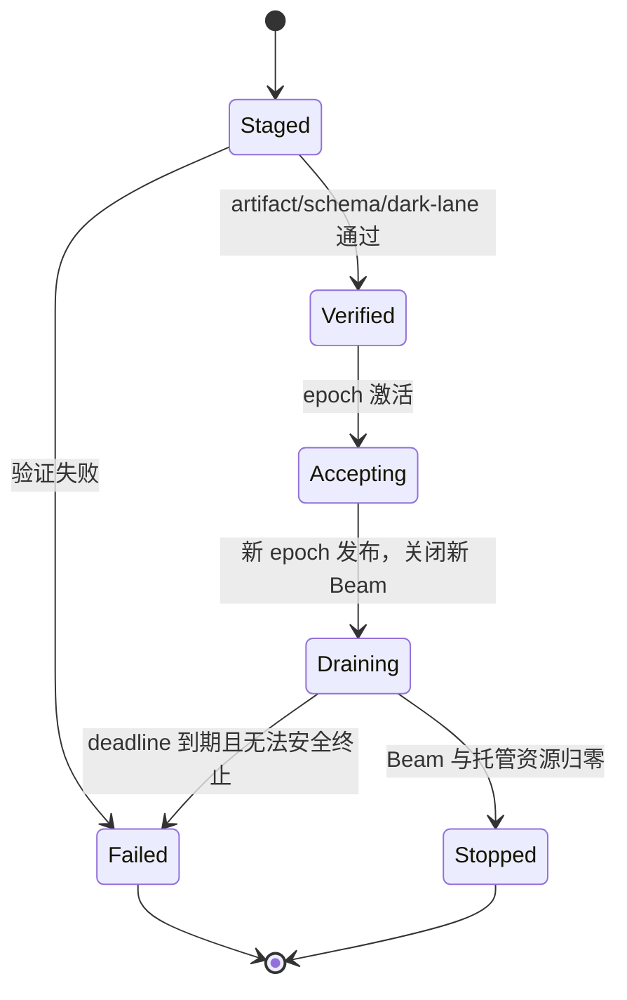

# `tokmon-n` 沿“折光因果透镜可拆卸编程范式”方向的完善方案

> 文档类型：实施路线图 / 架构补完规范草案  
> 审查基线：`tokmon-n@e243077b92c52a0253a1ca8d2dd5f60cffbfe907`  
> 编写日期：2026-08-25  
> 适用范围：Nyxia、C++ SDK、C ABI、多语言 Worker、十九个正式 Lens、Calculator 示例、CLI/Desktop 与测试体系  
> 上位规范：[DESIGN.md](DESIGN.md)  
> 背景评估：[RCLD 与 tokmon-n 客观评估](rcld-tokmon-n-comparative-objective-analysis.zh.md)

## 1. 执行摘要

`tokmon-n` 已经具备 RCLD 的主要工程骨架：append-only Photon、hash chain、不可变 LightPath snapshot、Lens `view/refract`、结构化 Act、Beam ticket、动态库换代、多语言 worker、Windows Job Object、审批与 Secret binding，以及覆盖真实文件、Git、PTY、HTTP、MCP/LSP 等边界的测试。

下一阶段不应继续扩大术语或增加更多 Lens，而应优先把以下六个基础保证做成可由运行时强制、可由测试复现的性质：

1. **历史完整性**：任意规模的 Photon 流都能分页读取、完整验证、恢复和派生，不能在 4096 或 100000 条处静默截断；
2. **代际单调性**：daemon 重启、并发 reconcile 和失败恢复后，epoch/generation 仍全局单调，不会复用身份；
3. **未来零新增贡献**：新 epoch 中不会出现已卸载 generation 的直接 Surface contribution，也不会启动指向旧 generation 的新 Act；
4. **资源归属可验证**：线程、timer、连接、进程、临时文件、watcher、Secret binding 等资源由 mount guard 托管，卸载后能枚举、停止和给出证据；
5. **副作用准入不可伪造**：审批、权限、目标 generation、schema、idempotency 和 sandbox 结果由宿主签发并绑定，模型或 Lens 不能用输入字段冒充审批结论。
6. **事实密度受控**：机械运行信号默认不进入 PhotonStore；只有影响恢复、审计、未来规范行为或外部世界的最小充分事实才被 Photon 化，模型只接收经过独立 Surface Gate 选择的有界认知面。

当前最优先的工作不是性能优化，而是修复若干会破坏上述保证的具体问题：

| 编号 | 当前问题 | 影响 | 优先级 |
|---|---|---|---|
| RCLD-001 | `read_ray()` 默认返回最早 4096 条，长 ray 的新事实可能不可见 | Surface、模型循环和自然停机错误 | P0 |
| RCLD-002 | `verify()` 最多校验前 100000 条 Photon | 超长历史的后半段未被验证 | P0 |
| RCLD-003 | recovery/admission 使用默认 `read_all()`，只读取最早 4096 条全局历史 | 在途 Act、child scope、近期审批可能被漏掉 | P0 |
| RCLD-004 | daemon 重启后 LightPath 从 epoch 1 重新开始 | epoch/generation 复用，破坏代际身份 | P0 |
| RCLD-005 | `BeamRegistry` 没有 closed-generation gate | publish/afterglow 并发窗口可重新取得旧代 ticket | P0 |
| RCLD-006 | `Act.approved` 是可输入布尔值，不是宿主准入凭证 | Lens 可能把模型输入误认为真实审批 | P0 |
| RCLD-007 | `act.proposed` 在 Act id/epoch/target 规范化前写审计 | 同一 Act 的 hash、因果 id 和 epoch 不稳定 | P0 |
| RCLD-008 | Surface contribution 缺少 generation、artifact、path hash 与输入前缀 | 无法严格证明旧代直接贡献消失 | P0 |
| RCLD-009 | in-process/C ABI Lens 的 channel、proposal、大小配额未由 host builder 强制 | manifest 权限主要依赖纪律 | P0 |
| RCLD-010 | `OpticalHost` 只有 `emit/log`，设计中的 MountGuard 未完整落地 | 资源不可统一归属和撤销 | P0 |
| RCLD-011 | 权限扩张只与“当前挂载”比较，先卸载再挂载可绕开比较 | authority expansion 审批不闭环 | P0 |
| RCLD-012 | runtime 会强制补回 Calculator | desired LightPath 不是实际能力真相 | P0 |
| RCLD-013 | Windows Job Object 主要是进程树 containment，不是文件/网络安全沙箱 | 安全强度可能被高估 | P0/P1 |
| RCLD-014 | reconcile 每次重建全部 Lens，并依次等待旧代 | 不必要换代、资源抖动，最坏可累计等待 | P1 |
| RCLD-015 | dark lane 只做空窗口 `view` smoke test | 无法发现历史、Act、停止和资源问题 | P1 |
| RCLD-016 | natural darkness 只看“当前没有 proposal” | 未建模 pending Beam、approval、child ray 和外部等待 | P1 |
| RCLD-017 | `mount.epoch-committed` 先写入、随后才 publish，且 publish 无 CAS/single-writer 证明 | 并发或故障下 durable journal 可能与 active path 不一致 | P0 |
| RCLD-018 | Photon commit 后 observer 在无异常隔离的情况下执行 | observer 抛异常时调用方可能误以为 append 未提交 | P0 |
| RCLD-019 | 缺少统一 Fact Gate 与 schema durability policy | 机械信号可能被误提交为永久 Photon，账本信噪比持续下降 | P0 |
| RCLD-020 | telemetry、flight recorder、artifact 与 durable fact 没有统一分流接口 | 调试、指标和大输出容易污染事实账本或散落在 Lens 内 | P1 |
| RCLD-021 | Photon 持久化与模型可见性没有被定义为两个独立决策 | 已持久化的审计/运行事实可能无差别进入 Surface，增加认知噪声 | P0 |

## 2. 目标：把 RCLD 从比喻变成运行时契约

### 2.1 应保留的核心方向

`tokmon-n` 应继续坚持：

- Fact/Photon 是唯一进入恢复、审计和未来规范行为的已提交事实；瞬时 Signal 只表示运行过程，不构成规范状态；
- Photon 只追加，不原地更新或删除；
- Surface 是当前 epoch 对已提交事实前缀的派生视图；
- Lens 的直接 contribution 带有宿主生成的 provenance；
- Act 是唯一允许触发外部作用的结构化意图；
- Beam 固定 epoch、target generation、deadline、permission 和 resource guard；
- LightPath 以完整不可变 snapshot 发布；
- 卸载只停止未来贡献并收敛旧代资源，不删除历史、不伪造现实回滚；
- 不可信扩展通过 worker/process/OS sandbox 隔离；
- 缓存、连接和线程可以存在，但只能作为可丢弃、可重建、可托管的工程资源存在。

### 2.2 应停止使用的绝对化表述

实现和文档都不应再承诺：

- “移除 Lens 后所有关于它的历史 token 都消失”；
- “纯函数自动保证所有物理资源被释放”；
- “线性光路天然无死锁、天然合流”；
- “模型对已卸载工具的幻觉率数学上为 0”；
- “Job Object 等同于完整安全沙箱”；
- “发布 snapshot 的耗时等同于完整拆卸耗时”；
- 未提供 benchmark 工具、原始数据和统计分布的纳秒、内存或百分比承诺。

### 2.3 建议固定的十六条运行时不变式

| ID | 不变式 | 可执行含义 |
|---|---|---|
| INV-01 | Append Only | 已提交 Photon 在 SQLite API 和数据库 trigger 层都不可 UPDATE/DELETE |
| INV-02 | Full Prefix Integrity | 对任意长度历史均验证 sequence、previous hash 和 content hash，无静默上限 |
| INV-03 | Monotonic Epoch | 同一数据目录中每个 committed/activated epoch 全局唯一、严格递增 |
| INV-04 | Immutable Path | 一次 view/refract 使用一个完整 LightPath snapshot，不跨 epoch 混读 |
| INV-05 | Provenanced Surface | 每个 contribution 都有 lens、generation、epoch、artifact hash、path hash 和输入前缀 |
| INV-06 | Current Generation Start | publish 之后启动的新 Beam 只能指向当前 snapshot 中的 generation |
| INV-07 | Host-issued Admission | 只有宿主生成的 AdmissionReceipt 能表示 allow/approval，输入布尔值无权限意义 |
| INV-08 | Act Before Reality | 外部作用之前必须已有 normalized proposal、policy decision、admission 和 `act.started` |
| INV-09 | Resource Custody | mount 创建的长期资源全部进入 ResourceLedger，并在 afterglow 后归零或明确失败 |
| INV-10 | No Silent Side Channel | T2/T3 Lens 无法绕过 worker bridge；T0/T1 同进程 Lens 明确属于可信边界 |
| INV-11 | History-preserving Detach | 卸载不删除旧 Photon；新 epoch 不再产生旧代直接 contribution/Act |
| INV-12 | Bounded Failure | I/O、worker、Beam、approval、loop 和 afterglow 都有显式 deadline/budget/fail-closed 结果 |
| INV-13 | Minimal Durable Fact | Photon 是通过 Fact Gate 的最小充分语义事实，不是任意内部事件、日志或数据帧 |
| INV-14 | Durability Separation | transient signal、telemetry、flight record、artifact 与 durable Photon 使用不同存储和生命周期 |
| INV-15 | Bounded Cognitive Surface | 无论 Photon 历史多长，每次模型 Surface 都受 channel/token/byte/relevance budget 约束 |
| INV-16 | Dropped Signal Non-Normativity | 被丢弃或采样的 signal 不得偷偷决定未来规范行为；若会影响行为，必须提交其最小决定性结果 |

### 2.4 两道门：Fact Gate 与 Surface Gate

RCLD 不应被实现成“运行时发生的一切都是 Photon”。正确关系是：

> **所有 Photon 都是事件，但绝大多数运行时事件不应成为 Photon。**

系统必须把“是否持久化”和“是否给模型看”定义成两个独立、确定性的决策：

```text
运行时 Signal
    │
    ▼
Fact Gate：是否值得持久化？
    ├─ drop：立即丢弃
    ├─ ring：只进入有界 flight recorder
    ├─ metric：聚合为 counter/gauge/histogram
    ├─ telemetry：短期、可采样的诊断存储
    ├─ blob：大内容写 ArtifactStore，只提交引用
    └─ photon：提交最小充分语义事实
                    │
                    ▼
Surface Gate：当前模型是否需要看？
    ├─ never：仅审计/恢复，永不进入模型
    ├─ fold：确定性折叠成当前状态
    ├─ retrieve：仅相关性命中时加入
    ├─ summarize：有来源引用的有损摘要
    └─ current：在严格预算内进入当前 Surface
```

这两道门分别解决不同问题：

- Fact Gate 控制存储成本、恢复语义、审计密度和运行效率；
- Surface Gate 控制 token 成本、模型注意力、过期信息、幻觉诱因和认知稳定性。

不能通过“少存 Photon”代替 Surface 选择，也不能因为某 Photon 值得审计就默认让模型看到它。

#### 2.4.1 五类运行时信息

| 类别 | 默认处理 | 典型内容 | 是否允许影响规范状态 |
|---|---|---|---:|
| Transient Signal | drop 或 bounded stream | 函数调用、queue push/pop、scheduler tick、正常 heartbeat、token chunk | 否 |
| Operational Metric | 聚合 | 延迟、吞吐、内存、queue depth、重试计数、Lens view 耗时 | 否 |
| Diagnostic Trace | flight recorder/短期 telemetry | worker frame、最近 N 条内部状态、debug log、部分 stdout | 否 |
| Recoverable Fact | Photon | user input、workflow step、mount activation、Act lifecycle、memory decision | 是 |
| Security/External Fact | 强制 Photon | approval、authority change、Secret consume、文件写入、消息发送、不可逆 receipt | 是 |

#### 2.4.2 Photon 化判定

一个事件只有满足至少一个条件时才进入 PhotonStore：

```text
Persist(event) =
    required_for_crash_recovery
 OR required_for_security_or_audit
 OR changes_future_normative_behavior
 OR crosses_an_external_boundary
 OR is_a_user_visible_semantic_result
```

如果以上条件全部为否，应进入 drop/metric/ring/telemetry，而不是以“以后可能调试有用”为理由永久保存。

反向约束同样重要：如果一个 transient signal 会改变未来行为，就必须提交其最小决定性结果。例如无需保存模型的每个 token chunk，但必须保存最终 tool call；无需保存每次 policy 函数内部判断，但必须保存最终 policy/approval receipt。

#### 2.4.3 持久化策略属于 schema

建议每个 schema 声明：

```yaml
kind: process.stdout-chunk
durability: transient       # transient | telemetry | recoverable | audit
retention: none             # none | session | 7d | permanent | policy:<id>
aggregation: stream         # none | counter | gauge | histogram | coalesce | stream
payload_policy: blob_ref    # inline | hash_only | blob_ref
model_visibility: never     # never | fold | retrieve | summarize | current
sensitivity: normal
rate_limit: 100/s
max_payload_bytes: 65536
```

这些字段由 Nyxia 的 SchemaRegistry 和 Fact Gate 强制，Lens 不能自行把 `transient` schema 提升为永久事实，也不能把 `model_visibility: never` 的内容直接注入 Model Surface。

#### 2.4.4 默认分类示例

| 信息 | 默认去向 | 持久化结果 |
|---|---|---|
| streaming token/chunk | ephemeral stream | 最终 response 或中断摘要 Photon |
| 正常 worker heartbeat | metric/drop | 只在 unhealthy/recovered 状态变化时提交 Photon |
| tool stdout/stderr chunk | ring/blob stream | terminal Photon 保存 BlobRef、hash、size、truncated |
| Lens view 开始/结束 | histogram | 不提交 Photon；失败时提交有界诊断事实 |
| scheduler poll/tick | drop | 只提交 quiescent/budget-exhausted/cancelled 状态变化 |
| filesystem watcher burst | debounce/coalesce | 一条规范化 `workspace.changes-observed` Photon |
| retry sleep | metric | 最终结果中记录 attempts/backoff summary |
| approval/authority expansion | audit Photon | 永久、不可采样、默认不直接进入模型 |
| 大文件、长日志、模型原始响应 | ArtifactStore | Photon 只保存 BlobRef、hash、size、provenance |

## 3. 建议的目标对象模型

### 3.1 Surface provenance 必须扩展

当前 `SurfaceContribution` 只有 `lens/channel/key/value/priority`。建议扩展为：

```cpp
struct SurfaceProvenance {
  LensId lens;
  GenerationId generation;
  MountEpoch epoch;
  std::string artifact_hash;
  std::string light_path_hash;
  std::uint64_t input_tail_sequence;
  std::string input_tail_hash;
};

struct SurfaceContribution {
  ContributionId id;
  SurfaceProvenance provenance;
  std::string channel;
  std::string key;
  cbor::Value value;
  std::int32_t priority{0};
  std::string content_hash;
  std::size_t ordinal{0};
};

struct SurfaceSnapshot {
  MountEpoch epoch;
  std::string light_path_hash;
  std::uint64_t input_tail_sequence;
  std::string input_tail_hash;
  std::vector<SurfaceContribution> contributions;
  std::vector<ActProposal> proposals;
  std::string surface_hash;
};
```

这些字段应由 Nyxia 创建的 `SurfaceBuilder` 填入，Lens 只能提供 channel/key/value/priority，不能自报 provenance。

### 3.2 Proposal、Resolved Act 和 AdmissionReceipt 分层

当前单个 `Act` 同时承载模型提议、目标解析、审批和执行字段，容易混淆信任边界。建议拆分：

```cpp
struct ActProposal {
  ActId id;
  RayId ray;
  std::string kind;
  std::string schema;
  cbor::Value parameters;
  LensId requested_target;
  ProposalProvenance proposer;
  RiskClass claimed_risk;
  std::string idempotency_key;
  std::chrono::milliseconds timeout;
};

struct ResolvedAct {
  ActProposal proposal;
  LensId target;
  GenerationId target_generation;
  MountEpoch epoch;
  RiskClass effective_risk;
  std::string normalized_hash;
};

struct AdmissionReceipt {
  AdmissionId id;
  ActId act;
  std::string act_hash;
  AdmissionDecision decision;
  std::string policy_hash;
  std::optional<PhotonId> approval_photon;
  MountEpoch epoch;
  GenerationId target_generation;
  std::chrono::system_clock::time_point expires_at;
  std::string receipt_hash;
};
```

`approved` 不再是来自模型或 Lens 的布尔字段。若为兼容保留，应在反序列化时忽略，在 admission 后由宿主派生只读视图。

### 3.3 Mount 与资源对象

```cpp
enum class MountState { staged, verified, accepting, draining, stopped, failed };

struct MountIdentity {
  LensId lens;
  GenerationId generation;
  MountEpoch epoch;
  std::string artifact_hash;
};

class MountGuard {
 public:
  Result<BeamTicket> acquire_beam(const ResolvedAct& act);
  void close_admission() noexcept;
  void request_stop() noexcept;
  Result<ResourceReport> drain_until(Deadline deadline);
  Result<ResourceReport> force_stop();
  ResourceSnapshot resources() const;
};
```

推荐生命周期：



## 4. P0：必须先修复的正确性与安全边界

### 4.1 RCLD-001/002/003：长历史读取、验证和恢复

#### 当前问题

- `PhotonStore::read_ray()` 默认 `limit=4096`，查询从 sequence 0 正序读取，因此长 ray 只返回最早 4096 条；
- `RayTracingEngine::view()` 直接使用这个默认读取，超过上限的新用户消息、Act 结果和停止事实可能不进入 Surface；
- `recover_inflight_acts()` 与 admission callback 使用默认 `read_all()`，只看到最早 4096 条全局事件；
- `PhotonStore::verify()` 调用 `read_all(0, 100'000)`，超过 100000 条后的链不被校验；
- 上述行为没有返回 `truncated=true`，调用方会把不完整前缀误认为完整历史。

#### 目标改造

1. 删除“返回 vector 但不声明是否截断”的历史 API；
2. 提供 cursor/page API：

```cpp
struct PhotonPage {
  std::vector<Photon> items;
  std::uint64_t next_after_sequence;
  bool has_more;
};

Result<PhotonPage> read_ray_page(RayId, Sequence after, PageSize);
Result<PhotonPage> read_global_page(Sequence after, PageSize);
Result<PhotonPage> read_ray_tail(RayId, PageSize);
Result<void> for_each_photon(Sequence after, Visitor);
Result<IntegrityReport> verify_all(VerifyCheckpoint checkpoint = {});
```

3. recovery 使用索引查询未终结 Act，而不是扫描首个固定窗口；
4. approval/child scope 使用 ray-local、kind-indexed、倒序 bounded query；
5. Surface 通过 projection checkpoint + tail 构造，不直接无限加载 vector；
6. 对任何有硬上限的 API 返回 `has_more/truncated`，禁止静默截断。

#### 数据库建议

- 为 `caused_by_act, kind, sequence` 增加覆盖索引；
- 为 `ray, kind, sequence DESC` 增加查询索引；
- 增加独立的完整性 checkpoint 表，记录已验证 tail sequence/hash；
- checkpoint 只是派生加速状态，损坏后必须能从 Photon 1 重建；
- `verify_all()` 分页迭代到真实 tail，不得以 100000 为正确性边界。

#### 验收标准

- 构造 4097、100001 和百万级 Photon fixture，最后一条均能进入正确 Surface；
- 篡改第 100001 条或其 previous hash，启动完整性验证必须失败；
- 第 5000 条后的 `approval.granted` 能被 admission 找到；
- 第 5000 条后的 `act.started` 在崩溃恢复时生成 `act.outcome-unknown`；
- 所有分页 API 对空页、页边界、并发 append 和 cursor gap 有测试。

#### 代码落点

- `sdk/cpp/include/tokmon/photon_store.hpp`
- `nyxia/storage/photon_store.cpp`
- `nyxia/runtime/runtime.cpp`
- `nyxia/engine/ray_tracing_engine.cpp`
- `tests/unit/core_tests.cpp`

### 4.2 RCLD-004：epoch/generation 跨重启单调

#### 当前问题

`LightPath` 构造时 active epoch 为 0；runtime 打开已有数据库后没有恢复最近 committed/activated epoch，`reconcile()` 又使用 `current->epoch + 1`。daemon 重启后会再次产生 epoch 1，generation 也按 `epoch * 1000` 重新分配。

这会破坏：

- Act/approval/Secret binding 的代际唯一性；
- “旧 generation 不可能重新出现”的假设；
- path hash、审计和 replay 的身份稳定性；
- Surface 直接贡献消失定理。

#### 目标改造

1. 启动时从 mount journal 恢复最大 epoch；
2. epoch allocator 存入独立元数据表，使用单事务 `next_epoch()`；
3. generation 使用全局单调 allocator 或随机 128-bit MountId，不再依赖 `epoch*1000`；
4. 区分 `mount.epoch-prepared`、`mount.epoch-activated`、`mount.epoch-aborted`；
5. 启动发现 prepared 未 activated 时，依据 config hash/artifact existence 明确 abort 或重新 stage，不能静默复用；
6. 当前 active path 必须与最后 activated journal 一致，并追加 recovery evidence。

#### 验收标准

- 同一数据库连续启动三次，epoch 严格递增；
- 在 prepare、Photon commit、snapshot publish、afterglow 各点注入崩溃，恢复结果唯一且可解释；
- 旧 approval/secret binding 在重启后的新 generation 绝不匹配；
- 并发调用 reconcile 只能有一个 coordinator writer。

### 4.3 RCLD-005：关闭旧 generation 的 Beam admission 竞态

#### 当前问题

`BeamRegistry::stop_generation()` 只对已经存在的 ticket 调用 `request_stop()`；registry 不记录某 generation 已关闭。持有旧 LightPath snapshot 的线程可能在 publish/stop 之后才调用 `acquire()`，重新创建旧代 ticket。

#### 目标改造

- `acquire()` 返回 `Result<BeamTicket>`，必须检查 mount state；
- generation 进入 `draining` 后永久拒绝新 ticket；
- ticket acquisition 与 active epoch/generation 检查共享同一线性化机制；
- 旧 snapshot 获取 ticket 失败后，调用方只允许重新从当前 LightPath 解析，不得自动把旧 Act 路由到新 target；
- afterglow 记录 `admission_closed_at`、已有 ticket 数、完成数、取消数、强杀数和最终资源数。

#### 推荐发布顺序

1. candidate 全量 stage/verify，guard 尚不 accepting；
2. coordinator 序列化进入 publish critical section；
3. 原子发布新 active snapshot；
4. 新 guard 进入 accepting，旧 guard 进入 draining；
5. `acquire()` 以当前 active mount identity 校验，因此 publish 后旧 snapshot 不能新建 Beam；
6. 等待 publish 前已获得的旧 ticket；
7. cooperative cancel；
8. worker/process 强制终止；
9. 资源 ledger 归零后记录 stopped。

#### 验收标准

- 用 barrier 精确制造“旧 snapshot 已取得但尚未 acquire”的竞态，publish 后 acquire 必须返回 stale generation；
- 高并发 reconcile/refract 压测中，`beam.started_at > epoch.activated_at` 的 ticket 必须属于新 snapshot；
- afterglow 完成 Photon 不得在 `active_beams > 0` 时声称成功，应区分 completed/degraded/failed。

### 4.4 RCLD-006/007：审批凭证和 Act 审计规范化

#### 当前问题

- `Act.approved` 可由输入携带；部分 Lens 直接检查该字段；
- pipeline 的真实 admission decision 没有结构化 receipt；
- `act.proposed` 在 pipeline 分配 id、填 epoch、解析 target/generation 之前写入；
- proposed、admitted、started 的 act hash 可能不是同一个规范对象；
- rejected Photon 不总是绑定同一个 `caused_by_act`。

#### 目标改造

Act 生命周期固定为：

```text
raw proposal
→ normalize id/ray/kind/schema/parameters/timeout
→ append act.proposed (proposal_hash)
→ resolve exact target + generation + epoch
→ validate schema + authority + risk
→ evaluate policy/approval
→ append admission.decided (AdmissionReceipt)
→ reserve idempotency key
→ append act.started
→ perform effect
→ append exactly one terminal outcome
```

要求：

- 删除或忽略外部输入的 `approved`；
- Lens 只接收 `ResolvedAct + AdmissionReceiptView`；
- `AdmissionReceipt` 绑定 act hash、policy hash、approval Photon、epoch、generation、deadline；
- policy allow 与人类 approval 是不同 evidence；
- 所有审计 Photon 使用相同 ActId；
- 每次 hash 变化都必须形成新的 proposal/revision，不能原地改 Act 后沿用旧审计。

#### 验收标准

- 输入 `approved=true` 且无审批 Photon，所有 ask/irreversible Act 仍被拒绝；
- 修改参数、target、generation、deadline 任一字段都会使旧 receipt 失效；
- one-shot approval 被使用一次后不可重放；
- session approval 仍受 target generation、epoch、kind、deadline 和 policy 上界约束；
- 一个 `act.started` 最终只有 completed/rejected/failed/cancelled/outcome-unknown 中一种终态。

### 4.5 RCLD-008/009：Surface provenance、channel 与配额强制

#### 当前问题

- contribution 只有 LensId，没有 generation/epoch/artifact/path/input tail；
- `SurfaceBuilder` 不检查 manifest `view_channels`；
- worker proxy 会做部分 channel/permission 检查，但同进程 Lens 和 C ABI 路径没有同等强制；
- proposal 没有 proposer generation，任何 Lens 都能提出指向任意 target 的 Act；
- contribution count、单项大小、总字节数、priority 范围和重复 key 没有统一限制；
- Surface 只按 priority stable sort，没有正式 collision/fold 规则。

#### 目标改造

由 Nyxia 为每个 mounted Lens 创建受限 builder：

```cpp
SurfaceBuilder builder(SurfaceBuildPolicy{
  .mount = mounted.identity,
  .light_path_hash = path.hash,
  .input_tail = window.tail_ref(),
  .allowed_channels = manifest.view_channels,
  .can_propose_acts = has_permission("act.request"),
  .max_contributions = limits.surface_items,
  .max_total_bytes = limits.surface_bytes,
  .priority_range = {-1000, 1000},
});
```

统一强制：

- channel allowlist；
- proposal permission；
- contribution/proposal 数量与 CBOR 大小；
- UTF-8、schema、key 长度；
- source provenance 由 host 覆盖；
- 同 channel/key 的 replace/merge/error 策略由 channel schema 声明；
- Surface 完成后计算 canonical `surface_hash`；
- model request 记录 `surface_hash + contribution ids + tool schema hash + path hash`。

#### 验收标准

- in-process、C ABI、Node、Python、WASM 对违规 channel 得到相同错误；
- Lens 不能伪造另一个 lens/generation 的 contribution；
- 卸载后新 Surface 中不存在旧 generation 的直接 contribution；
- history/audit Lens 仍可合法显示“旧 Lens 曾经存在”，证明没有删除历史；
- 超量贡献 fail closed，并追加有界、脱敏的 `lens.view-rejected` 诊断。

### 4.6 RCLD-010：实现真正的 MountGuard 与受限 OpticalHost

#### 当前问题

当前 `OpticalHost` 只暴露 `emit/log`。线程、timer、socket、HTTP endpoint、watcher、PTY、process、临时文件和 Secret binding 分散在 Lens 或 common helper 中；一些 Lens 需要在 destructor/`request_stop()` 手工清理。

全局 Secret binding map 也不属于某个 mount，虽然有 expiry 和 one-shot 约束，但卸载时不能按 generation 一次性枚举撤销。

#### 目标接口

```cpp
class OpticalHost {
 public:
  virtual SignalSink& signals() noexcept = 0;
  virtual MetricSink& metrics() noexcept = 0;
  virtual FlightRecorder& debug() noexcept = 0;
  virtual ArtifactStore& artifacts() noexcept = 0;
  virtual PhotonEmitter& photons() noexcept = 0;
  virtual HostedTasks& tasks() noexcept = 0;
  virtual HostedTimers& timers() noexcept = 0;
  virtual HostedIo& io() noexcept = 0;
  virtual HostedProcesses& processes() noexcept = 0;
  virtual HostedSubscriptions& subscriptions() noexcept = 0;
  virtual HostedSecrets& secrets() noexcept = 0;
  virtual HostedTemp& temporary() noexcept = 0;
  virtual LensLogger& logger() noexcept = 0;
  virtual const CapabilitySet& capabilities() const noexcept = 0;
};
```

每个 hosted resource 都必须具有：

- `resource_id`；
- `mount identity`；
- 创建 Act/Beam；
- capability；
- deadline/budget；
- cooperative cancel；
- force-close 策略；
- 当前状态；
- 无 secret 的诊断信息。

#### 迁移顺序

1. 先建立 `MountGuard + ResourceLedger`，允许旧 helper 通过 adapter 注册；
2. 迁移 Secret binding 和 Nota exporter/Prometheus endpoint；
3. 迁移 watcher/timer/subscription；
4. 迁移 HTTP/process/PTY/temp file；
5. 禁止官方 Lens 直接创建长期系统资源；
6. 对第三方同进程 Lens 只开放 T0/T1 官方签名白名单；其余强制 worker。

#### 验收标准

- inspector 能列出每个 generation 的活动资源；
- 卸载后 ledger 为零，或给出具体 leaked resource 并将 mount 标成 failed；
- Secret binding 在 generation draining 时全部撤销并清零；
- Lens 忘记手写 cleanup 时，host 仍能关闭托管资源；
- 同进程恶意代码仍不属于可证明隔离范围，文档明确这一边界。

### 4.7 RCLD-011：权限扩张审批必须持久、不可绕过

#### 当前问题

reconcile 只把候选 permission 与当前同 id Lens 比较。若先卸载 Lens，再以更大权限重新挂载，当前 snapshot 中找不到 previous mount，就可能绕过“权限扩张需要显式批准”的检查。

#### 目标改造

- 建立 append-only `lens.authority-baseline`；
- authority identity 至少包含 lens id、signer、artifact lineage；
- 新权限与历史批准过的最大/最近 authority 比较，而不仅是当前 mount；
- expansion 生成独立 `authority.expansion-proposed`；
- 人类批准绑定 candidate artifact hash、permission diff、runtime、trust、workspace scope 和过期时间；
- 项目配置只能收紧用户 trust boundary；
- 降权可自动允许，但需写 `authority.reduced`；
- signer/lineage 改变按新主体处理，默认 ask/deny。

#### 验收标准

- remove → re-add 不能绕过 expansion approval；
- artifact 内容改变但 manifest permission 相同，仍依据 signer/lineage policy 决定是否重新批准；
- approval 不能从一个 workspace/candidate hash 重放到另一个。

### 4.8 RCLD-012：移除 Calculator 隐式常驻

Calculator 应是：

- SDK 示例；
- 集成测试 fixture；
- demo profile 可选 Lens。

它不应由 `runtime.cpp:683-689` 在候选路径缺失时强制补回。否则 desired/current diff、卸载测试、能力表面和“所有业务 Lens 可配置”都不真实。

验收标准：空 LightPath、最小 LightPath、无 Calculator 的正式 LightPath 都能合法启动；只有依赖 Calculator 的 demo test 显式配置它。

### 4.9 RCLD-013：区分 containment 与 security sandbox

Windows Job Object 的 `KILL_ON_JOB_CLOSE` 能控制进程树生命周期，但默认不阻止：

- 访问用户可读写文件；
- 访问宿主网络；
- 读取继承的环境和用户凭据；
- 调用同权限 Win32 API；
- 与同用户进程交互。

因此应建立清晰的强度等级：

| 等级 | 保证 | 可用机制 |
|---|---|---|
| C0 cooperative | 仅 stop token/协议 shutdown | 同进程可信 Lens |
| C1 containment | 进程树、deadline、输出、PID/内存限制 | Job Object / cgroup / rlimit |
| C2 capability sandbox | 文件、网络、环境、进程、Secret 按 allowlist 限制 | AppContainer、低完整性 token、Linux namespaces/seccomp、macOS sandbox、容器 |
| C3 strong isolation | 独立 VM/远端执行与受控数据通道 | microVM、专用 runner |

manifest 和 Photon 必须报告实际达成等级，不能把请求的 C2 退化成 C1 后仍返回成功。Styx 已采用 fail-closed 思路，应把它推广到 worker launcher。

### 4.10 Schema Registry 必须进入 Nyxia append/admission 边界

当前部分工具参数由 Lens 内的 schema validator 检查，但 PhotonStore 本身只要求 kind/schema 非空；`schema_bundle` 更多用于 artifact evidence，尚未形成统一运行时 schema registry。

建议：

- 系统 schema 由 Nyxia 内置并版本化；
- Lens artifact schema bundle 在 stage 时注册到 candidate-local registry；
- `SurfaceBuilder::propose` 和 admission 前校验 Act parameters；
- `RefractionBeam::commit_fact` 校验 Lens 是否声明可发该 durable Photon kind/schema，并校验 payload；`progress/metric/artifact` 分别走独立策略；
- schema identity 使用稳定 URI/semantic version/hash；
- 同 schema id 不同 hash 默认拒绝；
- backward/forward compatibility 规则显式声明；
- unknown schema 在可信开发 profile 可诊断，在 production profile fail closed。

### 4.11 RCLD-017/018：明确持久提交、内存激活和 observer 语义

#### 当前问题

- reconcile 先追加 `mount.epoch-committed`，再调用 `LightPath::publish()`；
- `LightPath::publish()` 先 load current、再 atomic store candidate，没有 compare-and-swap，也没有接口层可见的 single-writer guard；
- 若出现并发 reconcile、publish 失败或两步之间进程崩溃，Photon 中的“committed”可能不代表该 snapshot 曾经成为 active；
- `PhotonStore::append()` 在 SQLite COMMIT 后调用 observer，observer 异常未隔离。此时事实已经持久化，但上层可能收到异常并错误重试。

#### 目标改造

1. 将术语分成 `prepared`、`activated`、`aborted/recovered`，不再让 committed 同时表示数据库决定和内存可见；
2. MountCoordinator 保证单 writer，LightPath publication 使用预期 epoch 的 CAS 或等价序列化断言；
3. `mount.epoch-prepared` 写入候选 identity；active snapshot 切换成功后再追加 `mount.epoch-activated`；
4. 若 activated Photon 写入失败，runtime 进入 degraded/fail-stop，启动恢复时依据 active marker 和 candidate journal 作唯一协调；
5. observer 必须是 `noexcept` 通知边界，单个 observer 失败只追加/记录诊断，不能改变已提交 append 的返回语义；
6. 需要可靠消费的组件使用持久 cursor 拉取 Photon，不依赖易失 observer 回调提供 exactly-once。

#### 验收标准

- 两个 reconcile 并发时只有一个 epoch 被激活，另一个重新基于新 current 计算或明确失败；
- 在 prepared、publish、activated evidence 三个位置注入崩溃，恢复后 current/journal 唯一一致；
- observer 主动抛异常时 Photon 仍只提交一次，调用方收到稳定的“提交成功、通知失败已隔离”语义；
- 不允许因 observer 异常重复执行对应外部 Act。

### 4.12 RCLD-019/020/021：实现 Fact Gate、运行分流和 Surface Gate

#### 当前问题

- `RefractionBeam::emit()` 的语义默认是向 PhotonStore 提交事实，缺少 progress/metric/artifact/fact 的类型区分；
- 机械运行事件是否持久化主要由各 Lens 自行判断，没有统一 schema policy 和 rate/retention enforcement；
- debug log、指标、大 stdout、stream chunk、状态变化容易使用不同临时方案，缺少统一 flight recorder/telemetry/artifact 分流；
- “已持久化”与“模型可见”没有统一的正交策略，Surface Lens 可能重新投影大量审计或机械事实；
- 大 payload 若直接进入 Photon，会放大 SQLite、hash、CBOR、备份、回放与模型筛选成本。

#### 目标接口

```cpp
enum class DurabilityClass {
  transient,
  telemetry,
  recoverable,
  audit,
};

enum class ModelVisibility {
  never,
  fold,
  retrieve,
  summarize,
  current,
};

struct FactPolicy {
  DurabilityClass durability;
  ModelVisibility model_visibility;
  RetentionPolicy retention;
  AggregationPolicy aggregation;
  PayloadPolicy payload;
  RateLimit rate_limit;
  std::size_t max_payload_bytes;
};

class RefractionBeam {
 public:
  Result<void> progress(SignalFrame frame);       // ephemeral
  Result<void> metric(MetricSample sample);       // aggregated
  Result<ArtifactRef> artifact(ArtifactDraft);    // content addressed
  Result<Photon> commit_fact(FactDraft draft);    // Fact Gate
};
```

`commit_fact()` 的处理顺序：

```text
resolve schema policy
→ verify Lens emit permission
→ validate payload schema/size/sensitivity
→ apply rate/coalesce rule
→ convert large payload to BlobRef when required
→ attach host provenance
→ append recoverable/audit Photon
→ notify durable consumers
```

`progress()`、`metric()` 和 `debug()` 不得被 Lens 当作隐式规范状态；如果它们的结果将影响下一步 Act、恢复或用户可见结果，Lens 必须显式提交相应最小 Fact。

#### Flight recorder

每个 process、ray、mount 可以拥有有界 flight recorder：

```text
按条数和字节双重上限保存最近窗口
→ 正常运行时覆盖旧记录
→ crash/security/error 触发冻结
→ 脱敏并写入诊断 Artifact
→ 只提交一条 diagnostic.captured Photon 引用
```

flight recorder 不是事实账本，不能参与正常业务 fold。它只用于故障诊断，并受 retention/sensitivity policy 控制。

#### 典型流程改造

模型调用：

```text
token chunks → Snow ephemeral stream
usage/latency → metrics
raw response → inline 或 ArtifactRef
final semantic response → model.completed Photon
```

进程执行：

```text
stdout/stderr chunks → bounded UI stream + flight recorder
完整大输出 → ArtifactStore
exit_code/hash/BlobRef/duration/truncated → process.completed Photon
```

文件 watcher：

```text
OS notifications → transient queue
→ debounce/deduplicate/rename normalization
→ workspace.changes-observed Photon
```

Lens view：

```text
duration/count/bytes → metrics
normal start/end → 不提交 Photon
deterministic view failure/state transition → 有界 diagnostic/recoverable Photon
```

#### Surface Gate

Surface Gate 应按 channel 应用独立预算和选择规则：

| Channel | 默认策略 |
|---|---|
| system/instruction | 固定上限、显式来源、最高优先级 |
| current user task | 优先完整保留 |
| active tools | 只包含当前 generation，经 schema 去重 |
| workflow/current state | 确定性 fold 后的紧凑结构 |
| recent dialogue | token-aware 滑动窗口 |
| relevant memory/RAG | top-k、threshold、source refs、去重 |
| tool results | 摘要 + ArtifactRef，按需展开 |
| diagnostics/telemetry/audit | 默认 `never`，仅显式诊断任务检索 |

Surface materialization 必须记录：

- 输入 tail sequence/hash；
- LightPath epoch/path hash；
- 各 channel 输入/保留/丢弃的 item 和字节/token 估算；
- contribution provenance；
- truncation/retrieval/summarization 原因；
- 最终 `surface_hash` 和 tool schema hash。

#### 验收标准

- 百万机械 signal 可以被处理，但 Photon 数只随语义状态变化增长，不随 scheduler tick/heartbeat/token chunk 线性增长；
- 安全审计 schema 不得被 sampling/drop；
- `durability: transient` 的 schema 不能通过任何 runtime 进入 PhotonStore；
- `model_visibility: never` 的 Photon 不会进入普通模型请求；
- 删除 telemetry、flight recorder、artifact cache 和 projection 后，不改变规范 Photon 历史与可重建状态；
- 大工具输出只产生有界 Photon 和可校验 ArtifactRef；
- 若被 drop 的 signal 会影响后续 Act，属性测试必须失败，迫使实现提交最小决定性 Fact；
- Surface 在百万 Photon 历史下仍满足固定 channel/token/byte budget。

#### 代码落点

- `sdk/cpp/include/tokmon/lens.hpp`
- `sdk/cpp/include/tokmon/photon.hpp`
- 新增 `sdk/cpp/include/tokmon/fact_policy.hpp`
- 新增 `nyxia/facts/fact_gate.cpp`
- 新增 `nyxia/telemetry/flight_recorder.cpp`
- `nyxia/engine/ray_tracing_engine.cpp`
- `nyxia/loader/manifest_io.cpp`
- `lenses/nota/nota_lens.cpp`
- `lenses/textus/textus_lens.cpp`
- `lenses/chora/chora_lens.cpp`

## 5. P1：补齐完整换代、规模化与故障恢复

### 5.1 desired/current diff，而不是每次重建全部 Lens

当前 reconcile 会 stage 所有 enabled Lens、发布全部新 generation，再对全部旧 Lens 做 afterglow。应按以下 identity 判定复用：

```text
(lens id, artifact hash, runtime, runtime version,
 manifest hash, permission set, config projection hash)
```

分为：

- unchanged：复用同一 mount/generation；
- config-only R0：只替换不可执行派生数据；
- replace R1/R2：新 generation；
- add；
- remove；
- authority expansion：等待批准；
- rejected：保留旧 active path，不发布半候选。

afterglow 只处理 removed/replaced generation，并行 drain，不应按 Lens 串行等待最多 2 秒造成线性累积。

### 5.2 完整 dark lane

dark lane 至少包含：

1. artifact/hash/signature/SBOM/schema 校验；
2. manifest dependency/conflict/order/pattern overlap；
3. 历史采样 replay；
4. 同一输入两次 view 的 canonical hash 比较；
5. contribution channel/schema/size/quota；
6. synthetic Act resolve/admission/refract dry-run；
7. 禁止真实 emission，或使用 withholding sandbox；
8. worker crash/timeout/oversized frame/malformed CBOR；
9. request_stop deadline；
10. ResourceLedger baseline/delta；
11. authority diff；
12. 新旧 Surface diff 与 tool schema diff。

dark lane 结果应追加 `lens.candidate-verified/rejected`，包含测试集版本、输入 prefix hash、输出 surface hash、资源报告和实际 sandbox strength。

### 5.3 派生投影、checkpoint 与缓存

长会话不能每次把所有 Photon 复制进 vector 并让每个 Lens 从头扫描。建议引入可丢弃的 host-owned projection cache：

```text
ProjectionKey = lens artifact hash
              + projector schema version
              + ray id
              + input tail hash

ProjectionCheckpoint = folded state
                     + covered sequence/hash
                     + checksum
```

规则：

- cache 不是事实，删除后可从 Photon 重建；
- cache 必须按 artifact/projector version 隔离；
- epoch 可复用相同 Lens 的纯 projection，但 contribution 必须重新绑定当前 epoch；
- checkpoint 不得覆盖未验证前缀；
- compaction 只生成 archive/checkpoint Photon，不改写旧 Photon；
- 每个 Lens 声明 reducer 的确定性版本和最大状态大小。

这能同时解决性能和“允许工程缓存但不让缓存成为规范状态”的矛盾。

### 5.4 natural darkness 与调度器

建议把 ray 状态明确建模为：

```text
running
waiting_model
waiting_act
waiting_approval
waiting_child
waiting_external
quiescent
budget_exhausted
cancelled
failed
```

自然熄灭条件应是：

- 当前 Surface 无可执行 proposal；
- 无 active Beam；
- 无 pending approval；
- 无未完成 child join；
- 无已登记的外部 wake-up；
- 没有被 dedupe/repeat detector 判定为尚可推进的新信息；
- 最后一个模型/工具 stream 已终结。

多个 proposal 不能永远只取 `front()`；应有确定性 scheduler、priority/fairness、conflict set 和同一 beat 的最大并发规则。

### 5.5 外部作用、幂等和补偿

RCLD 不应承诺现实可逆，但应让不可逆性成为结构化事实。

建议扩展 effect class：

| 类型 | 例子 | 运行时策略 |
|---|---|---|
| acquisition | 打开连接、创建 watcher | guard 托管并可关闭 |
| local reversible | 临时文件、临时 worktree | 记录 inverse/cleanup，由 guard 执行 |
| withheld emission | 草稿消息、待提交写入 | approval 后才真正提交 |
| compensable emission | 可撤销发布、可回滚部署 | 记录 compensation Act，不宣称严格逆 |
| irreversible emission | 支付、已发送消息 | 强审批、idempotency、receipt、禁止自动重试 |

建立 idempotency ledger：

- key 在 effect 前原子 reserve；
- terminal 后记录 outcome hash；
- duplicate 返回已有 outcome 或明确 conflict；
- crash 后为 `outcome-unknown`，禁止自动重放 irreversible Act；
- compensation 是新 Act/Photon，不删除原结果。

### 5.6 artifact、签名与可重复构建

需要完善：

- builtin artifact hash 不能仅是 `sha256("builtin:<id>:0.1.0")`，应绑定实际二进制/build manifest；
- HMAC 适合本地共享信任，不适合作为开放分发的发布者签名；生产 artifact 建议支持 Ed25519/平台代码签名；
- trusted signer 只有验证权，不应因此获得伪造发布物的共享密钥；
- schema bundle、SBOM、runtime、dependency tree、compiler/SDK ABI 都进入签名 material；
- stage 后从内容寻址、只读目录加载，防止验证后替换；
- loader 检查实际 runtime/trust/replacement 组合，例如 T2 native 不得 in-process；
- semantic version 使用真正 parser，不能用字符串字典序比较。

### 5.7 Worker Protocol 与资源配额

当前已有 frame 大小和 deadline 基础，应继续补齐：

- protocol major/minor + feature negotiation；
- startup ready 包含 SDK ABI、schema hash、artifact hash；
- per-request frame、总输出、日志、contribution、draft 数量配额；
- `memory_mb`、PID、CPU、wall clock 在实际 OS 机制中执行；
- 清理继承环境、cwd、handle/fd；
- heartbeat 或同步 request deadline 后的 kill evidence；
- worker 不得直接决定 provenance、approval 或 final epoch；
- shutdown、cancel、crash、partial frame、stdout pollution 均有 contract tests；
- Node/Python/WASM 的错误语义和 C++ `Result` 对齐。

### 5.8 完整 crash-recovery 状态机

需要注入故障测试：

- Photon INSERT 前/后；
- `act.started` 后、真实 effect 前；
- effect 完成后、terminal Photon 前；
- candidate prepared 后；
- mount epoch journal 后、active snapshot 前；
- active snapshot 后、afterglow 前；
- worker 响应半帧；
- SQLite WAL checkpoint；
- ResourceGuard force close。

恢复原则：

- 历史不修改；
- 不确定外部结果写 `outcome-unknown`；
- irreversible Act 不自动重试；
- 当前 path 从最后 activated epoch 和当前 config 重新协调；
- 资源因进程退出而消失时记录 recovered/stopped evidence；
- 所有恢复动作本身追加 Photon。

### 5.9 观测与 Lens Inspector

至少暴露：

- active epoch/path hash/config hash；
- desired/current/staged/rejected diff；
- Lens id/generation/artifact/trust/runtime/permissions；
- contribution 数量、字节、surface hash、构造时间；
- active Beam、deadline、cancel/kill；
- ResourceLedger；
- afterglow 状态；
- stale Act、schema、channel、quota 拒绝计数；
- Photon tail、verified tail、WAL/checkpoint；
- worker 实际 sandbox strength；
- model request 的 Surface/Tool provenance。

Inspector 必须默认脱敏；Secret 只显示引用和 binding 元数据。

### 5.10 物理分层、归档与保留策略

逻辑 append-only 不应被解释成“所有字节永远留在同一个热 SQLite 文件”。建议区分：

| 层 | 内容 | 生命周期 |
|---|---|---|
| Hot Photon | 活跃 ray、近期恢复窗口、安全关键 tail | 主数据库、低延迟查询 |
| Warm Segment | 已结束 ray 的 sealed 只读段 | 本地压缩、按需挂载 |
| Cold Archive | 长期审计/历史段 | 内容寻址归档、离线验证 |
| Artifact/Blob | 大输出、文件、模型原始响应、诊断包 | 独立 retention/dedup/encryption |
| Projection/Index | checkpoint、embedding、查询索引 | 可删除重建 |
| Telemetry | metric/log/trace | 短期 TTL、采样、聚合 |

物理迁移必须保留 segment 的 sequence range、Merkle/root hash、schema catalog hash 和 archive location Photon。读取和验证通过逻辑 cursor 跨段进行，Lens 不感知物理位置。

保留策略按数据类别制定：

- security/authority/external receipt：按审计政策长期保留；
-普通 recoverable fact：按 workspace/session policy 归档；
- telemetry/flight recorder：短 TTL；
- artifact：引用计数、policy TTL、legal hold；
- projection/index：随时可删；
- Secret/隐私数据：Photon 只保存引用或密文，必要时采用 key destruction/crypto-shredding，并追加删除证据。

严格 append-only 与法律删除要求存在真实张力，必须在产品政策中明确。不能既宣称明文永不删除，又承诺可彻底清除个人数据。推荐让 Photon 保存最小元数据、hash 和受控引用，把可删除敏感内容放在独立加密 Artifact/Secret store。

## 6. 十九个正式 Lens 与 Calculator 的逐项完善建议

| 组件 | 重点完善 | RCLD 验收点 |
|---|---|---|
| Nyxia | epoch allocator、MountCoordinator、SchemaRegistry、Fact Gate、Surface Gate、MountGuard、ResourceLedger、完整分页/恢复 | 是唯一 publication/admission/append/durability 权威；跨重启单调 |
| Ignis | desired/current diff、artifact evidence、authority expansion、dark-lane report | 候选失败不影响当前 path；权限不可绕过 |
| Lemon | queue/cursor 资源归 guard；区分 transient frame 与 committed Fact；明确 durable cursor 与 epoch bridge | 换代不丢规范事实；机械 frame 不污染 Photon；旧 producer 不再发新 frame |
| Iris | endpoint capability、连接托管、reconnect generation、Secret binding | 卸载关闭连接；旧代回调不能进入新 epoch |
| Rhea | model request 绑定 surface/tool/path hash；token chunk 走 transient stream；stream cancel；provider retry/idempotency | 每个模型可见输入可重建；只持久化最终语义结果/必要 Artifact；取消后无新旧代 token 串流 |
| Janus | 明确 agent step 状态机、proposal provenance、repeat detection、natural darkness | 不读取旁路 tool registry；旧工具 proposal 必被 stale-target 拒绝 |
| Clotho | DAG 仅作为 Lens 内部显式 workflow；确定性 ready set；compensation 是新事实 | 不把内部 DAG 与全局 LightPath 混为一谈；恢复后步骤不重复 |
| Aya | child ray capability、预算、secret 不继承、worktree guard、merge proposal | child discard 不冒充现实回滚；merge 有 provenance/approval |
| Textus | host-owned projection cache、Surface Gate、channel/token budget、source refs、epoch-safe compaction | 删除缓存可重建；诊断/遥测默认不入模型；压缩结果是新 Photon，不覆写历史 |
| Enso | index/checkpoint 作为派生状态；skill/RAG trust；filesystem 只在 refract/host I/O | `view` 只读 Photon；artifact/skill 内容 hash 与来源完整 |
| Techor | tool schema registry、tool contribution generation、唯一 target、argument validation | tool schema 消失与 runtime stale-target rejection 双重保障 |
| Styx | 准确 sandbox level、process/resource guard、network/filesystem allowlist、WASM/container live test | 请求强度无法满足时 fail closed；无“host-unrestricted”伪装隔离 |
| Fallen | AdmissionReceipt、双层 policy、one-shot/session approval、authority expansion | 输入 `approved=true` 无效；审批严格绑定 Act/epoch/generation |
| Cista | Secret binding 移入 MountGuard、generation revoke、zeroization、出口 schema-aware redaction | 卸载撤销全部 binding；Photon/log 无明文 |
| Chora | Blob/checkpoint/hot-warm-cold archive 与 Photon append 权威分层；dedup/retention；backup/restore evidence | 大内容只留 ArtifactRef；Chora 不成为第二个 Photon writer；恢复不改旧历史 |
| Tracket | 全量流式 hash 验证、R0-R3 replay、flight recorder 冻结引用、fork-only live replay | 超过 100000 条仍完整验证；诊断轨迹不参与业务 fold；R3 永远写新 ray |
| Nota | metric/log/trace 与 Photon 分流；exporter/server/timer 全部托管；bounded telemetry；诊断包 provenance | 正常 heartbeat/view latency 只聚合；卸载 endpoint 消失；日志/导出默认脱敏 |
| Cove | watcher/process/file handle 托管；symlink/TOCTOU/precondition；worktree 生命周期 | 所有 workspace 改动先 Act、后事实；取消/失败留下明确结果 |
| Snow | listener/lease 托管、协议 epoch、cursor/gap、ephemeral progress/token stream、client capability | 实时 chunk 不永久 Photon 化；换代时旧 listener drain；客户端不会把旧 Surface 当当前状态 |
| Termon | R2 handoff、UI 全部由 snapshot/delta 重建、审批 receipt 显示 | UI 进程重启不丢规范状态；旧窗口不能提交旧 epoch Act |
| Calculator | 移出默认/强制路径，只保留 demo 与 SDK 合约 | 配置关闭后 tool schema 和 target 同时不可用 |

## 7. 测试与证明义务

### 7.1 RCLD 属性测试矩阵

| 属性 ID | 测试 | 必须断言 |
|---|---|---|
| PROP-01 | Detach direct contribution | 新 Surface 无旧 generation 直接 contribution，历史 Photon 仍在 |
| PROP-02 | Stale target safety | 任意旧 epoch/generation Act 都不能启动新 Beam |
| PROP-03 | Epoch monotonicity | 多次重启、并发 reconcile、失败恢复均不复用 epoch/generation |
| PROP-04 | Full integrity | 任意长度链的任意位置篡改都被发现 |
| PROP-05 | View determinism | 同 artifact + 同输入前缀产生同 canonical contribution hash |
| PROP-06 | Channel authority | 所有 runtime 对越权 channel/proposal/emit 一致拒绝 |
| PROP-07 | Approval unforgeability | 输入字段、旧 receipt、变更参数、过期 receipt 均不能绕过 |
| PROP-08 | Resource teardown | afterglow 后 guard ledger 为零或 mount 明确 failed |
| PROP-09 | Crash ambiguity | effect 后 terminal 前崩溃只产生 outcome-unknown，不自动重复不可逆动作 |
| PROP-10 | Cache disposability | 删除所有 projection cache 后 Surface 与未删除时一致 |
| PROP-11 | History preservation | detach、compact、replay 不 UPDATE/DELETE 旧 Photon |
| PROP-12 | Sandbox honesty | 实际达不到请求隔离等级时拒绝执行，报告值不能虚高 |
| PROP-13 | Minimal fact admission | scheduler tick、heartbeat、token chunk、正常 view start/end 不会线性增加 Photon |
| PROP-14 | Durability enforcement | transient/telemetry schema 不能进入 PhotonStore；audit schema 不能被采样或丢弃 |
| PROP-15 | Surface boundedness | 历史规模增长时 Surface 仍满足 channel/token/byte budget，且保留来源/截断原因 |
| PROP-16 | Dropped-signal non-normativity | 删除 ring/telemetry 后规范状态、Act 决策和可重建 Surface 不变 |

### 7.2 测试层次

#### 单元与模型测试

- cursor/page/verify；
- semver、pattern overlap、schema compatibility；
- canonical hashing；
- AdmissionReceipt；
- MountGuard state machine；
- ResourceLedger；
- projection checkpoint。
- FactPolicy/SchemaRegistry durability；
- Surface Gate budget/relevance/collision；
- coalesce/debounce/rate-limit；
- ArtifactRef 与 flight recorder freeze。

#### 并发测试

- publish 与 view；
- publish 与 Beam acquire；
- reconcile 与 reconcile；
- cancel 与 terminal emit；
- observer 与 append；
- worker shutdown 与 response。

建议加入可控制 barrier 的 deterministic concurrency tests，而不仅是随机循环。

#### 崩溃测试

使用 fault injection point 和子进程重启验证 mount/Act/SQLite 恢复。测试结果必须检查 Photon 序列，而不仅是 API 返回值。

#### Contract tests

同一套 Lens contract 对 in-process、C ABI、native worker、Node、Python、WASM 执行：

- manifest；
- view determinism；
- allowed channel；
- proposal provenance；
- emit permission/schema；
- deadline/cancel；
- stop/resource report；
- malformed input；
- oversized output。

#### 安全测试

- approval/receipt replay；
- remove/re-add authority expansion；
- path traversal/symlink race；
- environment/handle inheritance；
- secret in log/Photon/diagnostic bundle；
- worker protocol injection；
- artifact verify-to-load race；
- sandbox network/filesystem escape。

#### 长程 soak 与性能测试

- 百万 Photon；
- 数百次 Lens replacement；
- 多并发 ray；
- worker crash/restart；
- 长 streaming response；
- WAL/checkpoint/archive；
- ResourceLedger 长期不增长。
- 百万 heartbeat/scheduler signal 不产生百万 Photon；
- 长 streaming token/output 只形成有界 terminal Photon 与 ArtifactRef；
- 删除 telemetry/ring/index 后恢复结果不变。

### 7.3 Benchmark 报告规范

每项必须报告：

- commit/build manifest；
- OS/CPU/内存/编译器/优化级别；
- 数据规模和场景；
- warm-up 与样本数；
- P50/P95/P99/max；
- 错误率与超时数；
- 原始 JSON/CSV；
- benchmark 源码。

至少拆分：

- Surface materialization；
- LightPath validation；
- atomic activation；
- idle afterglow；
- in-flight drain；
- forced worker termination；
- resource ledger zero；
- Photon append/read/verify；
- projection cold rebuild/warm incremental；
- model tool surface detach。
- Fact Gate admission/drop/aggregate throughput；
- Surface Gate 在不同历史规模下的 token/byte 稳定性；
- Blob inline threshold、dedup 和 archive restore；
- flight recorder 正常覆盖与故障冻结成本。

禁止把 atomic pointer store 的耗时称为“完整卸载耗时”。

## 8. 兼容性与迁移

### 8.1 Photon 与数据库

- 不修改已提交 Photon；
- 新审计语义使用新 schema，例如 `tokmon.act.proposal.v2`、`tokmon.admission.receipt.v1`；
- 新增 epoch allocator、integrity checkpoint、idempotency ledger 表时只作为运行元数据，不伪装为事实；
- 所有元数据表都能由 Photon/journal 重建，或明确属于不可重建的安全材料；
- 启动迁移先 backup/checkpoint，再 append `storage.migrated` evidence。
- 为现有 schema 生成显式 durability/model-visibility catalog；没有分类的旧 schema 在开发模式诊断、生产模式默认 `recoverable + never`，避免误入模型；
- telemetry、flight recorder 和 ArtifactStore 使用独立目录/数据库/retention，不再复用 Photon 表；
- archive/segment 迁移只改变物理位置，通过 root hash 和 archive Photon 保持逻辑连续。

### 8.2 C++ SDK/C ABI

- ABI major 升级时保留 v1 adapter；
- v1 `Act.approved` 输入被忽略；
- v1 Surface contribution 由 host 补 provenance；
- 旧 Lens 若越权 channel，在开发 profile 给清晰诊断，在 production fail closed；
- `OpticalHost v2` 采用 capability table/size/version，便于 C ABI feature negotiation。
- v1 `beam.emit()` 通过兼容 policy 映射到 `commit_fact()`，只允许 manifest 中已分类的 durable schema；
- SDK v2 提供 `progress/metric/debug/artifact/commit_fact`，避免所有输出都走 Photon；
- 旧 Lens 输出大 payload 时由 host 强制转为 ArtifactRef 或拒绝，不允许静默扩大 Photon。

### 8.3 Worker Protocol

- protocol v2 明确 features、limits、mount identity 和 receipt；
- v1 worker 只能在受限兼容 profile 使用；
- compatibility adapter 不允许绕过 channel/schema/provenance；
- runtime version、SDK version 和 adapter hash 进入 artifact identity。
- worker frame 标记 `signal/metric/artifact/fact` 类型，host 始终重新执行 policy，不信任 worker 自报 durability；
- ephemeral progress stream 与 durable response 分 channel，断线时只恢复 durable 语义，不重放所有机械 chunk。

## 9. 推荐实施顺序

### Phase 0：冻结语义和基线

交付：

- 将十六条不变式以及 Fact Gate/Surface Gate 正交语义写入 `DESIGN.md`；
- 给现有文档加 normative/explanatory/vision/historical 状态；
- 固定当前 85 cases / 2965 checks 的基线 manifest；
- 删除或降级未经验证的零幻觉、零残留、0.18 ms、50 MB 等承诺。

退出条件：团队对“零新增贡献而非历史消失”以及“Signal 不等于 Photon、Photon 不等于 Model Surface”达成单一术语口径。

### Phase 1：修复历史、epoch 和旧代竞态

按顺序：

1. 分页/尾部/完整 verification API；
2. recovery/admission 改用正确索引查询；
3. epoch/generation 持久 allocator；
4. reconcile 单 writer；
5. closed-generation Beam acquire；
6. mount journal 与 crash tests。

退出条件：PROP-02、PROP-03、PROP-04 全部通过。

### Phase 2：建立可信 Fact、Surface 与 Admission

按顺序：

1. Surface provenance v2；
2. host-enforced builder；
3. ActProposal/ResolvedAct；
4. AdmissionReceipt；
5. SchemaRegistry durability/model-visibility catalog；
6. Fact Gate 与 `progress/metric/artifact/commit_fact`；
7. Surface Gate 与 channel/token/byte budget；
8. model request surface hash；
9. 移除 Calculator 强制挂载。

退出条件：PROP-01、PROP-05、PROP-06、PROP-07、PROP-13、PROP-14、PROP-15、PROP-16 全部通过。

### Phase 3：MountGuard 与安全隔离

按顺序：

1. ResourceLedger 与 guard state machine；
2. Secret binding 迁移；
3. task/timer/subscription/server/watcher；
4. process/PTY/HTTP/temp；
5. trust/runtime 强制映射；
6. worker quota；
7. sandbox strength 分级与 live tests。

退出条件：PROP-08、PROP-12 通过；所有正式 Lens 的长期资源均可在 inspector 中定位。

### Phase 4：规模化投影、自然停机与外部作用

交付：

- desired/current diff；
- projection checkpoint；
- telemetry/flight recorder/artifact 分流；
- hot/warm/cold segment 与 retention；
- scheduler/ray state；
- idempotency ledger；
- withholding/compensation/irreversible receipt；
- 完整 dark lane；
- crash recovery matrix。

退出条件：百万 Photon、百万机械 signal、数百次 replacement 和多 ray soak 无静默丢失、重复不可逆 Act、Surface 无界增长或资源线性增长。

### Phase 5：跨平台、证据与论文

交付：

- Linux/macOS/Windows 矩阵；
- Wasmtime 与 Docker live test；
- 非 Windows credential/envelope backend；
- benchmark harness 与原始数据；
- 基于真实不变式重写 RCLD whitepaper；
- 只发布已由模型/测试/实验支持的结论。

## 10. 建议拆分的前十五个 PR

| 顺序 | PR | 主要文件 | 完成定义 |
|---:|---|---|---|
| 1 | Photon 分页与 tail API | `photon_store.hpp/.cpp` | 无静默截断；4097/100001 测试 |
| 2 | 全量流式 integrity verify | `photon_store.cpp`、Tracket | 任意长度篡改可发现 |
| 3 | recovery/admission 索引查询 | `runtime.cpp`、DB schema | 近期 Act/approval 不受全局窗口影响 |
| 4 | 持久 epoch/generation allocator | runtime/storage/light_path | 重启严格单调 |
| 5 | Beam closed-generation gate | `light_path.hpp`、`lens_mount.cpp`、engine | publish 后旧代不能 acquire |
| 6 | Act normalize + AdmissionReceipt | `act.hpp`、`act_pipeline.cpp`、runtime | `approved=true` 不可伪造 |
| 7 | Surface provenance v2 | `surface.hpp`、`value_types.cpp`、engine | contribution 可绑定 generation/input/path |
| 8 | Host-enforced SurfaceBuilder | SDK/engine/C ABI/worker | 全 runtime channel/quota 一致 |
| 9 | FactPolicy catalog 与 Fact Gate | SchemaRegistry、新 facts 模块、SDK | transient 不入账本，audit 不可采样 |
| 10 | Surface Gate 与认知预算 | Textus/engine/surface | 百万历史下 Surface 仍有界且可解释 |
| 11 | 移除 Calculator 强制挂载与 reconcile diff 基础 | `runtime.cpp`、config/tests | desired 等于 current 来源 |
| 12 | MountGuard/ResourceLedger 骨架 | 新 mount/host 模块、SDK | 可登记/枚举/关闭测试资源 |
| 13 | Secret binding 迁移到 guard | Cista/common secret/runtime | generation stop 全撤销 |
| 14 | telemetry/flight recorder/ArtifactRef 分流 | Nota/Chora/Snow/Rhea/SDK | 机械流不污染 Photon，大内容只留引用 |
| 15 | dark lane v2 | Ignis/runtime/tests | replay/determinism/quota/stop/resource report |

这些 PR 应保持单一语义目标，避免同时大改十九个 Lens。先建立 adapter，再逐个迁移。

## 11. 文件级改造地图

| 文件/目录 | 建议职责变化 |
|---|---|
| `sdk/cpp/include/tokmon/photon_store.hpp` | cursor/page/tail/visitor/integrity checkpoint API |
| `nyxia/storage/photon_store.cpp` | 全量分页验证、索引、epoch/idempotency 元数据事务 |
| `sdk/cpp/include/tokmon/fact_policy.hpp` | durability、retention、aggregation、payload 与 model visibility 类型 |
| `nyxia/facts/fact_gate.cpp` | schema policy、权限、rate、payload、provenance 与持久化分流 |
| `nyxia/telemetry/flight_recorder.cpp` | 有界 ring、脱敏、错误冻结和诊断 Artifact |
| `sdk/cpp/include/tokmon/surface.hpp` | provenance、surface hash、quota policy、ActProposal |
| `nyxia/base/value_types.cpp` | canonical CBOR/hash、v1/v2 compatibility |
| `sdk/cpp/include/tokmon/act.hpp` | Proposal/ResolvedAct/AdmissionReceipt 分层 |
| `nyxia/engine/act_pipeline.cpp` | normalize/resolve/schema/policy/receipt，不信任 approved 输入 |
| `sdk/cpp/include/tokmon/light_path.hpp` | MountIdentity、guard state、Result acquire、coordinator |
| `nyxia/mount/lens_mount.cpp` | closed admission、resource ledger、drain/force stop |
| `sdk/cpp/include/tokmon/lens.hpp` | OpticalHost v2、Signal/Metric/Debug/Artifact/Fact 分流、capability-narrowed Beam |
| `nyxia/engine/ray_tracing_engine.cpp` | snapshot/input tail、builder enforcement、Surface Gate/hash、ray state/scheduler |
| `nyxia/runtime/runtime.cpp` | mount journal、epoch restore、single-writer reconcile、desired/current diff |
| `nyxia/loader/manifest_io.cpp` | semver、schema bundle、trust/runtime/replacement 约束 |
| `nyxia/worker/worker_lens_proxy.cpp` | protocol v2、实际 quota、environment/handle 清理、sandbox report |
| `lenses/common/secret_store.cpp` | 去全局无主 binding，改为 HostedSecrets/MountGuard |
| `lenses/nota/` | metric/log/trace 聚合与短期 telemetry，不把高频数据 Photon 化 |
| `lenses/chora/` | ArtifactRef、dedup、segment/archive/retention |
| `lenses/textus/` | channel/token budget、relevance 与 Surface selection evidence |
| `tests/support/lens_contract.hpp` | 所有 runtime 共用 RCLD contract |
| `tests/unit/core_tests.cpp` | 长历史、epoch、竞态、审批、crash、resource property tests |

## 12. 文档与发布治理

每篇文档增加：

```yaml
status: normative | explanatory | vision | historical
applies-to-commit: <sha>
implemented-requirements: [INV-01, ...]
unimplemented-requirements: [INV-09, ...]
evidence: <test manifest / benchmark artifact>
```

发布报告必须自动生成：

- Git commit 与 dirty 状态；
- compiler/build preset；
- 测试清单、case/check/failure 数；
- 各平台和可选后端的 live/not-run/unsupported；
- benchmark artifact；
- 已知限制；
- schema/ABI/protocol 版本；
- schema durability/model-visibility catalog 版本；
- Photon/Signal/Metric/Artifact 数量与比例；
- Surface channel 预算、截断与 provenance 统计；
- 正式 Lens 数量口径。

固定术语：

- Nyxia 是静态微内核；
- 十九个正式业务 Lens；
- Calculator 是示例 Lens；
- detach 是未来贡献与资源生命周期停止；
- history preservation 不等于现实回滚；
- model hallucination 不能被数学消除，runtime stale-target rejection 可以被强制。
- Signal 是运行时瞬时信息，Photon 是最小充分持久事实，Surface 是当前有界认知面；三者不可混称。

## 13. Definition of Done

一项 RCLD 能力只有同时满足以下条件才算完成：

1. **规范**：有明确输入、输出、状态机、失败模式和非目标；
2. **实现**：所有适用 runtime 走同一 host enforcement；
3. **审计**：需要恢复、安全或外部证明的成功、拒绝、超时、取消、恢复有最小 Photon evidence；机械过程进入 metric/ring/telemetry，不以审计名义永久膨胀；
4. **安全**：权限不足时 fail closed，不以较弱模式冒充成功；
5. **生命周期**：资源能归属到 mount/generation 并在卸载后收敛；
6. **测试**：正常、边界、并发、崩溃和恶意输入均覆盖；
7. **兼容**：ABI/schema/protocol 迁移规则明确；
8. **观测**：inspector/metric 能看见关键状态且不泄露 Secret；
9. **证据**：测试与 benchmark 绑定 commit/build；
10. **文档**：只陈述证据支持的强度。
11. **事实密度**：schema 明确 durability/model visibility；大内容使用 ArtifactRef；被丢弃 signal 不影响规范状态；Surface 在历史增长时仍严格有界。

## 14. 最终建议

`tokmon-n` 沿 RCLD 方向继续发展的最佳策略，是把“透镜”从统一比喻收敛成六个可强制边界：

```text
Signal/Fact 分类边界
→ 最小不可变事实边界
→ 有界认知投影边界
→ 宿主签发准入边界
→ generation 绑定执行边界
→ mount 资源托管边界
```

短期优先顺序应是：

1. 修复长历史静默截断；
2. 恢复跨重启 epoch 单调性；
3. 关闭旧 generation admission 竞态；
4. 取消可伪造的 `approved` 语义；
5. 为 Surface/Act 增加完整 provenance；
6. 建立 Fact Gate，分离 Signal/Metric/Telemetry/Artifact/Photon；
7. 建立 Surface Gate，强制 channel/token/byte/relevance budget；
8. 落地 MountGuard/ResourceLedger；
9. 移除 Calculator 隐式常驻并实现真正 diff reconcile；
10. 扩展 dark lane、retention/archive 与 crash tests；
11. 最后再建立 benchmark 和重写论文。

完成这些工作后，RCLD 的核心价值才能从“架构叙事”转化为一组可以由代码、审计和测试共同支持的工程性质。届时 `tokmon-n` 的差异化不需要依赖“绝对零残留”或“数学零幻觉”之类无法兑现的口号，而可以落在更强、更可信的承诺上：

> **机械信号不会淹没事实账本；持久事实不会无差别淹没模型上下文；历史不被篡改；当前认知面有界且可重建；旧能力不能重新启动；副作用不能绕过准入；资源能按 generation 收敛；任何无法满足的隔离要求都明确失败。**
